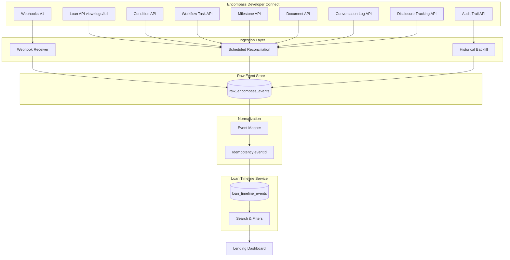

# Loan Communications & Activity Timeline

Production-grade knowledge layer for building a **unified loan activity timeline** on Encompass Developer Connect. Answers: *"What happened on this loan?"*

**Primary source:** [Encompass Developer Connect](https://developer.icemortgagetechnology.com/developer-connect)

| Marker | Meaning |
|--------|---------|
| **LENDER CONFIGURABLE** | Names, statuses, or behavior defined per lender in Encompass settings |
| **NOT ESTABLISHED BY CURRENT OFFICIAL DOCUMENTATION** | Could not be verified from official Developer Connect docs at time of writing |
| **NORMALIZED INTERNAL EVENT TYPE** | Dashboard taxonomy — not an official Encompass `eventType` string |

## Prerequisites

| Phase | Location |
|-------|----------|
| Domain model | [01-domain/](../01-domain/README.md) |
| API mapping | [02-apis/API-INDEX.md](../02-apis/API-INDEX.md) |

## Documentation map

| Document | Focus |
|----------|-------|
| [comment-source-matrix.md](./comment-source-matrix.md) | Every information type → API source (17-column matrix) |
| [comments-vs-notes-vs-conversations.md](./comments-vs-notes-vs-conversations.md) | Comment vs Note vs Conversation vs Email vs System |
| [comments.md](./comments.md) | Deep dive: all comment types across objects |
| [notes.md](./notes.md) | Entity-scoped notes (not loan-level) |
| [conversation-logs.md](./conversation-logs.md) | Conversation logs, alerts, `commentList` |
| [condition-comments.md](./condition-comments.md) | Standard + Enhanced condition comments & tracking |
| [task-comments.md](./task-comments.md) | Workflow task & subtask comments, disposition |
| [milestone-comments.md](./milestone-comments.md) | Milestone `comments` field vs Milestone History Log |
| [document-comments.md](./document-comments.md) | eFolder document comments |
| [loan-history.md](./loan-history.md) | System logs, loan lifecycle events |
| [field-changes.md](./field-changes.md) | Field change, EFC, audit trail |
| [unified-loan-timeline.md](./unified-loan-timeline.md) | End-to-end architecture & ingestion |
| [timeline-data-model.md](./timeline-data-model.md) | `LoanTimelineEvent` schema, event taxonomy |
| [timeline-api-strategy.md](./timeline-api-strategy.md) | Which APIs to call, webhook subscriptions |
| [search-strategy.md](./search-strategy.md) | Dashboard search & filter design |

## Core finding

**There is no single Encompass API that returns all comments, notes, or activity for a loan.** Comments are **resource-scoped** (condition, document, task, conversation log entry). Notes are **entity-scoped** (trade, borrower contact — not loan file). Loan-level communication history uses **Conversation Logs** and **system logs** embedded in `GET .../loans/{loanId}?view=logs|full`.

A unified timeline must **aggregate** from multiple APIs and webhooks, normalize into an internal event model, and preserve **raw source references** for audit.

## Architecture (summary)

## Twenty critical questions — explicit answers

### 1. Is there a single API to retrieve all comments for a loan?

**No.** Comments exist on parent resources: Enhanced/Standard **Conditions**, **Documents**, **Workflow Tasks/Subtasks**, **Conversation Log** entries (`commentList`), and **Milestone** logs (`comments` string field). Each requires its own GET or is embedded in a parent collection response (`conditions?view=Full`, `documents?view=detail|full`).

### 2. Is there a single API to retrieve all notes for a loan?

**No.** Documented **Note** APIs are entity-scoped: **Correspondent Trade Notes** (`/secondary/v1/trades/correspondent/{tradeId}/notes`) and **Borrower Contact Notes** (`/encompass/v1/borrowerContacts/{contactId}/notes`). For loan-file free-text communication, use **Conversation Logs** — not a global loan Notes API.

### 3. Which APIs provide Conversation Logs?

| API | Version | Endpoint |
|-----|---------|----------|
| List / Get | V1 | `GET /encompass/v1/loans/{loanId}/conversationLogs[/{logId}]` |
| Create / Manage | V3 | `PATCH /encompass/v3/loans/{loanId}/conversationlogs` |
| Embedded | V3 | `GET /encompass/v3/loans/{loanId}?view=logs\|full` |

### 4. Which APIs provide condition comments?

| Mode | Version | Endpoint |
|------|---------|----------|
| Enhanced | V3 | `GET/PATCH .../conditions/{conditionId}/comments` |
| Enhanced (bulk) | V3 | `GET .../conditions?view=Full` includes `comments[]` |
| Standard | V1 | `PATCH .../conditions/{type}/{conditionId}/comments` |

### 5. Which APIs provide condition tracking?

| Mode | Version | Endpoint |
|------|---------|----------|
| Enhanced | V3 | `GET/PATCH .../conditions/{conditionId}/tracking` |
| Enhanced (bulk) | V3 | `GET .../conditions?view=Detail\|Full` includes `tracking[]` |
| Standard | V1 | Status on condition object — dedicated tracking API: **NOT ESTABLISHED BY CURRENT OFFICIAL DOCUMENTATION** |

### 6. Which APIs provide task comments?

| Resource | Version | Endpoint |
|----------|---------|----------|
| Task | V1 | `GET/POST /workflow/v1/tasks/{id}/comments` |
| Subtask | V1 | `GET/POST /workflow/v1/tasks/{taskId}/subtasks/{subTaskId}/comments` |

Webhook: **Workflow Tasks** resource, **Task Comment Update** event (24.2+).

### 7. Which APIs provide milestone comments?

**Current-state only:** `comments` string on `GET/PATCH /encompass/v3/loans/{loanId}/milestones/{milestoneId}` (`MilestonesLogV3attributes`). **Historical milestone transitions:** **Milestone History Log** (system log) via `GET .../loans/{loanId}?view=logs|full` — not a separate comment collection API.

### 8. Which APIs provide document comments?

`GET /encompass/v3/loans/{loanId}/documents?view=detail|full` — comments array on each document. eFolder history: `GET .../histories/eFolder` for broader eFolder audit (not identical to inline comments).

### 9. Which APIs provide system history?

| Source | Access |
|--------|--------|
| Milestone History Log | `GET .../loans/{loanId}?view=logs\|full` |
| HTML Email Logs | Same |
| Lock Action Logs | Same |
| Field audit | `POST .../loans/{loanId}/auditTrail` |
| eFolder history | `GET .../histories/eFolder` |
| Webhook event history | `GET /webhook/v1/events` |
| Disclosure snapshots | `GET .../disclosureTracking2015Logs/snapshots` |

### 10. Which logs are included in the Loan response?

With `view=logs` or `view=full`:

- **Editable logs:** Conversation Logs, AUS Tracking Logs, other editable log collections per V3 loan schema
- **System logs:** Milestone History Log, HTML Email Logs, Lock Action Logs

With `view=entity` (default for most integrations): **no logs**.

Conditions, documents, tasks, milestones, disclosure logs: **not** fully included in loan GET — require separate APIs.

### 11. Which require separate API calls?

Conditions, documents, attachments, milestones (current state), workflow tasks, disclosure tracking logs, conversation logs (if not using `view=logs`), audit trail, eFolder history, document delivery status, trade notes, borrower contact notes.

### 12. Which resources have timestamps?

Most resources: `addedDate`, `statusDate`, `createdDate`, `eventTime`, `dateUtc`, `startDate`, `completed`, disclosure log dates, tracking entry dates. Exact field names vary by contract — see [comment-source-matrix.md](./comment-source-matrix.md).

### 13. Which have authors?

Conversation logs (`user`, `commentList.addedBy`), LogCommentContract (`addedBy`, `reviewedBy`), task comments (`createdBy` in webhook payload), webhooks (`meta.userId`), milestone associates, disclosure logs (per schema). System logs: system-generated — user may appear on triggering action in Milestone History.

### 14. Which support webhooks?

Loan resource (broad), Workflow Tasks, Document Delivery, Document Order, Enhanced Conditions category, Trades, Schedulers, EPC, DDA (limited). Dedicated Conversation Log webhooks: **NOT ESTABLISHED BY CURRENT OFFICIAL DOCUMENTATION**.

### 15. Which support pagination?

Workflow tasks (`start`/`limit`, `page`/`size`), task pipeline, audit trail (`start`/`limit`), webhook event history. Per-loan collections (conditions, documents, milestones, conversation logs): **generally full list per loan** — no cursor pagination documented.

### 16. Which support filtering?

Tasks (assignee, status, association to loan/condition), enhanced conditions (`conditionType`, `view`), documents (`view`, `includeRemoved`, `requireActiveAttachments`), fieldchange/change webhooks (max 50 attributes), loan pipeline (separate API for multi-loan search). Comment text search across loan: **NOT ESTABLISHED BY CURRENT OFFICIAL DOCUMENTATION**.

### 17. Which are editable?

Conversation logs, condition comments/tracking, document metadata/comments, task comments, milestone `comments` and assignment fields, disclosure logs (V3 PATCH), editable log collections.

### 18. Which are immutable?

System logs (Milestone History, HTML Email, Lock Action), field change **events** (webhook/audit — not retroactively edited), webhook notifications, most HTML email content.

### 19. Which are soft deleted?

Enhanced conditions (`isRemoved`), documents (`includeRemoved`), loans (`move` to trash — webhook `move`). Conversation log soft delete: **NOT ESTABLISHED BY CURRENT OFFICIAL DOCUMENTATION**. Task delete: hard delete (409 if children unless `force=true`).

### 20. How should a bank build a unified timeline without losing original Encompass source information?

1. **Ingest** webhooks into a raw event store keyed by `eventId` with full payload JSON.
2. **Reconcile** every webhook with GET on `meta.resourceRef` before updating dashboard state.
3. **Normalize** into `LoanTimelineEvent` with mandatory `source`, `rawReference`, and `encompassEventType` (when applicable).
4. **Never overwrite** raw payloads — timeline rows link to raw store for compliance replay.
5. **Poll** `view=logs` and resource APIs on schedule to catch non-webhook Smart Client changes.
6. **Backfill** audit trail and eFolder history for historical field/document activity.
7. **Label** internal event types distinctly from official Encompass `eventType` values.

See [unified-loan-timeline.md](./unified-loan-timeline.md) and [timeline-data-model.md](./timeline-data-model.md).

## Fictional reference loan

Same as domain knowledge base: John Smith, $400K purchase, LO Mike, Processor Sarah, UW Robert, Closer Lisa.

## Official entry points

- [Loan Management — logs classification](https://developer.icemortgagetechnology.com/developer-connect/reference/loan-management)
- [Loan Webhooks](https://developer.icemortgagetechnology.com/developer-connect/reference/wbhks-re-cat-loan)
- [Workflow Tasks Webhooks](https://developer.icemortgagetechnology.com/developer-connect/reference/wbhks-re-cat-workflow-tasks)
- [Conversation Log](https://developer.icemortgagetechnology.com/developer-connect/reference/loan-conversation-log-1)
