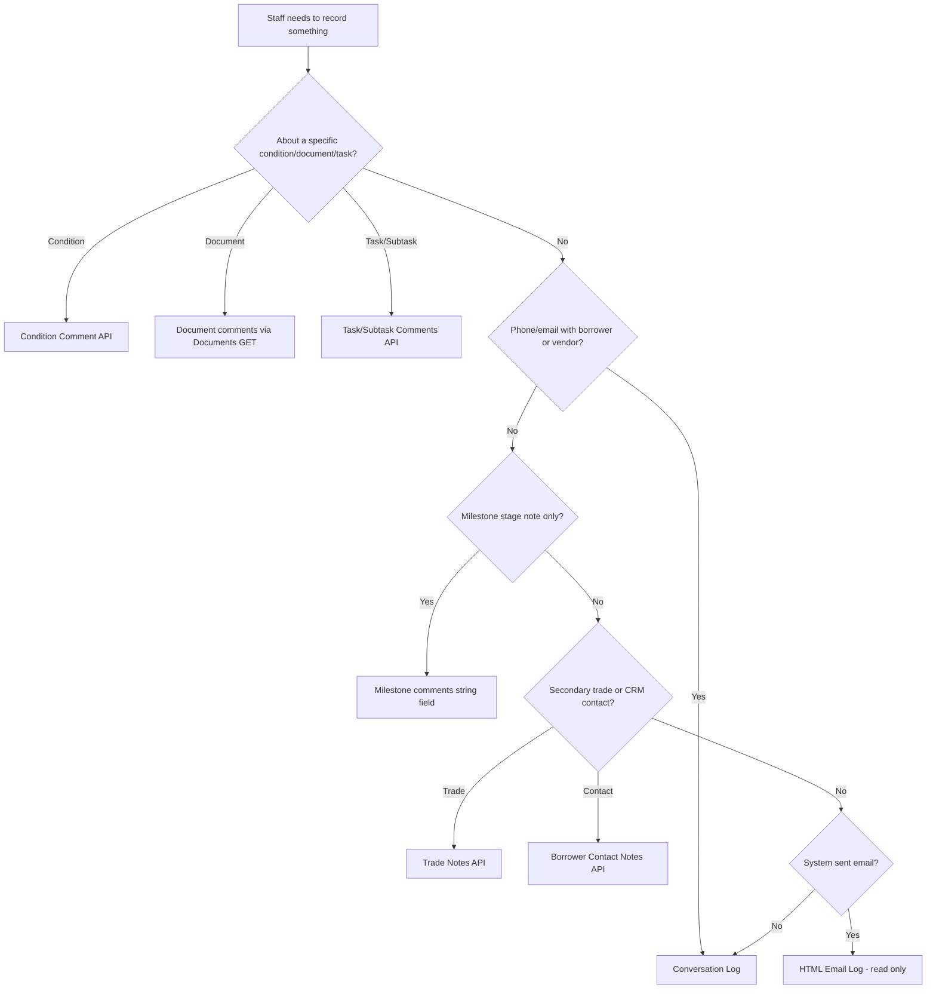

# Comments vs Notes vs Conversations

Extremely explicit comparison of overlapping Encompass concepts. **Do not treat these as interchangeable.**

---

## At a glance

| Concept | What it is | Scope | API pattern | User writes? | System writes? | Belongs to |
|---------|------------|-------|-------------|--------------|----------------|------------|
| **Comment** | Annotation on a **business object** | Resource | Per-resource GET/PATCH or embedded | Yes | Rarely | Condition, Document, Task, Milestone, Conversation Log entry |
| **Note** | Free-form annotation on a **non-loan entity** | Entity | Trade or Borrower Contact APIs | Yes | No | Correspondent Trade, Borrower Contact (CRM) |
| **Conversation Log** | Loan-level **communication record** + optional alerts | Loan | Conversation Log API + `view=logs` | Yes | Partial (`isSystemSpecificIndicator`) | Loan file |
| **Email Log (HTML)** | System-captured outbound/inbound email | Loan | `view=logs` only (system log) | **No** | Yes | Loan file |
| **System Log** | Platform audit (milestones, locks, emails) | Loan | `view=logs` | **No** | Yes | Loan file |
| **Field Change** | Data mutation event | Loan field | Webhook + auditTrail | User or API | Yes (event) | Loan field path |
| **Task Disposition** | Completion outcome + notes | Task | Task PATCH / webhook | Yes | No | Workflow Task |
| **Condition Tracking** | Status checkpoint checklist | Condition | Tracking API | Yes | No | Enhanced Condition |
| **Document History** | eFolder audit trail | Loan eFolder | `histories/eFolder` | **No** (audit) | Yes | Loan eFolder |

---

## Comment

### Definition

A **comment** is contextual text attached to a specific resource. Encompass reuses **`LogCommentContract`** (or resource-specific equivalents) in multiple domains.

### Where comments live

| Parent | API access | Threaded? |
|--------|------------|-----------|
| Enhanced Condition | `.../conditions/{id}/comments` | Yes (`comments[]`) |
| Standard Condition | `.../conditions/{type}/{id}/comments` | Partial |
| eFolder Document | `GET .../documents?view=detail\|full` | Yes (comments array) |
| Workflow Task | `GET/POST .../tasks/{id}/comments` | Yes |
| Workflow Subtask | `GET/POST .../subtasks/{id}/comments` | Yes |
| Conversation Log | `commentList[]` on log entry | Yes |
| Milestone log | Single `comments` **string** | **No** — not a collection |

### Key properties

- **Editable** (except where parent is read-only system log)
- **Resource-bound** — comment ID meaningless without parent resource ID
- **May generate webhook** — condition comment, document update, task comment update
- **Not a loan-level inbox** — must aggregate per resource

### Example (John Smith loan)

> "Need donor statement." on paystub **condition** → **Condition Comment**, not Conversation Log.

---

## Note

### Definition

Official Developer Connect documents **Notes** only on specific **entities outside the loan comment model**:

| Note type | Endpoint | Scope |
|-----------|----------|-------|
| Correspondent Trade Note | `/secondary/v1/trades/correspondent/{tradeId}/notes` | Secondary marketing trade |
| Borrower Contact Note | `/encompass/v1/borrowerContacts/{contactId}/notes` | CRM contact record |

### What Notes are NOT

- **NOT** a global `GET /loans/{loanId}/notes` API — **NOT ESTABLISHED BY CURRENT OFFICIAL DOCUMENTATION**
- **NOT** the same as Conversation Logs
- **NOT** the same as Condition Comments

### When to use Conversation Log instead

For loan-file staff communication ("Spoke with borrower about large deposit"), use **Conversation Log** — not Note.

### Example

Pricing exception on bulk purchase trade → **Trade Note** on correspondent trade, not on John Smith loan file.

---

## Conversation Log

### Definition

Official:

> Conversation log entries track communications with customers, partners, and vendors, and provide an alert mechanism to notify users of required actions and tasks.

### Classification

**Editable Log** on the loan — included in `GET .../loans/{loanId}?view=logs|full`.

### Distinctive features

| Feature | Conversation Log | Comment on other objects |
|---------|------------------|--------------------------|
| Loan-level record | Yes | No — scoped to parent |
| Contact fields (`name`, `phone`, `email`) | Yes | No |
| Follow-up **alerts** with due dates | Yes | No (except task due dates) |
| `isEmailIndicator` | Yes | N/A |
| `showInLoanLog` | Yes | N/A |

### Nested comments

`commentList[]` uses **LogCommentContract** — these are **comments on the conversation log entry**, not separate conversation logs.

---

## Email Log

### Definition

**HTML Email Logs** are **System Logs** on the loan:

- Captured automatically by Encompass for system-generated emails (e.g., disclosure delivery)
- **Cannot be edited** by any user
- Retrieved via `view=logs|full` — no separate CRUD API documented as primary access pattern

### vs Conversation Log

| | Conversation Log | HTML Email Log |
|--|------------------|----------------|
| Created by | Staff (typically) | System |
| Editable | Yes | **No** |
| Manual phone call summary | Yes | No |
| Auto CD email record | No | Yes |

### vs Disclosure Tracking

Disclosure Tracking logs are **compliance timeline records** (LE/CD delivery dates, recipient status) — separate API (`disclosureTracking2015Logs`). HTML Email Log is the **system email artifact**; Disclosure log is the **TRID tracking record**. Both may appear in timeline for same delivery event.

---

## System Log

### Definition

Platform-generated, **append-only** history on the loan file. Users cannot edit entries.

| System log | Content |
|------------|---------|
| **Milestone History Log** | Milestone transition audit (who finished which stage) |
| **HTML Email Logs** | System email records |
| **Lock Action Logs** | Exclusive loan lock/unlock history |

Access: `GET /encompass/v3/loans/{loanId}?view=logs|full`.

### vs Field Change

System logs are **narrative/audit entries** stored as log collections. Field changes are **structured mutation events** (field ID, previous value, new value) via webhooks and audit trail.

---

## Field Change

### Definition

An **immutable event** recording that a loan data field changed.

| Mechanism | Payload |
|-----------|---------|
| `fieldchange` webhook | Specified fields (max 50 filters); may include cascaded fields |
| `enhancedfieldchange` webhook | All field changes with previous/new values |
| `POST .../auditTrail` | Historical pull with pagination |

### Not a comment

Field changes describe **what data changed**, not free-text discussion. Display separately in timeline (e.g., "Loan Amount: $380,000 → $400,000").

---

## Task Disposition

### Definition

When a workflow task completes, **`resolution`** (code) and **`resolutionComment`** (text) capture outcome.

| Field | Type | Meaning |
|-------|------|---------|
| `resolution` | string | Disposition code — **LENDER CONFIGURABLE** |
| `resolutionComment` | string | Free-text completion notes |

This is **task completion metadata**, not a threaded comment collection — though task **comments API** provides separate annotation thread.

### Timeline treatment

Emit two potential events:

1. **NORMALIZED INTERNAL EVENT TYPE** `TASK_COMPLETED`
2. Optional **NORMALIZED INTERNAL EVENT TYPE** `TASK_DISPOSITION_RECORDED` when `resolution`/`resolutionComment` populated

Official webhook: Workflow Task **Update** — not a separate "disposition" event name.

---

## Condition Tracking

### Definition

**Enhanced Conditions** expose `tracking[]` — checklist of status checkpoints (e.g., "Requested", "Received", "Reviewed") with user/date on each entry.

| | Condition Comment | Condition Tracking |
|--|-------------------|-------------------|
| Purpose | Free-text annotation | Structured status progression |
| API | `.../comments` | `.../tracking` |
| Webhook | `addCommentsToConditions` | `updateStatusTrackingInConditions` |
| Text | Yes | Labels from definitions — **LENDER CONFIGURABLE** |

Tracking is **operational history**, not conversational comment.

---

## Document History

### Definition

| Source | What it captures |
|--------|------------------|
| Document `comments[]` | User QC notes on a document |
| `documentStatus` changes | Status progression (webhook `documentStatusUpdates`) |
| `GET .../histories/eFolder` | eFolder-level audit trail |

Document comments are **editable annotations**. eFolder history is **audit-oriented** and may overlap with webhook-driven status events — dedupe in normalization layer.

---

## Decision tree — "Where does this text go?"

---

## Timeline normalization guidance

| Source type | `resourceType` | `eventType` (internal) |
|-------------|----------------|------------------------|
| Condition comment | `CONDITION` | `CONDITION_COMMENTED` |
| Conversation log | `CONVERSATION_LOG` | `CONVERSATION_LOG_CREATED` |
| Trade note | `TRADE` | `NOTE_CREATED` |
| Field change | `LOAN_FIELD` | `LOAN_FIELD_CHANGED` |
| HTML email log | `SYSTEM_LOG` | `EMAIL_LOG_CREATED` |
| Task disposition | `TASK` | `TASK_COMPLETED` |

Official Encompass `eventType` values preserved separately in `encompassEventType` — see [timeline-data-model.md](./timeline-data-model.md).

---

## References

- [01-domain/comments-notes-logs.md](../01-domain/comments-notes-logs.md)
- [01-domain/communications.md](../01-domain/communications.md)
- [02-apis/conversation-log-api.md](../02-apis/conversation-log-api.md)
- [02-apis/notes-api.md](../02-apis/notes-api.md)
