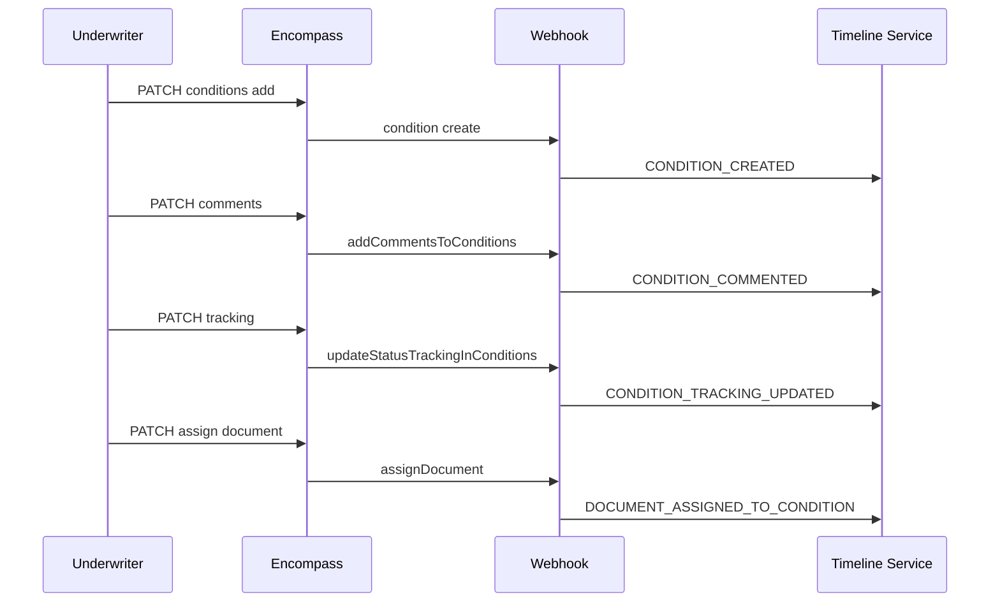

# Condition Comments & Tracking

Condition annotations and status checkpoints for **Enhanced** and **Standard** conditions.

Always check `loan.useEnhancedConditionIndicator` before choosing API family.

---

## Enhanced Conditions (primary path)

### Comments API

```
GET   /encompass/v3/loans/{loanId}/conditions/{conditionId}/comments
PATCH /encompass/v3/loans/{loanId}/conditions/{conditionId}/comments
```

Bulk read: `GET .../conditions?view=Full` includes `comments[]`.

### Tracking API

```
GET   /encompass/v3/loans/{loanId}/conditions/{conditionId}/tracking
PATCH /encompass/v3/loans/{loanId}/conditions/{conditionId}/tracking
```

Bulk read: `GET .../conditions?view=Detail|Full` includes `tracking[]`.

---

## LogCommentContract (comments)

| Field | Timeline mapping |
|-------|------------------|
| `id` | Comment `resourceId` (secondary) |
| `comments` | `description` |
| `addedBy` | `actor` |
| `addedDate` | `eventTime` |
| `reviewedBy` / `reviewedDate` | Optional review event |
| `forRole` | Filter by role |
| `isExternal` | TPO/borrower visibility flag |

### Who writes / reads

| | |
|--|--|
| **Writes** | Processors, underwriters with condition permissions |
| **Reads** | Internal staff; external parties when `isExternal` and portal configured |

### Editable / historical

- **Editable:** Yes — PATCH comments
- **Historical:** Review timestamps; full comment edit history **NOT ESTABLISHED** as version API
- **Soft delete:** Condition `isRemoved=true` — include removed in audit via `includeRemoved=true`

### Webhooks (official)

Loan resource `condition` subevents include comment and tracking updates.

Enhanced Conditions webhook category events (official names):

| Event | Use |
|-------|-----|
| `addCommentsToConditions` | New/updated comments |
| `updateStatusTrackingInConditions` | Tracking checkpoint changes |
| `create`, `update`, `assign`, `assignDocument`, `remove` | Lifecycle |

Also: status change subevents on loan `condition` webhook.

---

## Condition tracking (not comments)

### What tracking means

Structured checklist of status milestones for a condition — e.g., Requested → Received → Cleared. Labels and order are **LENDER CONFIGURABLE** via condition templates/settings.

### vs comments

| | Tracking | Comments |
|--|----------|----------|
| Structure | Checkbox/status entries | Free text |
| API | `/tracking` | `/comments` |
| Purpose | Operational progression | Clarification / instructions |
| Webhook | `updateStatusTrackingInConditions` | `addCommentsToConditions` |

### Timeline events

| Internal event type | Trigger |
|---------------------|---------|
| `CONDITION_TRACKING_UPDATED` | Tracking PATCH / webhook |
| `CONDITION_COMMENTED` | Comment PATCH / webhook |
| `CONDITION_STATUS_CHANGED` | `status` / `statusDate` change |
| `CONDITION_SATISFIED` | Derived when `statusOpen=false` or status label — **LENDER CONFIGURABLE** |

Official Encompass uses resource-specific webhook names — preserve in `encompassEventType`.

---

## Standard Conditions (legacy path)

### Comments API

```
PATCH /encompass/v1/loans/{loanId}/conditions/{type}/{conditionId}/comments
```

Types: `underwriting`, `preliminary`, `postclosing`.

### Tracking

Status on condition object in eFolder — dedicated tracking REST API: **NOT ESTABLISHED BY CURRENT OFFICIAL DOCUMENTATION** for standard conditions.

### Webhooks

When loan uses Enhanced Conditions indicator, loan-level condition webhooks apply. Standard-only: dedicated webhooks **NOT ESTABLISHED**.

---

## Document assignment to conditions

```
PATCH /encompass/v3/loans/{loanId}/conditions/{conditionId}/documents
```

Timeline: **NORMALIZED INTERNAL EVENT TYPE** `DOCUMENT_ASSIGNED_TO_CONDITION`

Official webhook: `assignDocument` on loan `condition` event.

---

## Condition lifecycle timeline (Enhanced)



---

## John Smith examples

| Text / action | Object |
|---------------|--------|
| "Need donor statement." | Enhanced condition **comment** on large-deposit condition |
| Check "Received" on tracking row | **Tracking** update — not comment |
| Assign Paystubs document | **Document assignment** — separate event |
| Condition added from DU findings | `sourceOfCondition: "DUFindings"` on condition — timeline metadata |

---

## Dashboard display guidance

1. Group condition events under condition `title` (retrieve-only at loan level)
2. Show tracking as status chips timeline, comments as text thread
3. Never collapse tracking checkbox into comment stream without labels
4. Respect `isRemoved` — show in "removed conditions" filter for compliance

---

## References

- [02-apis/enhanced-condition-api.md](../02-apis/enhanced-condition-api.md)
- [02-apis/condition-api.md](../02-apis/condition-api.md)
- [comments.md](./comments.md)
