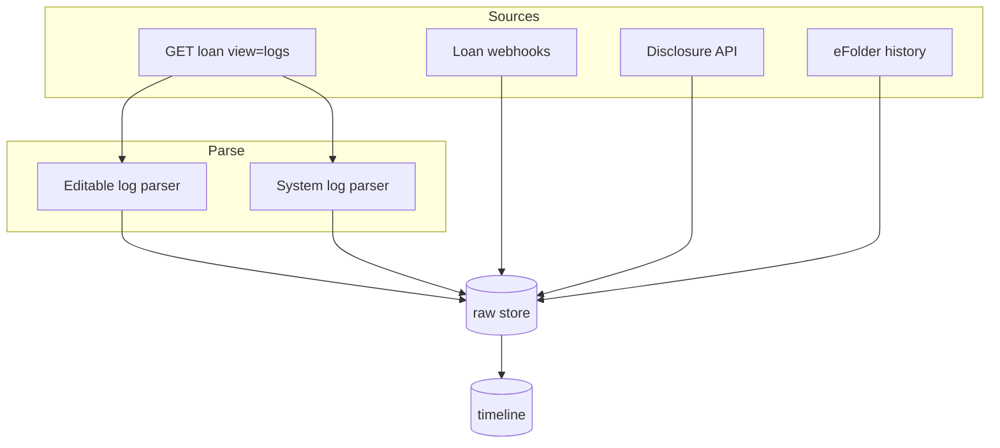

# Loan History & System Logs

System-generated and lifecycle history on the loan file — distinct from editable resource comments.

---

## Loan GET views and logs

```
GET /encompass/v3/loans/{loanId}?view=entity   → no logs
GET /encompass/v3/loans/{loanId}?view=logs     → logs only
GET /encompass/v3/loans/{loanId}?view=full     → entity + logs
```

Official [Loan Management](https://developer.icemortgagetechnology.com/developer-connect/reference/loan-management) classification:

| Log type | Examples | User editable? |
|----------|----------|----------------|
| **Editable logs** | Conversation Logs, AUS Tracking Logs | Yes |
| **System logs** | Milestone History, HTML Email, Lock Action | **No** |

---

## System logs (immutable)

### Milestone History Log

- **Purpose:** Audit trail of milestone stage transitions
- **Access:** `view=logs|full`
- **Editable:** **No**
- **Actor:** User who triggered transition (when captured)
- **Timeline:** Parse into `MILESTONE_FINISHED`, `MILESTONE_STARTED` rows — reconcile with milestone webhooks

### HTML Email Logs

- **Purpose:** System-captured email communications (e.g., disclosure emails)
- **Access:** `view=logs|full`
- **Editable:** **No**
- **Timeline:** **NORMALIZED INTERNAL EVENT TYPE** `EMAIL_LOG_CREATED`

Dedicated HTML Email CRUD API: **NOT ESTABLISHED** — primary access via loan logs view.

### Lock Action Logs

- **Purpose:** Exclusive loan lock / unlock audit
- **Access:** `view=logs|full`
- **Editable:** **No**
- **Related webhook:** Loan `lock`, `unlock` events
- **Timeline:** **NORMALIZED INTERNAL EVENT TYPE** `LOAN_LOCK_CHANGED`

Distinct from **rate lock** field changes — those are field change events on specific field IDs (**LENDER CONFIGURABLE**).

---

## Editable logs (on loan GET)

### Conversation Logs

See [conversation-logs.md](./conversation-logs.md).

### AUS Tracking Logs

- **Classification:** Editable log
- **Access:** `view=logs|full` + dedicated endpoints per loan schema
- **Purpose:** AUS run history and tracking
- **Timeline:** **NORMALIZED INTERNAL EVENT TYPE** `AUS_RUN_LOGGED` (internal)

---

## Loan lifecycle webhooks

Official Loan resource events ([wbhks-re-cat-loan](https://developer.icemortgagetechnology.com/developer-connect/reference/wbhks-re-cat-loan)):

| eventType | Meaning | Official? |
|-----------|---------|-----------|
| `create` | Loan created | Yes |
| `update` | Loan file updated | Yes |
| `delete` | Permanent deletion | Yes |
| `move` | Folder move / trash | Yes |
| `submit` | Consumer Connect submit | Yes |
| `lock` / `unlock` | Exclusive lock | Yes |
| `document` | Document subevents | Yes |
| `attachment` | Attachment created | Yes |
| `condition` | Condition subevents | Yes |
| `milestone` | Milestone subevents | Yes |
| `fieldchange` | Filtered field changes | Yes |
| `enhancedfieldchange` | All field changes (EFC) | Yes |
| `change` | JSON path attribute changes | Yes |
| `disclosureTracking` | Disclosure log create/update | Yes (Beta) |
| `alertchange` | Compliance alerts | Yes (Limited) |

---

## Disclosure events

### Disclosure Tracking 2015 logs

```
GET/POST/PATCH /encompass/v3/loans/{loanId}/disclosureTracking2015Logs
GET .../disclosureTracking2015Logs/snapshots
```

| Timeline use | Source |
|--------------|--------|
| LE/CD delivery recorded | Disclosure log entries |
| Point-in-time compliance state | Snapshots |
| Webhook | `disclosureTracking` (Beta) |

Internal types: `DISCLOSURE_GENERATED`, `DISCLOSURE_DELIVERED` — **NORMALIZED INTERNAL** unless matching official webhook subevent names in payload.

See [02-apis/disclosure-api.md](../02-apis/disclosure-api.md).

---

## Document delivery history

Document package delivery (Encompass Docs):

- Creates disclosure tracking entry
- Creates eFolder document containers
- Sends email to recipients

Webhook: [Document Delivery category](https://developer.icemortgagetechnology.com/developer-connect/reference/wbhks-re-cat-doc-delivery)

Timeline aggregates:

1. Delivery webhook event
2. Subsequent disclosure log GET
3. HTML Email Log from `view=logs` sync
4. Document webhooks for new containers

---

## eFolder history

```
GET /encompass/v3/loans/{loanId}/histories/eFolder
```

Loan-level eFolder audit — complements document webhooks. See [document-comments.md](./document-comments.md).

---

## Webhook event history (platform)

```
GET /webhook/v1/events
GET /webhook/v1/events/{eventId}
```

Replay / recovery when your endpoint missed notifications. Paginated per OpenAPI.

**Not a substitute** for loan-specific history — use for ingestion gap recovery.

---

## Consumer Connect submit

Official `submit` webhook — borrower clicked Submit on Consumer Connect.

- **Not** a conversation log
- **Timeline:** borrower-initiated action — `actorType: BORROWER` (internal classification)

---

## Compliance alerts

`alertchange` webhook (Limited availability) — compliance loan alerts changed.

Treat as system-adjacent events with official `eventType: alertchange`.

---

## Ingestion pattern for system logs



**Poll `view=logs`** on schedule even with webhooks — Smart Client edits may not emit granular webhooks for all log types.

---

## John Smith loan history snapshot

| Stage | Event source |
|-------|--------------|
| Loan created | `create` webhook |
| Processing milestone finished | `finishMilestones` + Milestone History Log |
| Conversation: large deposit call | Conversation Log (editable) |
| UW condition added | `condition` create |
| CD emailed | HTML Email Log + Disclosure Tracking log |
| Loan locked by UW | Lock Action Log + `lock` webhook |

---

## References

- [01-domain/loan-domain.md](../01-domain/loan-domain.md)
- [01-domain/events.md](../01-domain/events.md)
- [02-apis/loan-api.md](../02-apis/loan-api.md)
- [02-apis/disclosure-api.md](../02-apis/disclosure-api.md)
