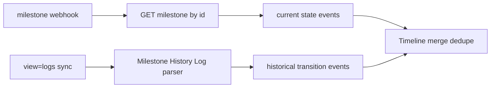

# Milestone Comments & History

Two distinct concepts often conflated:

1. **Milestone log `comments` field** — editable current-state note (single string)
2. **Milestone History Log** — append-only system audit of milestone transitions

---

## Milestone log comments (current state)

### API

```
GET  /encompass/v3/loans/{loanId}/milestones
GET  /encompass/v3/loans/{loanId}/milestones/{milestoneId}
PATCH /encompass/v3/loans/{loanId}/milestones/{milestoneId}
```

### Field

`comments` (string) on `MilestonesLogV3attributes` — **Read/Write**.

### Who writes / reads

| | |
|--|--|
| **Writes** | Users permitted to update milestone (finish milestone, assign associate) |
| **Reads** | Loan team viewing pipeline stage |

### Semantics

Free-text note attached to **current milestone record** — e.g., "Processing complete."

### Critical limitations

| Property | Value |
|----------|-------|
| **Threaded comments API** | **No** — single string only |
| **Append-only history of comment text** | **No** — PATCH overwrites prior value |
| **LogCommentContract** | **No** — plain string |
| **Editable** | Yes |
| **Deletable** | Set to empty string via PATCH |
| **Generates event** | Yes — loan webhook `milestone` |

### Webhooks (official)

Loan resource `milestone` event:

| Subevent | Meaning |
|----------|---------|
| `updateMilestones` | Milestone updated (includes assignment, dates, comments) |
| `finishMilestones` | Milestone marked done |

Payload includes milestone `id`, `title` (official samples) — **GET milestone for full `comments` string**.

---

## Milestone History Log (system audit)

### Access

```
GET /encompass/v3/loans/{loanId}?view=logs|full
```

Milestone History Log is a **System Log** — **cannot be edited by any user**.

### What it captures

Append-only history of milestone **transitions** — who finished which stage, when stages changed. Official domain documentation distinguishes this from the editable milestone log GET.

### vs milestone GET

| Source | Content | Editable |
|--------|---------|----------|
| `GET .../milestones/{id}` | Current milestone state + `comments` string | Yes |
| Milestone History Log in `view=logs` | Historical transition audit | **No** |

**Do not expect** milestone GET to return full transition history — use system log + webhooks.

---

## Milestone associate assignment

PATCH milestone with `loanAssociate`:

```json
{
  "loanAssociate": {
    "loanAssociateType": "User",
    "user": {
      "entityId": "admin",
      "entityType": "User"
    }
  }
}
```

Timeline: **NORMALIZED INTERNAL EVENT TYPE** `MILESTONE_ASSOCIATE_ASSIGNED` (derive from `updateMilestones` webhook + GET).

Official webhook: `updateMilestones` — not a separate assign event name.

---

## Milestone lifecycle events

| Internal event type | Trigger |
|---------------------|---------|
| `MILESTONE_STARTED` | `startDate` set — **NORMALIZED INTERNAL** |
| `MILESTONE_UPDATED` | PATCH / `updateMilestones` |
| `MILESTONE_FINISHED` | `doneIndicator: true` / `finishMilestones` |
| `MILESTONE_COMMENTED` | `comments` field changed — **NORMALIZED INTERNAL** |

Official Encompass webhook `eventType` on loan resource is `milestone` with meta payload subevent names above.

---

## John Smith example

Sarah finishes **Processing** milestone:

1. PATCH `{ "doneIndicator": true, "comments": "Processing complete." }`
2. Webhook: `eventType=milestone`, subevent `finishMilestones`
3. Milestone History Log entry appended (system) — read on next `view=logs` sync
4. Timeline shows:
   - `MILESTONE_FINISHED` at finish time
   - `MILESTONE_COMMENTED` with description "Processing complete."
   - Optional system log row from Milestone History parse

Robert assigned on **Cond. Approval**:

- PATCH with `loanAssociate` → `MILESTONE_UPDATED` / internal `MILESTONE_ASSOCIATE_ASSIGNED`

---

## SLA fields (context, not comments)

| Field | Meaning |
|-------|---------|
| `days` | Expected days — **LENDER CONFIGURABLE** |
| `duration` | Actual elapsed days |
| `startDate` | Milestone start |

Use for dashboard stage analytics — separate from comment timeline.

---

## Ingestion strategy



Dedupe key suggestion: `{loanId}:milestone:{milestoneId}:{eventType}:{eventTime}` for webhooks; system log rows use log entry ID if present in schema.

---

## References

- [02-apis/milestone-api.md](../02-apis/milestone-api.md)
- [01-domain/milestones.md](../01-domain/milestones.md)
- [loan-history.md](./loan-history.md)
