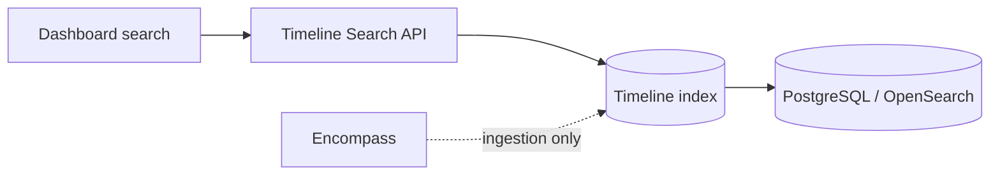

# Search Strategy

How the lending dashboard should support timeline search and filtering — given Encompass API constraints (no cross-loan comment search API documented).

---

## Design principle

**Index in your timeline store** — do not query Encompass synchronously for each dashboard search. Encompass provides resource-scoped GET with limited filters; unified search requires **your** `loan_timeline_events` index populated by ingestion.



---

## Search requirements matrix

| Requirement | Index field(s) | Encompass native? | Notes |
|-------------|----------------|-------------------|-------|
| **By loan** | `loanId` | Yes — all APIs scoped | Primary partition key |
| **By borrower** | `loanId` via join to loan `applications[].borrower` | Loan Pipeline API for discovery | Denormalize borrower names on ingest |
| **By date** | `eventTime` range | Per-resource timestamps | UTC storage |
| **By stage** | `metadata.milestoneName`, `metadata.loanFolder` | Milestone GET | Snapshot at ingest |
| **By user** | `actor`, `metadata.userId` | Partial — varies by resource | Resolve display names via Users API |
| **By task** | `resourceType=TASK`, `resourceId` | Task GET | |
| **By condition** | `resourceType=CONDITION`, `resourceId` | Condition GET | |
| **By document** | `resourceType=DOCUMENT`, `resourceId` | Document GET | |
| **By communication type** | `eventType` IN conversation/email/note types | No cross-type API | Internal filter |
| **By comment text** | Full-text on `description` | **NOT ESTABLISHED** cross-loan | OpenSearch / PG `tsvector` |
| **By event type** | `eventType` | Webhook eventType partial | Use internal taxonomy |
| **By milestone** | `metadata.milestoneName` | Milestone GET | |
| **By underwriter** | `metadata.associates.underwriter` | Associates / milestone | Denormalize from loan team |
| **By processor** | `metadata.associates.processor` | Same | **LENDER CONFIGURABLE** role names |

---

## Recommended index schema

### Primary table: `loan_timeline_events`

| Column | Index type | Search use |
|--------|------------|------------|
| `loan_id` | B-tree | Loan filter |
| `event_time` | B-tree | Date range |
| `event_type` | B-tree | Event type filter |
| `resource_type` | B-tree | Object filter |
| `resource_id` | B-tree | Task/condition/document drill-down |
| `actor` | B-tree | User filter |
| `description` | GIN / full-text | Comment text search |
| `metadata` | JSONB GIN | Stage, milestone, associates |

### Denormalized loan dimension: `loan_search_dim`

Updated on loan sync — avoids join to Encompass on every search:

| Column | Source |
|--------|--------|
| `loan_id` | Loan GUID |
| `loan_number` | Official `loanNumber` |
| `borrower_full_name` | Application borrower fields |
| `loan_folder` | Official `loanFolder` |
| `current_milestone_name` | Milestone GET |
| `processor_user_id` | Milestone-free / associate roles |
| `underwriter_user_id` | Associate on UW milestone |
| `use_enhanced_conditions` | Official indicator |

Role → user mapping is **LENDER CONFIGURABLE**.

---

## Query API design (internal)

### Timeline for one loan

```
GET /api/v1/loans/{loanId}/timeline
  ?from=2026-01-01T00:00:00Z
  &to=2026-03-31T23:59:59Z
  &eventType=CONDITION_COMMENTED,TASK_COMMENTED
  &resourceType=CONDITION
  &resourceId={conditionId}
  &actor=Sarah
  &q=donor+statement
  &cursor={eventTime}:{eventId}
  &limit=50
```

### Cross-loan search (pipeline view)

```
GET /api/v1/timeline/search
  ?borrowerName=Smith
  &processorId={userId}
  &underwriterId={userId}
  &milestone=Processing
  &eventType=CONVERSATION_LOG_CREATED
  &q=large+deposit
  &from=...
  &to=...
```

Requires `loan_search_dim` join.

---

## Filter mapping

### Communication type filter

| UI label | `eventType` values |
|----------|-------------------|
| Phone / conversation | `CONVERSATION_LOG_*` |
| Email (system) | `EMAIL_LOG_CREATED` |
| Condition notes | `CONDITION_COMMENTED` |
| Document QC | `DOCUMENT_COMMENTED` |
| Task notes | `TASK_COMMENTED` |
| Trade / CRM notes | `NOTE_CREATED` |
| Field changes | `LOAN_FIELD_CHANGED` |
| System | `LOAN_LOCK_CHANGED`, milestone history parses |

### Stage filter

Option A: `metadata.milestoneName` at event time (preferred for historical accuracy)

Option B: `loan_search_dim.current_milestone_name` (current state only — label clearly in UI)

### Underwriter / processor filter

At ingest:

1. `GET /encompass/v3/loans/{loanId}/milestones` — find associate on relevant milestone
2. `GET /encompass/v3/loans/{loanId}/milestoneFreeRoles` — roles not tied to milestones
3. Store in `metadata.associates` and `loan_search_dim`

Official role names vary by lender — map via settings, not hardcoded "Processor".

---

## Full-text search on comment text

Encompass does not document a loan-wide comment search API (**NOT ESTABLISHED**).

**Implementation:**

1. Index `description` + selected `metadata` text fields in PostgreSQL `tsvector` or OpenSearch
2. On ingest, index comment bodies from:
   - Condition `comments[].comments`
   - Document comments
   - Task comments
   - Conversation log `comments` + `commentList`
   - Milestone `comments` string
   - Trade/contact note `details`

3. Query with `q` parameter against local index only

### PII in search

Mask SSN/account numbers in indexed text if present in comments — apply redaction before indexing.

---

## Pagination

| Layer | Strategy |
|-------|----------|
| Timeline API | Keyset cursor on `(event_time DESC, event_id DESC)` |
| Encompass poll | Full per-loan collections (no cursor) |
| Audit trail | `start` + `limit` official pagination |
| Task list | `page`/`size` or `start`/`limit` |

---

## Performance guidelines

| Pattern | Guidance |
|---------|----------|
| Loan timeline page | Default last 90 days; lazy-load older |
| Cross-loan search | Require at least one narrow filter (date range or user) |
| Export | Async job — do not scan Encompass live |
| Counts | Maintain rollup table by `loan_id` + `event_type` if needed |

---

## Encompass-native discovery (supplement)

For **finding loans** (not events within a loan):

| Need | API |
|------|-----|
| Pipeline search | Loan Pipeline API (separate from timeline) |
| Task queue | `GET /workflow/v1/taskPipeline` |
| Field-based loan search | Reporting / Pipeline — not timeline store |

Link pipeline results to timeline via `loanId`.

---

## Example queries

### "Show all comments mentioning donor on John Smith loan"

```
loanId = {johnSmithLoanGuid}
q = "donor"
eventType IN (CONDITION_COMMENTED, CONVERSATION_LOG_CREATED, CONVERSATION_LOG_COMMENT_ADDED, TASK_COMMENTED, DOCUMENT_COMMENTED)
```

### "What did Sarah do last week across her pipeline?"

```
actor = Sarah OR metadata.userId = {sarahId}
from = 7 days ago
join loan_search_dim WHERE processor_user_id = {sarahId}
```

### "Underwriter activity on Cond. Approval stage"

```
metadata.milestoneName = "Cond. Approval"
actorType = USER
eventType matches underwriting-related types
```

Stage name **LENDER CONFIGURABLE** — use milestone setting ID where possible instead of display name.

---

## References

- [timeline-data-model.md](./timeline-data-model.md)
- [comment-source-matrix.md](./comment-source-matrix.md)
- [02-apis/api-pagination.md](../02-apis/api-pagination.md)
