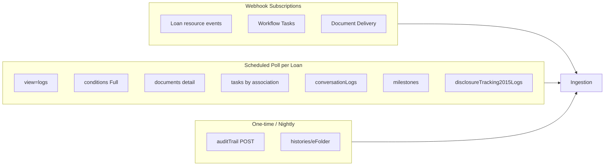

# Timeline API Strategy

Which Encompass APIs to call, when, and which webhooks to subscribe to for a complete loan activity timeline.

---

## Strategy overview

| Mode | Purpose |
|------|---------|
| **Webhooks (push)** | Near-real-time signals — always reconcile with GET |
| **Polling (pull)** | Catch Smart Client edits, log types without dedicated WH |
| **Backfill (batch)** | Historical field audit, onboarding existing loan book |



---

## Recommended webhook subscriptions

### Loan resource (minimum)

```json
{
  "resource": "Loan",
  "events": [
    "create",
    "update",
    "move",
    "delete",
    "milestone",
    "condition",
    "document",
    "attachment",
    "disclosureTracking",
    "lock",
    "unlock",
    "submit"
  ],
  "endpoint": "https://your-dashboard.example/webhooks/encompass/loan"
}
```

Illustrative — confirm against [Create Subscription](https://developer.icemortgagetechnology.com/developer-connect/reference/create-a-subscription) OpenAPI.

### Field changes (choose one strategy)

| Strategy | Subscription | Tradeoff |
|----------|--------------|----------|
| **Surgical** | `fieldchange` + `filters.attributes` (≤50 critical fields) | Lower volume; misses unsubscribed fields |
| **Full mirror** | `enhancedfieldchange` (no filters) | Complete audit; very high volume |
| **Hybrid** | `fieldchange` for dashboard fields + nightly `auditTrail` | Balance |

Do **not** attach filters to `enhancedfieldchange` — not supported (official).

### Workflow Tasks

```json
{
  "resource": "Workflow Tasks",
  "events": ["Create", "Update", "Delete", "Update"],
  "endpoint": "https://your-dashboard.example/webhooks/encompass/tasks"
}
```

Task Comment `Update` event available 24.2+ — include for comment stream.

**Note:** Multiple `Update` entries may refer to task vs task comment — distinguish via webhook payload resource subtype (confirm OpenAPI).

### Document Delivery (optional)

Subscribe if dashboard shows package delivery milestones:

- Resource: Document Delivery category
- Endpoint separate from Loan WH

### Enhanced Conditions category (optional duplicate)

Loan `condition` events may suffice. Separate Enhanced Conditions webhook category documented — avoid overlapping subscriptions in same domain (official constraint).

---

## REST API call matrix (per loan sync)

Execute after webhook or on poll schedule:

| Priority | API | Version | When |
|----------|-----|---------|------|
| P0 | `GET /encompass/v3/loans/{loanId}?view=entity` | V3 | Resolve `useEnhancedConditionIndicator`, current folder |
| P0 | `GET meta.resourceRef` from webhook | varies | Every webhook processing |
| P1 | `GET .../loans/{loanId}?view=logs` | V3 | Conversation, system logs, AUS |
| P1 | `GET .../conditions?view=Full` | V3 | If enhanced — comments + tracking |
| P1 | `GET .../conditions/{type}` | V1 | If standard — all types |
| P1 | `GET .../documents?view=detail` | V3 | Comments + status |
| P2 | `GET /workflow/v1/tasks?associationEntityId={loanId}` | V1 | Task + comment sync |
| P2 | `GET .../milestones` | V3 | Current milestone state |
| P2 | `GET .../conversationLogs` | V1 | Canonical conversation list |
| P3 | `GET .../disclosureTracking2015Logs` | V3 | TRID timeline |
| P3 | `GET .../histories/eFolder` | V3 | eFolder audit |
| P4 | `POST .../auditTrail` | V3 | Nightly backfill / gap fill |

---

## Webhook processing algorithm

```
1. Verify signature
2. INSERT raw payload (eventId UNIQUE)
3. If duplicate eventId → ACK and exit
4. GET meta.resourceRef with OAuth token
5. Map to LoanTimelineEvent(s)
6. UPSERT timeline rows (idempotent keys)
7. ACK webhook
```

On GET failure: retry with backoff; do not drop raw payload.

---

## Condition API branch

```
GET loan.useEnhancedConditionIndicator
  ├─ true  → V3 Enhanced Conditions endpoints
  └─ false → V1 Standard Conditions by type (underwriting, preliminary, postclosing)
```

Never call both families for the same loan.

---

## Conversation log dual path

| Path | Use |
|------|-----|
| V1 `GET conversationLogs` | Canonical list for timeline |
| V3 `PATCH conversationlogs` | Writes only |
| `view=logs` | Reconciliation cross-check |

Dedupe on log `id`.

---

## Initial loan onboarding (backfill)

When loan first linked to dashboard:

1. `GET loan?view=full` — entity + all logs
2. Full condition/document/milestone/task pull
3. `POST auditTrail` paginate until exhausted
4. `GET histories/eFolder`
5. `GET disclosureTracking2015Logs` + snapshots if needed
6. Register loan for ongoing webhooks

Store `lastSyncedAt` per resource type for incremental poll.

---

## Rate limits & volume

- **EFC on all loans** — design dedicated worker tier; consider fieldchange filters for UI-critical updates only
- **view=full** — avoid on recurring poll; use `view=logs` + targeted GETs
- **Webhook payload > 250 KB** — field change may not fire (release note); rely on auditTrail

---

## Permissions checklist

Integration persona needs read access to:

- [ ] Loan entity fields displayed on timeline
- [ ] eFolder documents and comments
- [ ] Conditions (standard or enhanced)
- [ ] Conversation logs
- [ ] Milestones and associates
- [ ] Disclosure tracking
- [ ] Workflow tasks associated to loans
- [ ] Webhook subscription management (admin)

**LENDER CONFIGURABLE** — validate with lender admin.

---

## Error handling

| HTTP | Action |
|------|--------|
| 401 | Refresh OAuth token |
| 403 | Log permission gap; surface monitoring alert |
| 404 | Resource deleted — mark timeline row superseded |
| 409 | Task delete conflict — retry with `force` if intentional |

---

## API version defaults

| Domain | Version |
|--------|---------|
| Loan | V3 |
| Conditions | V3 Enhanced / V1 Standard |
| Documents | V3 |
| Milestones | V3 |
| Tasks | V1 |
| Conversation logs | V3 write / V1 read |
| Disclosure | V3 |
| Webhooks | V1 |

See [02-apis/api-version-matrix.md](../02-apis/api-version-matrix.md).

---

## References

- [02-apis/API-INDEX.md](../02-apis/API-INDEX.md)
- [02-apis/webhook-api.md](../02-apis/webhook-api.md)
- [02-apis/api-production-guidelines.md](../02-apis/api-production-guidelines.md)
- [unified-loan-timeline.md](./unified-loan-timeline.md)
