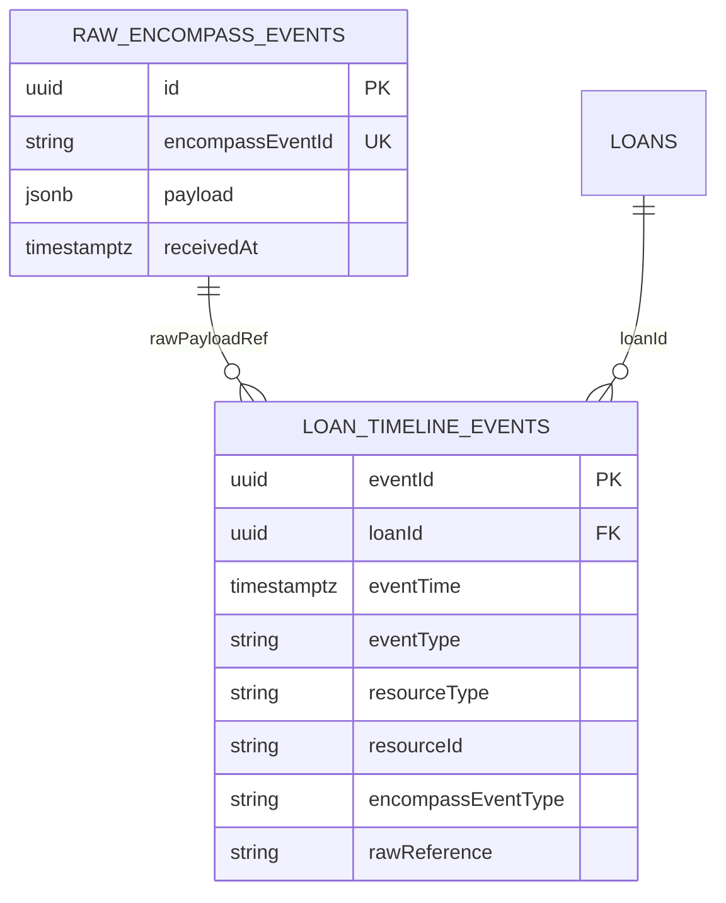

# Timeline Data Model

`LoanTimelineEvent` — internal projection model for the lending dashboard. Clearly separates **proposed internal fields** from **official Encompass fields**.

---

## LoanTimelineEvent schema

```json
{
  "loanId": "a1b2c3d4-e5f6-7890-abcd-ef1234567890",
  "eventId": "550e8400-e29b-41d4-a716-446655440000",
  "eventTime": "2026-03-15T14:30:00.000Z",
  "eventType": "CONDITION_COMMENTED",
  "resourceType": "CONDITION",
  "resourceId": "cond-guid-123",
  "actor": "Sarah",
  "actorType": "USER",
  "title": "Condition commented",
  "description": "Need donor statement.",
  "previousValue": null,
  "newValue": null,
  "source": "encompass:loan:v3:condition:comments",
  "rawReference": "/encompass/v3/loans/{loanId}/conditions/{conditionId}/comments",
  "encompassEventType": "condition",
  "encompassEventId": "webhook-event-id-from-encompass",
  "rawPayloadRef": "raw_store_uuid",
  "metadata": {
    "conditionTitle": "Large deposit documentation",
    "milestoneName": "Processing",
    "subResourceId": "comment-guid-456",
    "isExternal": false
  },
  "ingestedAt": "2026-03-15T14:30:05.000Z",
  "schemaVersion": "1.0"
}
```

---

## Field classification

| Field | Classification | Notes |
|-------|----------------|-------|
| `loanId` | **Internal** (Encompass loan GUID) | Official loan `id` — used as FK |
| `eventId` | **Internal** | Your UUID — primary key in timeline store |
| `eventTime` | **Mixed** | From official timestamps (`addedDate`, `eventTime`, `dateUtc`, etc.) |
| `eventType` | **Internal** | **NORMALIZED INTERNAL EVENT TYPE** — see taxonomy below |
| `resourceType` | **Internal** | Dashboard enum |
| `resourceId` | **Official** | Encompass GUID/ID of parent resource |
| `actor` | **Mixed** | Resolved from official `addedBy`, `meta.userId`, `user` |
| `actorType` | **Internal** | `USER`, `SYSTEM`, `BORROWER`, `INTEGRATION` |
| `title` | **Internal** | Display headline — generated by normalizer |
| `description` | **Mixed** | Often official comment text or generated diff summary |
| `previousValue` | **Official** (when present) | EFC / status change / audit |
| `newValue` | **Official** (when present) | EFC / status change / audit |
| `source` | **Internal** | Provenance tag for ingestion pipeline |
| `rawReference` | **Official path** | Encompass API path or `meta.resourceRef` |
| `encompassEventType` | **Official** | Webhook `eventType` when from webhook — null for poll-only |
| `encompassEventId` | **Official** | Webhook `eventId` |
| `rawPayloadRef` | **Internal** | FK to immutable raw store |
| `metadata` | **Internal** | Extensible bag; may contain official fields copied for indexing |
| `ingestedAt` | **Internal** | When your system recorded the event |
| `schemaVersion` | **Internal** | Migration version |

---

## Official Encompass webhook eventType values (Loan resource)

These are **official** — store in `encompassEventType`, not as primary `eventType`:

| Official `eventType` | Description |
|---------------------|-------------|
| `create` | Loan created |
| `update` | Loan updated |
| `delete` | Loan deleted |
| `move` | Loan moved / trashed |
| `submit` | Consumer Connect submit |
| `document` | Document subevents |
| `attachment` | Attachment created |
| `condition` | Condition subevents |
| `milestone` | Milestone subevents |
| `fieldchange` | Field change (filtered) |
| `enhancedfieldchange` | Enhanced field change |
| `change` | Attribute change |
| `lock` | Loan locked |
| `unlock` | Loan unlocked |
| `disclosureTracking` | Disclosure log (Beta) |
| `alertchange` | Alert change (Limited) |

Workflow Tasks resource uses `Create`, `Update`, `Delete`, Task Comment `Update` — official resource-level event names.

---

## Normalized internal event taxonomy

Unless marked **Official**, these are **NORMALIZED INTERNAL EVENT TYPE** values for `eventType`:

### Loan

| eventType | Typical source |
|-----------|----------------|
| `LOAN_CREATED` | WH `create` |
| `LOAN_UPDATED` | WH `update` |
| `LOAN_MOVED` | WH `move` |
| `LOAN_DELETED` | WH `delete` |
| `LOAN_SUBMITTED` | WH `submit` |
| `LOAN_FIELD_CHANGED` | WH `fieldchange` / `enhancedfieldchange` / auditTrail |
| `LOAN_ATTRIBUTE_CHANGED` | WH `change` |
| `LOAN_LOCK_CHANGED` | WH `lock` / `unlock` / Lock Action Log |

### Milestone

| eventType | Typical source |
|-----------|----------------|
| `MILESTONE_STARTED` | Milestone PATCH / History Log |
| `MILESTONE_UPDATED` | WH `milestone` → `updateMilestones` |
| `MILESTONE_FINISHED` | WH `milestone` → `finishMilestones` |
| `MILESTONE_COMMENTED` | Milestone `comments` field change |
| `MILESTONE_ASSOCIATE_ASSIGNED` | Milestone `loanAssociate` change |

### Task

| eventType | Typical source |
|-----------|----------------|
| `TASK_CREATED` | WH Task Create |
| `TASK_ASSIGNED` | Task PATCH assignee |
| `TASK_UPDATED` | WH Task Update |
| `TASK_COMPLETED` | Task status COMPLETED |
| `TASK_COMMENTED` | WH Task Comment Update |
| `SUBTASK_CREATED` | WH Subtask Create |
| `SUBTASK_UPDATED` | WH Subtask Update |
| `SUBTASK_COMMENTED` | Subtask comments poll |

### Condition

| eventType | Typical source |
|-----------|----------------|
| `CONDITION_CREATED` | WH `condition` create |
| `CONDITION_REQUESTED` | Status → Requested (**LENDER CONFIGURABLE** label) |
| `CONDITION_UPDATED` | WH `condition` update |
| `CONDITION_COMMENTED` | Comments API / `addCommentsToConditions` |
| `CONDITION_TRACKING_UPDATED` | Tracking API / `updateStatusTrackingInConditions` |
| `CONDITION_REVIEWED` | Comment `reviewedDate` set |
| `CONDITION_RE_REQUESTED` | Status regression — internal derivation |
| `CONDITION_SATISFIED` | `statusOpen=false` or cleared status |
| `CONDITION_REMOVED` | `isRemoved=true` |

### Document

| eventType | Typical source |
|-----------|----------------|
| `DOCUMENT_CREATED` | WH `createDocuments` |
| `DOCUMENT_UPLOADED` | WH `attachment` create |
| `DOCUMENT_UPDATED` | WH `updateDocuments` |
| `DOCUMENT_COMMENTED` | Document comments change |
| `DOCUMENT_STATUS_CHANGED` | WH `documentStatusUpdates` |
| `DOCUMENT_ATTACHMENT_ASSIGNED` | WH `assignAttachmentsToDocument` |
| `DOCUMENT_ASSIGNED_TO_CONDITION` | WH `assignDocument` |

### Communication

| eventType | Typical source |
|-----------|----------------|
| `CONVERSATION_LOG_CREATED` | Conversation Log PATCH / poll |
| `CONVERSATION_LOG_UPDATED` | `updatedDateUtc` change |
| `CONVERSATION_LOG_COMMENT_ADDED` | `commentList[]` item |
| `CONVERSATION_ALERT_CREATED` | `alerts[]` added |
| `CONVERSATION_ALERT_COMPLETED` | `followedUpDate` set |
| `NOTE_CREATED` | Trade / Contact notes |
| `EMAIL_LOG_CREATED` | HTML Email Log |
| `AUS_RUN_LOGGED` | AUS Tracking Log |

### Disclosure & delivery

| eventType | Typical source |
|-----------|----------------|
| `DISCLOSURE_LOG_CREATED` | WH `disclosureTracking` / POST disclosure log |
| `DISCLOSURE_LOG_UPDATED` | PATCH disclosure log |
| `DISCLOSURE_DELIVERED` | Document delivery + disclosure dates |
| `DOCUMENT_DELIVERY_INITIATED` | Document Delivery WH |

### Legacy alias

| eventType | Notes |
|-----------|-------|
| `FIELD_CHANGED` | Alias for `LOAN_FIELD_CHANGED` — pick one in implementation |
| `LOCK_CHANGED` | Rate lock field — prefer `LOAN_FIELD_CHANGED` with field map |

---

## resourceType enum (internal)

```
LOAN | LOAN_FIELD | MILESTONE | TASK | SUBTASK | CONDITION | DOCUMENT | ATTACHMENT |
CONVERSATION_LOG | DISCLOSURE_LOG | SYSTEM_LOG | TRADE | BORROWER_CONTACT | DELIVERY
```

---

## actorType enum (internal)

| Value | When |
|-------|------|
| `USER` | `meta.userId`, `addedBy`, staff user fields |
| `SYSTEM` | HTML Email Log, automated conditions, system logs |
| `BORROWER` | Consumer Connect submit |
| `INTEGRATION` | API service account — derive from OAuth client mapping |

---

## Entity relationship (timeline store)



---

## Versioning

Increment `schemaVersion` when:

- Adding required fields
- Renaming `eventType` values (provide mapping table)
- Changing `metadata` conventions

Never mutate raw store schema retroactively — append-only.

---

## References

- [comment-source-matrix.md](./comment-source-matrix.md)
- [unified-loan-timeline.md](./unified-loan-timeline.md)
- [02-apis/webhook-api.md](../02-apis/webhook-api.md)
