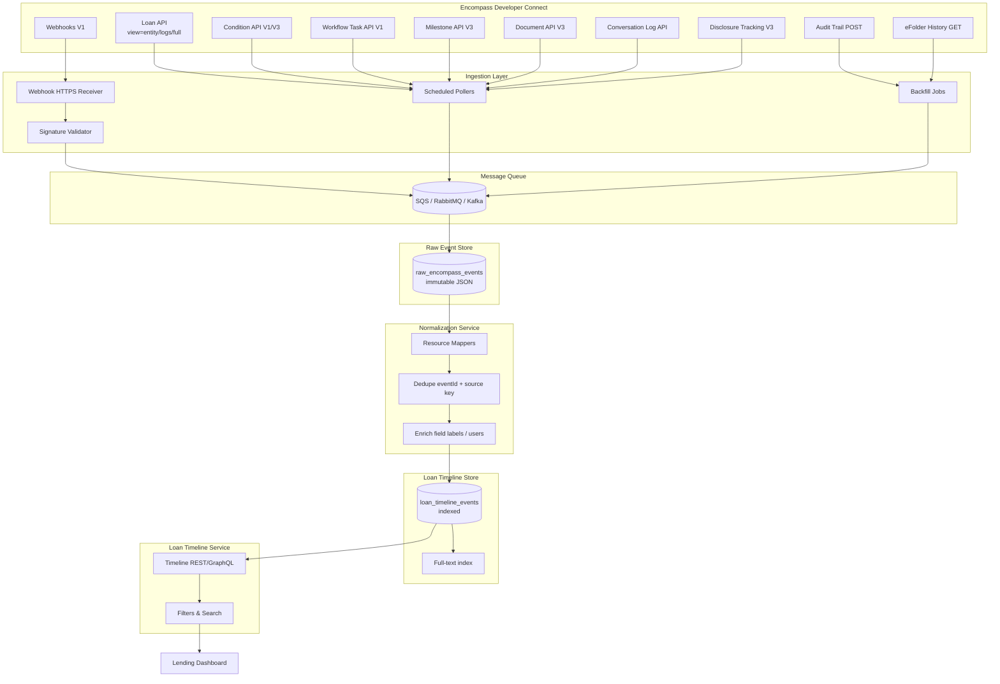
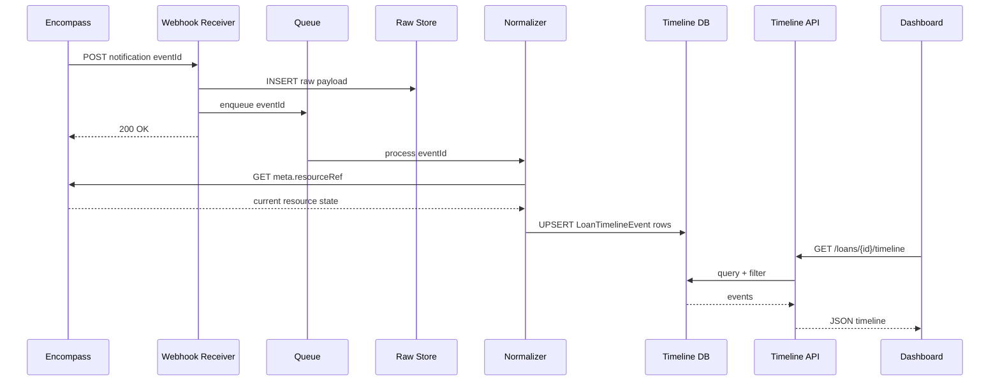

# Unified Loan Timeline — Architecture

End-to-end design for answering **"What happened on this loan?"** by aggregating Encompass sources into one chronological stream.

---

## Problem statement

Encompass stores activity across:

- Loan entity updates and **logs** (`view=logs`)
- **Conditions** (comments, tracking, status)
- **Documents** (comments, status, attachments)
- **Workflow tasks** (comments, disposition)
- **Milestones** (current state + system history)
- **Conversation logs**
- **Disclosure tracking**
- **Field changes** (webhooks + audit)
- **Delivery** and **email** system records

No single API returns this aggregate. The dashboard requires an **ingestion → normalization → timeline service** architecture.

---

## Architecture diagram

---

## Component responsibilities

### Webhook receiver

- Validate signing key on every POST (official requirement)
- Return 2xx quickly; enqueue payload
- Store raw body in `raw_encompass_events` before ack

### Scheduled pollers

| Poller | Frequency | Source |
|--------|-----------|--------|
| Loan logs | 5–15 min | `view=logs` |
| Conditions | 5–15 min | `GET conditions?view=Full` (if EC) |
| Documents | 15–30 min | `GET documents?view=detail` |
| Tasks | 5–15 min | `tasks?associationEntityId={loanId}` |
| Milestones | 15 min | `GET milestones` |
| Conversation logs | 5–15 min | V1 list |

Webhooks are not guaranteed real-time (official note on lock events applies broadly).

### Backfill jobs

- `POST auditTrail` with pagination for historical field changes
- `GET histories/eFolder` for document audit
- Disclosure snapshots for compliance point-in-time

### Normalization

- Map each raw payload → zero or more `LoanTimelineEvent` rows
- Preserve **official** Encompass identifiers alongside **internal** taxonomy
- Never delete raw payloads

### Timeline service

- Query by `loanId` + filters
- Sort by `eventTime` descending (default)
- Support cursor pagination on `(eventTime, eventId)`

---

## Data flow (webhook path)

---

## Source preservation (question 20)

Every normalized event MUST include:

| Field | Purpose |
|-------|---------|
| `source` | API family + version (e.g., `encompass:loan:v3:condition`) |
| `rawReference` | Encompass URL or path to authoritative resource |
| `rawEventId` | Official `eventId` from webhook when applicable |
| `rawPayloadRef` | FK to `raw_encompass_events.id` |

Reconstruct original Encompass state by following `rawReference` — timeline rows are a **projection**, not a replacement.

---

## Multi-event fan-out

One webhook may produce multiple timeline rows:

| Webhook | Fan-out |
|---------|---------|
| `enhancedfieldchange` | One row per `fieldChangeEvents[]` item |
| `condition` update | Status + comment + tracking rows if multiple aspects changed |
| `document` updateDocuments | Status change + comment additions |
| `milestone` finishMilestones | Finish event + optional comment update |

---

## Idempotency

| Key | Use |
|-----|-----|
| Webhook `eventId` | Primary dedupe for webhook-sourced rows |
| `{source}:{resourceType}:{resourceId}:{subResourceId}:{eventTime}:{eventType}` | Poll-sourced dedupe |
| Content hash | Comment text re-sync |

---

## Stage / milestone correlation

Attach `metadata.milestoneName` to events by:

1. Reading current milestone state at ingest time
2. Mapping `eventTime` to active milestone from Milestone History Log
3. Storing pipeline stage from loan folder / milestone at index time

Milestone name on webhook payload: partial (`title` in milestone subevents) — enrich via GET.

---

## What the unified timeline includes

From the core requirement checklist:

| Requirement | Primary source(s) |
|-------------|-------------------|
| Loan changes | `update`, `create`, `move` webhooks |
| Field changes | EFC / fieldchange / auditTrail |
| Milestone changes | Milestone API + Milestone History Log + `milestone` WH |
| Task create/assign/complete | Workflow Task API + WH |
| Task comments | Task comments API + Task Comment WH |
| Condition create/status/comments/tracking | Enhanced Condition API + `condition` WH |
| Documents add/upload/comments/condition assign | Document + Attachment + Condition APIs |
| Conversation logs | Conversation Log API + `view=logs` |
| Notes | Trade / Contact notes (linked loans) |
| Email logs | HTML Email Log via `view=logs` |
| Disclosure events | Disclosure Tracking API + WH (Beta) |
| Document delivery | Document Delivery WH + disclosure side effects |
| System history | System logs + eFolder history + webhook history |

---

## Deployment considerations

- **Persona-scoped GET** — integration user must have field/log visibility matching dashboard needs
- **Volume** — EFC on all loans may require dedicated worker pool
- **Loan lock** — write APIs inherit lock; ingestion is read-heavy
- **Enhanced vs Standard conditions** — branch pollers on `useEnhancedConditionIndicator`

---

## References

- [timeline-data-model.md](./timeline-data-model.md)
- [timeline-api-strategy.md](./timeline-api-strategy.md)
- [search-strategy.md](./search-strategy.md)
- [01-domain/events.md](../01-domain/events.md)
