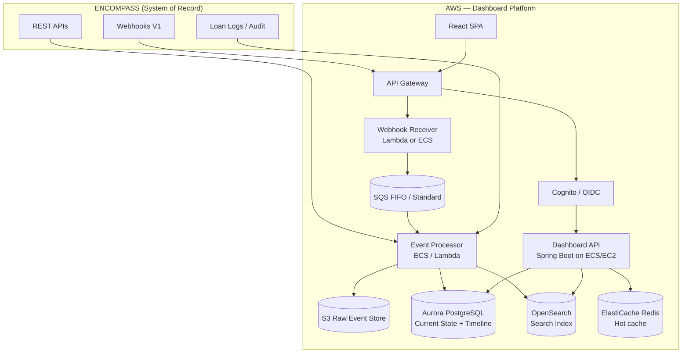

# Lending Dashboard Architecture

Production-grade architecture for a **read-optimized operational dashboard and intelligence layer** on top of **ICE Encompass Developer Connect**.

**Encompass remains the system of record.** This application does not replace Encompass — it mirrors, aggregates, and enriches data for faster operations, search, SLA visibility, and unified activity timelines.

---

## Product capabilities

| Capability | Primary data source |
|------------|---------------------|
| Loan Search | Operational DB + Search Index (Loan Pipeline sync) |
| Loan Overview | Current State (loan entity projection) |
| Borrower Profile | Application / borrower projection |
| Loan Team | Associates + milestone-free roles |
| Loan Stage | Current milestone + folder |
| Milestone Progress | Milestone projection + derived SLA |
| Condition Dashboard | Condition projection + derived aging |
| Document Dashboard | Document + attachment metadata |
| Task Dashboard | Workflow task projection |
| Communication Timeline | Timeline Store (conversation logs, emails) |
| Notes | Entity-scoped notes (trade/contact) + conversation logs |
| Comments | Resource comments (denormalized for read) |
| Activity Timeline | Timeline Store (all event types) |
| Disclosure Status | Disclosure projection |
| Loan Aging | **Derived** from milestone/field snapshots |
| SLA | **Derived** from milestone `days` vs `duration` |
| Processor / UW Workload | **Derived** aggregates on tasks + associates |
| Outstanding Conditions | **Derived** filter on `status_open` |
| Condition / Document Aging | **Derived** from `status_date` |
| Borrower Communication History | Timeline + conversation log projection |
| Field Change History | Timeline + `field_change` table |
| Audit Timeline | Timeline Store + raw event store |

---

## Documentation map

| Document | Focus |
|----------|-------|
| [system-architecture.md](./system-architecture.md) | AWS topology, store roles, Mermaid diagrams |
| [data-model.md](./data-model.md) | Tables/entities, Encompass vs derived fields |
| [event-ingestion.md](./event-ingestion.md) | Webhooks, SQS, processors, polling |
| [timeline-service.md](./timeline-service.md) | Normalization, `LoanTimelineEvent`, fan-out |
| [search.md](./search.md) | OpenSearch, loan search, timeline full-text |
| [security.md](./security.md) | PII, encryption, RBAC, banking controls |
| [scalability.md](./scalability.md) | 100k+ loans, millions of events |
| [reconciliation.md](./reconciliation.md) | Idempotency, replay, drift correction |
| [api-design.md](./api-design.md) | Dashboard REST APIs (Spring Boot) |
| [dashboard-ux.md](./dashboard-ux.md) | Loan page layout, widgets |
| [observability.md](./observability.md) | Metrics, tracing, alerts |
| [failure-handling.md](./failure-handling.md) | Retries, DLQ, degradation |

---

## Prior knowledge base

| Phase | Location |
|-------|----------|
| Domain model | [01-domain/](../01-domain/README.md) |
| API mapping | [02-apis/API-INDEX.md](../02-apis/API-INDEX.md) |
| Communications & timeline sources | [03-loan-communications/](../03-loan-communications/README.md) |

---

## Architecture (summary)

---

## Store roles (one paragraph each)

| Store | Role |
|-------|------|
| **System of Record** | Encompass — all writes of loan truth happen here (or via Encompass UI). Dashboard reads; optional write-back is out of scope for v1 read model. |
| **Cache** | Redis — hot loan overview, session-scoped fragments, rate limiting. TTL 1–15 min; invalidated on webhook for `loanId`. |
| **Operational Database** | Aurora PostgreSQL — normalized **current state** projections (loan, conditions, tasks, documents) optimized for dashboard queries. |
| **Event Store** | S3 + `webhook_event` table — **immutable** raw Encompass payloads for compliance replay. |
| **Search Index** | OpenSearch — loan pipeline search, borrower name, full-text timeline/comment search across millions of events. |
| **Timeline Store** | Aurora `loan_timeline_event` (+ optional OpenSearch mirror) — append-oriented activity stream for UI and audit views. |
| **Analytics Store** | Aurora read replicas or Redshift / Athena on S3 — workload aggregates, SLA reporting, aging dashboards. Async ETL from operational DB. |

Details: [system-architecture.md](./system-architecture.md).

---

## Field provenance rule

Every column in the operational DB is tagged in schema docs as:

| Tag | Example |
|-----|---------|
| `ENCOMPASS` | `milestone.start_date` ← official `startDate` |
| `DERIVED` | `milestone_age_days` ← computed from `start_date` and `now()` |
| `INTERNAL` | `sync_version`, `last_webhook_at` |

See [data-model.md](./data-model.md).

---

## Technology stack (recommended)

| Layer | Technology |
|-------|------------|
| Dashboard API | Java 21, Spring Boot 3.4, Spring Security |
| Database | Aurora PostgreSQL 16 |
| Queue | SQS (+ DLQ) |
| Raw events | S3 (SSE-KMS), Glacier for retention tier |
| Search | Amazon OpenSearch |
| Cache | ElastiCache Redis |
| Compute | ECS Fargate (API + workers) or EC2 (existing pattern) |
| Frontend | React 19, TanStack Query |
| Secrets | AWS Secrets Manager |
| OAuth to Encompass | Client credentials / authorization code per ICE docs |

---

## Non-goals (v1 read model)

- Replacing Encompass UI for loan editing
- Storing attachment file bytes (metadata + Encompass URLs only)
- Real-time sub-second sync (eventual consistency with SLA target, e.g. p95 < 60s)

---

## Official Encompass references

- [Developer Connect](https://developer.icemortgagetechnology.com/developer-connect)
- [Webhooks](https://developer.icemortgagetechnology.com/developer-connect/reference/webhook)
- [Loan Management](https://developer.icemortgagetechnology.com/developer-connect/reference/loan-management)
