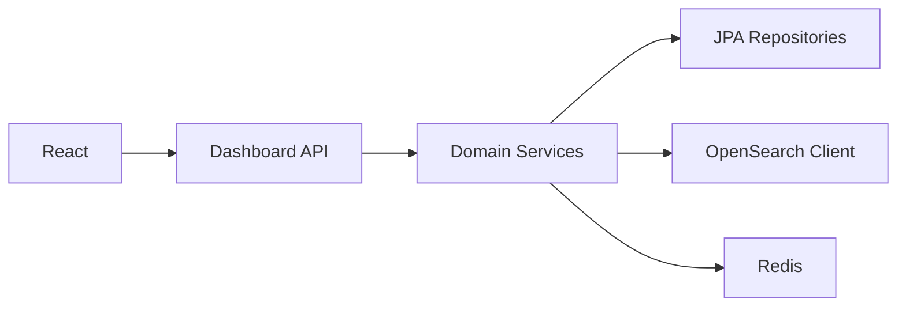

# Dashboard API Design

Spring Boot **Backend-for-Frontend** REST API — read-only operational endpoints. No Encompass calls on default request path.

Base path: `/api/v1`

---

## API layers



---

## Resource endpoints

### Loan search & overview

| Method | Path | Description |
|--------|------|-------------|
| GET | `/loans/search` | OpenSearch loan picker |
| GET | `/loans/{loanId}/overview` | Header + stage + amounts |
| GET | `/loans/{loanId}/team` | Associates + roles |
| GET | `/loans/{loanId}/borrowers` | Borrower profile |

### Milestones & stage

| Method | Path | Description |
|--------|------|-------------|
| GET | `/loans/{loanId}/milestones` | Progress strip + SLA fields |
| GET | `/loans/{loanId}/stage` | Current stage summary |

### Conditions

| Method | Path | Description |
|--------|------|-------------|
| GET | `/loans/{loanId}/conditions` | List with `is_outstanding`, `condition_age_days` |
| GET | `/loans/{loanId}/conditions/summary` | Count by category |
| GET | `/loans/{loanId}/conditions/{id}` | Detail + comments + tracking |

### Documents

| Method | Path | Description |
|--------|------|-------------|
| GET | `/loans/{loanId}/documents` | Document dashboard |
| GET | `/loans/{loanId}/documents/{id}` | Detail + attachments + comments |
| POST | `/loans/{loanId}/documents/{id}/download-url` | Proxied short-lived URL |

### Tasks

| Method | Path | Description |
|--------|------|-------------|
| GET | `/loans/{loanId}/tasks` | Task dashboard |
| GET | `/users/{userId}/tasks` | Processor workload |

### Communications & timeline

| Method | Path | Description |
|--------|------|-------------|
| GET | `/loans/{loanId}/timeline` | Activity timeline (paginated) |
| GET | `/loans/{loanId}/timeline/communications` | Borrower comm history preset |
| GET | `/loans/{loanId}/timeline/audit` | Field + lock + disclosure audit |
| GET | `/loans/{loanId}/conversation-logs` | Conversation log list |
| GET | `/loans/{loanId}/field-changes` | Field change tab |

### Disclosures & aging

| Method | Path | Description |
|--------|------|-------------|
| GET | `/loans/{loanId}/disclosures` | Disclosure status |
| GET | `/loans/{loanId}/aging` | Loan + condition + document aging |

### Workload (managers)

| Method | Path | Description |
|--------|------|-------------|
| GET | `/workload/processors` | Open tasks + conditions by processor |
| GET | `/workload/underwriters` | UW queue metrics |

### Admin

| Method | Path | Description |
|--------|------|-------------|
| POST | `/admin/loans/{loanId}/sync` | Trigger Encompass reconciliation |
| GET | `/admin/integration/errors` | Recent `integration_error` |

---

## DTO example — Loan overview

```java
public record LoanOverviewDto(
    UUID loanId,
    String loanNumber,           // ENCOMPASS
    String borrowerDisplayName,  // DERIVED
    BigDecimal loanAmount,       // ENCOMPASS
    String purpose,              // ENCOMPASS
    String program,              // ENCOMPASS
    String currentStage,         // DERIVED
    int loanAgeDays,             // DERIVED
    int openConditionCount,      // DERIVED
    int overdueTaskCount,        // DERIVED
    Instant lastActivityAt,      // DERIVED from timeline
    Instant syncedAt             // INTERNAL
) {}
```

```java
@RestController
@RequestMapping("/api/v1/loans")
@RequiredArgsConstructor
public class LoanController {

  private final LoanOverviewService overviewService;

  @GetMapping("/{loanId}/overview")
  @PreAuthorize("hasPermission(#loanId, 'Loan', 'READ')")
  public LoanOverviewDto overview(@PathVariable UUID loanId) {
    return overviewService.getOverview(loanId);
  }
}
```

---

## Timeline query parameters

```
GET /api/v1/loans/{loanId}/timeline
  ?from=2026-01-01T00:00:00Z
  &to=2026-03-31T23:59:59Z
  &eventType=CONDITION_COMMENTED,TASK_COMPLETED
  &resourceType=CONDITION
  &actor=Robert
  &q=donor
  &cursor=2026-03-15T10:32:00Z:550e8400-e29b-41d4-a716-446655440000
  &limit=50
```

Response:

```json
{
  "items": [ { /* LoanTimelineEventDto */ } ],
  "nextCursor": "2026-03-15T09:20:00Z:...",
  "hasMore": true
}
```

---

## Error model

```json
{
  "error": "LOAN_NOT_FOUND",
  "message": "Loan not found or access denied",
  "traceId": "abc-123"
}
```

| HTTP | When |
|------|------|
| 400 | Invalid query |
| 401 | Unauthenticated |
| 403 | Not authorized for loan |
| 404 | Loan not found (or hidden as 403) |
| 503 | OpenSearch down — degraded mode header |

---

## Versioning

- URL version `/api/v1`
- `Accept-Version` header for minor DTO additions
- Breaking changes → `/api/v2`

---

## OpenAPI

Generate via SpringDoc:

```xml
<dependency>
  <groupId>org.springdoc</groupId>
  <artifactId>springdoc-openapi-starter-webmvc-ui</artifactId>
</dependency>
```

Publish at `/swagger-ui.html` — disabled in production or auth-gated.

---

## References

- [dashboard-ux.md](./dashboard-ux.md)
- [timeline-service.md](./timeline-service.md)
- [security.md](./security.md)
