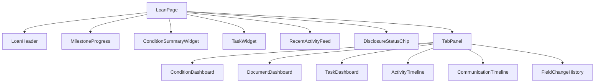

# Dashboard UX — Loan Page

React SPA layout for the operational loan file view. Data from [api-design.md](./api-design.md) — no live Encompass calls.

---

## Loan page wireframe

```
+--------------------------------------------------+
| LOAN #123456                          [Search 🔍]|
| John Smith | $400,000 | Purchase | Conventional |
| LO: Mike | Processor: Sarah | UW: Robert         |
+--------------------------------------------------+
| Stage: Conditional Approval     Age: 18 days     |
| ● SLA: Cond Approval — 2 days remaining          |
+--------------------------------------------------+
| [Overview] [Conditions] [Docs] [Tasks] [Timeline]|
+--------------------------------------------------+

=== Overview tab (default) ===

Milestones
--------------------------------
Started          ✓  Mar 1
Processing       ✓  Mar 4  (3d)
Submittal        ✓  Mar 8
Cond Approval    ●  Mar 10 — current
Resubmittal      ○
Approval         ○
Clear to Close   ○
Docs             ○
Funding          ○
Shipping         ○
Completion       ○

Conditions (summary)                Tasks (open)
--------------------------------    --------------------------------
Income           2 open  ⚠ aging   Sarah   Verify Income      Due Today
Assets           1 open              Robert  Review Conditions  Tomorrow
Credit           0 open              Lisa    Order Title        Mar 18
Property         1 open

Recent Activity                     Disclosure
--------------------------------    --------------------------------
10:32 Robert commented on cond.     LE delivered: Mar 5 ✓
10:15 Borrower uploaded document    CD sent: pending
09:50 Condition re-requested
09:20 Task completed
08:40 Milestone updated
```

---

## Component map



| Component | API |
|-----------|-----|
| `LoanHeader` | `GET /loans/{id}/overview`, `/team` |
| `MilestoneProgress` | `GET /loans/{id}/milestones` |
| `ConditionSummaryWidget` | `GET /loans/{id}/conditions/summary` |
| `TaskWidget` | `GET /loans/{id}/tasks?status=open` |
| `RecentActivityFeed` | `GET /loans/{id}/timeline?limit=10` |
| `ActivityTimeline` | `GET /loans/{id}/timeline` + filters |
| `CommunicationTimeline` | `GET /loans/{id}/timeline/communications` |

---

## Visual encoding

| Signal | UI |
|--------|-----|
| Milestone complete | ✓ green check |
| Current milestone | ● filled circle, bold |
| Future milestone | ○ empty |
| SLA breached | Red badge on milestone |
| Condition aging > 3d | ⚠ amber on row |
| Task overdue | Red "Overdue" chip |
| System event | Gray icon (email, lock) |
| User comment | Blue icon |
| Field change | Purple icon |

---

## Milestone progress component

Data: `MilestoneDto[]` with **ENCOMPASS** + **DERIVED** fields:

```typescript
interface MilestoneDto {
  name: string;              // ENCOMPASS
  startDate: string | null;  // ENCOMPASS
  doneIndicator: boolean;    // ENCOMPASS
  milestoneAgeDays: number;  // DERIVED
  slaBreached: boolean;      // DERIVED
  daysExpected: number;      // ENCOMPASS
}
```

Render horizontally on desktop; vertical stack on mobile.

---

## Condition dashboard tab

Table columns:

| Column | Source |
|--------|--------|
| Category | ENCOMPASS |
| Title | ENCOMPASS |
| Status | ENCOMPASS |
| Age | DERIVED `condition_age_days` |
| Assigned docs | ENCOMPASS count |
| Last comment | DERIVED — latest `condition_comment` |
| Owner | ENCOMPASS |

Filters: category, outstanding only, aging > N days.

Click row → drawer with comments thread + tracking checklist (read-only mirror).

---

## Task dashboard tab

| Column | Source |
|--------|--------|
| Assignee | DERIVED display name |
| Task | ENCOMPASS `name` |
| Due | ENCOMPASS `due_date` |
| Status | ENCOMPASS |
| Overdue | DERIVED `task_overdue` |

Group by assignee for manager view.

---

## Activity timeline tab

Full-height virtualized list (react-window) — millions of events per loan rare but possible.

Filter bar:

- Date range
- Event type multi-select
- Actor
- Search text (`q`)

Event row:

```
[icon] 10:32 AM  Robert  Condition commented
       "Need donor statement." — Income > Large deposit
       [View in Encompass ↗]  (links rawReference — optional deep link pattern)
```

**Sync indicator:** "Last synced 42s ago" from `loan.syncedAt` — INTERNAL.

---

## Communication timeline tab

Subset filter — conversation logs, email logs, notes. Shows contact name/phone (masked per [security.md](./security.md)).

---

## Field change / audit tab

Table: field label (DERIVED dictionary), previous → new, user, time.

Suppress noise: hide cascading derived fields unless "Show all" toggled.

---

## Workload views (separate pages)

### Processor dashboard

- My open tasks (due today first)
- My loans with outstanding conditions
- Conversation alerts due (from conversation log projection)

### Underwriter dashboard

- Loans in Cond Approval / Resubmittal
- Open UW conditions by aging

API: `/users/{id}/tasks`, `/workload/processors`, OpenSearch aggregates.

---

## React data fetching

```typescript
// TanStack Query — parallel load on loan page
const { data: overview } = useQuery({
  queryKey: ['loan', loanId, 'overview'],
  queryFn: () => api.getOverview(loanId),
  staleTime: 60_000,
});

const { data: timeline } = useInfiniteQuery({
  queryKey: ['loan', loanId, 'timeline', filters],
  queryFn: ({ pageParam }) => api.getTimeline(loanId, { ...filters, cursor: pageParam }),
  getNextPageParam: (last) => last.nextCursor,
});
```

Invalidate on WebSocket/SSE sync notification (optional future) or poll `syncedAt` every 60s.

---

## Empty & error states

| State | UX |
|-------|-----|
| Loan syncing (new) | Skeleton + "Syncing from Encompass…" |
| Stale > 2h | Amber banner "Data may be outdated — [Refresh]" |
| No permission | 403 page — no loan existence leak |
| Encompass deleted | "Loan archived in Encompass" |

---

## Accessibility

- Milestone progress: `aria-current="step"` on active stage
- Timeline: semantic `<time datetime>` elements
- Color not sole indicator for SLA breach — include text

---

## References

- [api-design.md](./api-design.md)
- [03-loan-communications/comment-source-matrix.md](../03-loan-communications/comment-source-matrix.md)
