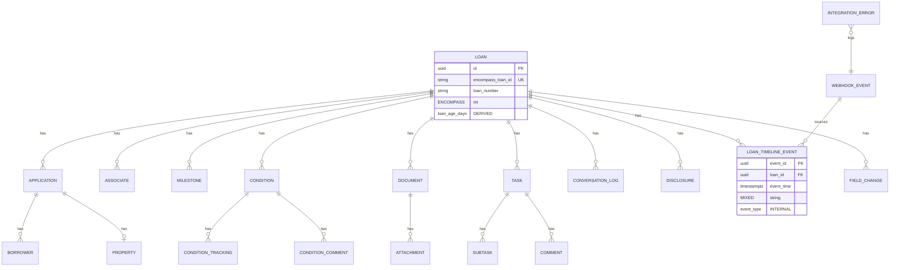

# Data Model

Aurora PostgreSQL schema for **current-state projections** and **timeline**. Every field is classified:

| Tag | Meaning |
|-----|---------|
| **ENCOMPASS** | Copied from official Developer Connect API field (document source path) |
| **DERIVED** | Computed by dashboard ingestion or query time |
| **INTERNAL** | Platform-only — never sent to Encompass |

---

## Entity relationship diagram



---

## `loan`

Current-state loan header for overview and search.

| Column | Type | Tag | Encompass source |
|--------|------|-----|------------------|
| `id` | UUID PK | INTERNAL | — |
| `encompass_loan_id` | VARCHAR(36) UK | ENCOMPASS | `loan.id` |
| `loan_number` | VARCHAR(64) | ENCOMPASS | `loanNumber` |
| `loan_folder` | VARCHAR(128) | ENCOMPASS | `loanFolder` |
| `loan_amount` | DECIMAL(15,2) | ENCOMPASS | Field / V3 path — map via field dictionary |
| `purpose` | VARCHAR(64) | ENCOMPASS | `property.loanPurposeType` or field map |
| `program` | VARCHAR(128) | ENCOMPASS | Field map — **LENDER CONFIGURABLE** |
| `occupancy` | VARCHAR(64) | ENCOMPASS | Application/property |
| `use_enhanced_conditions` | BOOLEAN | ENCOMPASS | `useEnhancedConditionIndicator` |
| `current_milestone_id` | UUID FK | DERIVED | First incomplete milestone by order |
| `current_milestone_name` | VARCHAR(128) | ENCOMPASS/DERIVED | `milestones[].name` of current stage |
| `loan_stage_display` | VARCHAR(128) | DERIVED | UX label from milestone + folder |
| `loan_age_days` | INT | DERIVED | `days between loan.created_at_enc and now()` |
| `days_in_current_stage` | INT | DERIVED | From current milestone `start_date` |
| `created_at_enc` | TIMESTAMPTZ | ENCOMPASS | Loan create / earliest known |
| `updated_at_enc` | TIMESTAMPTZ | ENCOMPASS | Last Encompass modification |
| `sync_version` | BIGINT | INTERNAL | Monotonic per loan |
| `last_webhook_at` | TIMESTAMPTZ | INTERNAL | Last processed webhook |
| `last_poll_at` | TIMESTAMPTZ | INTERNAL | Last successful poller sync |
| `is_deleted` | BOOLEAN | INTERNAL | Trashed in Encompass (`move` webhook) |
| `raw_entity_hash` | VARCHAR(64) | INTERNAL | SHA-256 of canonical entity JSON |

---

## `borrower`

| Column | Type | Tag | Encompass source |
|--------|------|-----|------------------|
| `id` | UUID PK | INTERNAL | — |
| `application_id` | UUID FK | INTERNAL | — |
| `encompass_borrower_id` | VARCHAR(64) | ENCOMPASS | Application borrower id |
| `first_name` | VARCHAR(128) | ENCOMPASS | Field 36 / V3 path |
| `last_name` | VARCHAR(128) | ENCOMPASS | Field 37 |
| `email` | VARCHAR(256) | ENCOMPASS | **PII** |
| `phone` | VARCHAR(32) | ENCOMPASS | **PII** |
| `ssn_last_four` | CHAR(4) | DERIVED | Masked — never store full SSN unless policy requires tokenized vault |
| `is_primary` | BOOLEAN | ENCOMPASS | Borrower pair index |
| `display_name` | VARCHAR(256) | DERIVED | `first_name + ' ' + last_name` |

---

## `application`

Borrower pair + property grouping per Encompass application model.

| Column | Type | Tag | Encompass source |
|--------|------|-----|------------------|
| `id` | UUID PK | INTERNAL | — |
| `loan_id` | UUID FK | INTERNAL | — |
| `encompass_application_id` | VARCHAR(64) | ENCOMPASS | Application id in loan |
| `application_index` | INT | ENCOMPASS | Pair index |
| `property_id` | UUID FK | INTERNAL | — |

---

## `property`

| Column | Type | Tag | Encompass source |
|--------|------|-----|------------------|
| `id` | UUID PK | INTERNAL | — |
| `street` | VARCHAR(256) | ENCOMPASS | **PII** |
| `city` | VARCHAR(128) | ENCOMPASS | |
| `state` | CHAR(2) | ENCOMPASS | |
| `postal_code` | VARCHAR(16) | ENCOMPASS | |
| `appraised_value` | DECIMAL(15,2) | ENCOMPASS | Field map |
| `purchase_price` | DECIMAL(15,2) | ENCOMPASS | Field map |

---

## `associate`

Loan team from milestones + milestone-free roles + V1 associates.

| Column | Type | Tag | Encompass source |
|--------|------|-----|------------------|
| `id` | UUID PK | INTERNAL | — |
| `loan_id` | UUID FK | INTERNAL | — |
| `role_name` | VARCHAR(128) | ENCOMPASS | `loanAssociate.role` — **LENDER CONFIGURABLE** |
| `user_entity_id` | VARCHAR(64) | ENCOMPASS | `user.entityId` |
| `user_display_name` | VARCHAR(256) | DERIVED | Resolved via Users API cache |
| `associate_type` | VARCHAR(16) | ENCOMPASS | `User` / `Group` |
| `milestone_id` | UUID FK | ENCOMPASS | Null if milestone-free role |
| `is_primary_team_member` | BOOLEAN | ENCOMPASS | Milestone PATCH context |

**Derived workload views** join `associate.user_entity_id` → open `task` + open `condition` counts.

---

## `milestone`

| Column | Type | Tag | Encompass source |
|--------|------|-----|------------------|
| `id` | UUID PK | INTERNAL | — |
| `loan_id` | UUID FK | INTERNAL | — |
| `encompass_milestone_id` | VARCHAR(64) UK | ENCOMPASS | `milestones[].id` |
| `name` | VARCHAR(128) | ENCOMPASS | `name` — **LENDER CONFIGURABLE** |
| `start_date` | TIMESTAMPTZ | ENCOMPASS | `startDate` |
| `days_expected` | INT | ENCOMPASS | `days` — SLA target |
| `duration_actual` | INT | ENCOMPASS | `duration` |
| `done_indicator` | BOOLEAN | ENCOMPASS | `doneIndicator` |
| `reviewed_indicator` | BOOLEAN | ENCOMPASS | `reviewedIndicator` |
| `comments` | TEXT | ENCOMPASS | `comments` (single string) |
| `sort_order` | INT | DERIVED | From milestone template order |
| `milestone_age_days` | INT | DERIVED | `days since start_date` (if not done) |
| `sla_breached` | BOOLEAN | DERIVED | `milestone_age_days > days_expected` when `days_expected > 0` |
| `sla_days_remaining` | INT | DERIVED | `days_expected - milestone_age_days` |

---

## `task`

Workflow Task API projection (not Encompass milestone tasks).

| Column | Type | Tag | Encompass source |
|--------|------|-----|------------------|
| `id` | UUID PK | INTERNAL | — |
| `encompass_task_id` | VARCHAR(64) UK | ENCOMPASS | Task `id` |
| `loan_id` | UUID FK | DERIVED | From `workEntity` / association |
| `name` | VARCHAR(512) | ENCOMPASS | `name` |
| `type` | VARCHAR(128) | ENCOMPASS | `type` |
| `status` | VARCHAR(64) | ENCOMPASS | `status` |
| `priority` | INT | ENCOMPASS | `priority` |
| `due_date` | TIMESTAMPTZ | ENCOMPASS | `due` |
| `completed_at` | TIMESTAMPTZ | ENCOMPASS | `completed` |
| `assignee_entity_id` | VARCHAR(64) | ENCOMPASS | `assignee` URN |
| `assignee_display_name` | VARCHAR(256) | DERIVED | Users cache |
| `resolution` | VARCHAR(128) | ENCOMPASS | `resolution` |
| `resolution_comment` | TEXT | ENCOMPASS | `resolutionComment` |
| `task_overdue` | BOOLEAN | DERIVED | `due_date < now() AND status NOT COMPLETED` |
| `days_until_due` | INT | DERIVED | `due_date - today` |

---

## `subtask`

| Column | Type | Tag | Encompass source |
|--------|------|-----|------------------|
| `id` | UUID PK | INTERNAL | — |
| `task_id` | UUID FK | INTERNAL | — |
| `encompass_subtask_id` | VARCHAR(64) UK | ENCOMPASS | Subtask `id` |
| `name` | VARCHAR(512) | ENCOMPASS | `name` |
| `status` | VARCHAR(64) | ENCOMPASS | `status` |
| `required` | BOOLEAN | ENCOMPASS | `required` |

---

## `condition`

Enhanced (V3) primary; standard (V1) mapped to same table with `api_variant` flag.

| Column | Type | Tag | Encompass source |
|--------|------|-----|------------------|
| `id` | UUID PK | INTERNAL | — |
| `loan_id` | UUID FK | INTERNAL | — |
| `encompass_condition_id` | VARCHAR(64) UK | ENCOMPASS | `id` / `conditionId` |
| `api_variant` | VARCHAR(16) | INTERNAL | `ENHANCED` / `STANDARD` |
| `condition_type` | VARCHAR(64) | ENCOMPASS | `conditionType` / path type |
| `title` | VARCHAR(512) | ENCOMPASS | `title` (retrieve-only EC) |
| `category` | VARCHAR(128) | ENCOMPASS | `category` |
| `status` | VARCHAR(64) | ENCOMPASS | `status` — **LENDER CONFIGURABLE** |
| `status_date` | TIMESTAMPTZ | ENCOMPASS | `statusDate` |
| `status_open` | BOOLEAN | ENCOMPASS | `statusOpen` |
| `prior_to` | VARCHAR(64) | ENCOMPASS | `priorTo` |
| `source_of_condition` | VARCHAR(64) | ENCOMPASS | `sourceOfCondition` |
| `is_removed` | BOOLEAN | ENCOMPASS | `isRemoved` |
| `condition_age_days` | INT | DERIVED | `days since status_date` when open |
| `is_outstanding` | BOOLEAN | DERIVED | `status_open AND NOT is_removed` |

---

## `condition_tracking`

| Column | Type | Tag | Encompass source |
|--------|------|-----|------------------|
| `id` | UUID PK | INTERNAL | — |
| `condition_id` | UUID FK | INTERNAL | — |
| `encompass_tracking_id` | VARCHAR(64) | ENCOMPASS | Tracking entry id |
| `label` | VARCHAR(256) | ENCOMPASS | Tracking definition label |
| `is_checked` | BOOLEAN | ENCOMPASS | `isChecked` or equivalent |
| `checked_by` | VARCHAR(64) | ENCOMPASS | User ref |
| `checked_at` | TIMESTAMPTZ | ENCOMPASS | Entry date |

---

## `condition_comment`

Denormalized for read; source of truth remains Encompass.

| Column | Type | Tag | Encompass source |
|--------|------|-----|------------------|
| `id` | UUID PK | INTERNAL | — |
| `condition_id` | UUID FK | INTERNAL | — |
| `encompass_comment_id` | VARCHAR(64) | ENCOMPASS | LogComment `id` |
| `comments` | TEXT | ENCOMPASS | `comments` |
| `added_by` | VARCHAR(64) | ENCOMPASS | `addedBy` |
| `added_at` | TIMESTAMPTZ | ENCOMPASS | `addedDate` |
| `reviewed_by` | VARCHAR(64) | ENCOMPASS | `reviewedBy` |
| `reviewed_at` | TIMESTAMPTZ | ENCOMPASS | `reviewedDate` |
| `is_external` | BOOLEAN | ENCOMPASS | `isExternal` |

---

## `document`

| Column | Type | Tag | Encompass source |
|--------|------|-----|------------------|
| `id` | UUID PK | INTERNAL | — |
| `loan_id` | UUID FK | INTERNAL | — |
| `encompass_document_id` | VARCHAR(64) UK | ENCOMPASS | `documentId` / `id` |
| `title` | VARCHAR(512) | ENCOMPASS | `title` |
| `document_status` | VARCHAR(64) | ENCOMPASS | `documentStatus` (26.1+) |
| `is_removed` | BOOLEAN | ENCOMPASS | Removed flag |
| `document_age_days` | INT | DERIVED | Days since last status change |
| `has_active_attachments` | BOOLEAN | DERIVED | From attachment join |

---

## `attachment`

Metadata only — **no file bytes** in operational DB.

| Column | Type | Tag | Encompass source |
|--------|------|-----|------------------|
| `id` | UUID PK | INTERNAL | — |
| `document_id` | UUID FK | INTERNAL | — |
| `encompass_attachment_id` | VARCHAR(64) UK | ENCOMPASS | Attachment `id` |
| `file_name` | VARCHAR(512) | ENCOMPASS | `title` / file name |
| `file_size_bytes` | BIGINT | ENCOMPASS | Size |
| `uploaded_at` | TIMESTAMPTZ | ENCOMPASS | Created date |
| `mime_type` | VARCHAR(128) | ENCOMPASS | Content type |

---

## `conversation_log`

| Column | Type | Tag | Encompass source |
|--------|------|-----|------------------|
| `id` | UUID PK | INTERNAL | — |
| `loan_id` | UUID FK | INTERNAL | — |
| `encompass_log_id` | VARCHAR(64) UK | ENCOMPASS | `id` |
| `comments` | TEXT | ENCOMPASS | `comments` — **PII** |
| `contact_name` | VARCHAR(256) | ENCOMPASS | `name` |
| `contact_phone` | VARCHAR(32) | ENCOMPASS | **PII** |
| `contact_email` | VARCHAR(256) | ENCOMPASS | **PII** |
| `conversation_date` | TIMESTAMPTZ | ENCOMPASS | `dateUtc` |
| `updated_at` | TIMESTAMPTZ | ENCOMPASS | `updatedDateUtc` |
| `is_email_indicator` | BOOLEAN | ENCOMPASS | `isEmailIndicator` |
| `user_id` | VARCHAR(64) | ENCOMPASS | `user` / `userId` |

---

## `note`

Non-loan entity notes (trade, borrower contact) — optional table if secondary/CRM integrated.

| Column | Type | Tag | Encompass source |
|--------|------|-----|------------------|
| `id` | UUID PK | INTERNAL | — |
| `entity_type` | VARCHAR(32) | INTERNAL | `TRADE`, `BORROWER_CONTACT` |
| `entity_id` | VARCHAR(64) | ENCOMPASS | Trade or contact id |
| `loan_id` | UUID FK | DERIVED | Assignment join |
| `details` | TEXT | ENCOMPASS | `details` |
| `created_at` | TIMESTAMPTZ | ENCOMPASS | `createdTimeStamp` / `timestamp` |
| `created_by` | VARCHAR(64) | ENCOMPASS | Author |

---

## `comment`

Generic table for task/subtask/document comments (resource polymorphic).

| Column | Type | Tag | Encompass source |
|--------|------|-----|------------------|
| `id` | UUID PK | INTERNAL | — |
| `resource_type` | VARCHAR(32) | INTERNAL | `TASK`, `SUBTASK`, `DOCUMENT` |
| `resource_id` | UUID FK | INTERNAL | Local FK |
| `encompass_comment_id` | VARCHAR(64) | ENCOMPASS | Comment id |
| `comment_text` | TEXT | ENCOMPASS | Body |
| `created_by` | VARCHAR(64) | ENCOMPASS | Author |
| `created_at` | TIMESTAMPTZ | ENCOMPASS | Timestamp |

---

## `loan_timeline_event`

See [03-loan-communications/timeline-data-model.md](../03-loan-communications/timeline-data-model.md).

| Column | Type | Tag |
|--------|------|-----|
| `event_id` | UUID PK | INTERNAL |
| `loan_id` | UUID FK | INTERNAL |
| `event_time` | TIMESTAMPTZ | MIXED |
| `event_type` | VARCHAR(64) | INTERNAL |
| `resource_type` | VARCHAR(32) | INTERNAL |
| `resource_id` | VARCHAR(64) | ENCOMPASS |
| `actor` | VARCHAR(256) | MIXED |
| `actor_type` | VARCHAR(16) | INTERNAL |
| `title` | VARCHAR(512) | INTERNAL |
| `description` | TEXT | MIXED |
| `previous_value` | TEXT | ENCOMPASS |
| `new_value` | TEXT | ENCOMPASS |
| `source` | VARCHAR(128) | INTERNAL |
| `raw_reference` | VARCHAR(512) | ENCOMPASS path |
| `encompass_event_type` | VARCHAR(64) | ENCOMPASS |
| `encompass_event_id` | VARCHAR(64) | ENCOMPASS |
| `webhook_event_id` | UUID FK | INTERNAL |
| `metadata` | JSONB | INTERNAL |
| `ingested_at` | TIMESTAMPTZ | INTERNAL |

**Indexes:** `(loan_id, event_time DESC)`, GIN on `metadata`, full-text on `description`.

---

## `field_change`

Optimized slice for field history tab (also duplicated in timeline).

| Column | Type | Tag | Encompass source |
|--------|------|-----|------------------|
| `id` | UUID PK | INTERNAL | — |
| `loan_id` | UUID FK | INTERNAL | — |
| `modified_field` | VARCHAR(64) | ENCOMPASS | `modifiedField` |
| `parent_field_id` | VARCHAR(64) | ENCOMPASS | `parentFieldId` |
| `previous_value` | TEXT | ENCOMPASS | EFC / audit |
| `new_value` | TEXT | ENCOMPASS | EFC / audit |
| `changed_at` | TIMESTAMPTZ | ENCOMPASS | `eventTime` / audit |
| `changed_by` | VARCHAR(64) | ENCOMPASS | `meta.userId` |
| `field_display_label` | VARCHAR(256) | DERIVED | Field dictionary |

---

## `disclosure`

Disclosure Tracking 2015 projection.

| Column | Type | Tag | Encompass source |
|--------|------|-----|------------------|
| `id` | UUID PK | INTERNAL | — |
| `loan_id` | UUID FK | INTERNAL | — |
| `encompass_log_id` | VARCHAR(64) UK | ENCOMPASS | Disclosure log id |
| `disclosure_type` | VARCHAR(64) | ENCOMPASS | LE / CD / etc. |
| `provided_date` | TIMESTAMPTZ | ENCOMPASS | Tracking dates per schema |
| `received_date` | TIMESTAMPTZ | ENCOMPASS | |
| `compliance_status` | VARCHAR(64) | DERIVED | Rules on dates — internal rules engine |

---

## `webhook_event`

| Column | Type | Tag |
|--------|------|-----|
| `id` | UUID PK | INTERNAL |
| `encompass_event_id` | VARCHAR(64) UK | ENCOMPASS |
| `event_type` | VARCHAR(64) | ENCOMPASS |
| `event_time` | TIMESTAMPTZ | ENCOMPASS |
| `loan_id` | UUID FK | DERIVED |
| `resource_ref` | VARCHAR(512) | ENCOMPASS |
| `s3_key` | VARCHAR(512) | INTERNAL |
| `payload_sha256` | CHAR(64) | INTERNAL |
| `received_at` | TIMESTAMPTZ | INTERNAL |
| `processed_at` | TIMESTAMPTZ | INTERNAL |
| `process_status` | VARCHAR(16) | INTERNAL | PENDING, OK, FAILED, SKIPPED_DUPE |

---

## `integration_error`

| Column | Type | Tag |
|--------|------|-----|
| `id` | UUID PK | INTERNAL |
| `webhook_event_id` | UUID FK | INTERNAL |
| `loan_id` | UUID FK | INTERNAL |
| `error_code` | VARCHAR(64) | INTERNAL |
| `error_message` | TEXT | INTERNAL |
| `stack_trace` | TEXT | INTERNAL |
| `retry_count` | INT | INTERNAL |
| `created_at` | TIMESTAMPTZ | INTERNAL |

---

## JPA example — derived fields not persisted on Encompass sync

```java
@Entity
@Table(name = "milestone")
public class MilestoneEntity {

  @Column(name = "start_date")
  private Instant startDate; // ENCOMPASS

  @Column(name = "days_expected")
  private Integer daysExpected; // ENCOMPASS

  @Column(name = "done_indicator")
  private boolean doneIndicator; // ENCOMPASS

  /** DERIVED — computed on read or by @PrePersist refresh job */
  @Transient
  public int getMilestoneAgeDays() {
    if (doneIndicator || startDate == null) return 0;
    return (int) ChronoUnit.DAYS.between(startDate, Instant.now());
  }

  @Transient
  public boolean isSlaBreached() {
    return daysExpected != null && daysExpected > 0
        && getMilestoneAgeDays() > daysExpected;
  }
}
```

Prefer **materialized derived columns** (`milestone_age_days`, `sla_breached`) updated by event processor for filter/sort performance at scale.

---

## Flyway naming

```
V200__dashboard_loan_core.sql
V201__dashboard_conditions_documents.sql
V202__dashboard_timeline_webhooks.sql
V203__dashboard_indexes_fulltext.sql
```

---

## References

- [03-loan-communications/comment-source-matrix.md](../03-loan-communications/comment-source-matrix.md)
- [system-architecture.md](./system-architecture.md)
