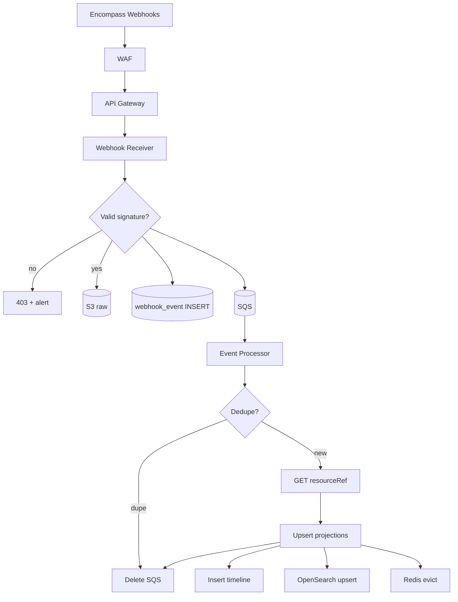

# Event Ingestion

Webhook receiver, SQS buffering, and event processor design for Encompass → dashboard sync.

---

## Ingestion topology



---

## Webhook receiver (Spring Boot)

Dedicated thin service — **fast ACK**, minimal logic.

### Responsibilities

1. Verify `Ellis-Signature` / official signing header (see ICE Signing Keys docs)
2. Gzip JSON to S3
3. Insert `webhook_event` with status `PENDING`
4. Enqueue lightweight SQS message
5. Return **200 within 3 seconds**

### Example controller

```java
@RestController
@RequestMapping("/webhooks/encompass")
@RequiredArgsConstructor
public class EncompassWebhookController {

  private final WebhookSignatureVerifier signatureVerifier;
  private final RawEventStorage rawEventStorage;
  private final WebhookEventRepository webhookEventRepository;
  private final SqsTemplate sqsTemplate;

  @PostMapping
  public ResponseEntity<Void> receive(
      @RequestHeader("Ellis-Signature") String signature,
      @RequestBody byte[] body) {

    signatureVerifier.verify(signature, body);

    JsonNode payload = objectMapper.readTree(body);
    String encompassEventId = payload.get("eventId").asText();
    String eventType = payload.get("eventType").asText();
    String loanGuid = payload.path("meta").path("resourceId").asText();

    String s3Key = rawEventStorage.store(encompassEventId, body);

    WebhookEventEntity row = webhookEventRepository.save(
        WebhookEventEntity.pending(encompassEventId, eventType, loanGuid, s3Key));

    sqsTemplate.send(to -> to
        .queue(encompassEventsQueue)
        .payload(new IngestCommand(row.getId(), encompassEventId, loanGuid)));

    return ResponseEntity.ok().build();
  }
}
```

### Signature verification

```java
@Component
public class WebhookSignatureVerifier {

  @Value("${encompass.webhook.signing-key}")
  private String signingKey; // from Secrets Manager

  public void verify(String signatureHeader, byte[] body) {
    byte[] expected = HmacUtils.hmacSha256(signingKey.getBytes(StandardCharsets.UTF_8), body);
    byte[] provided = Base64.getDecoder().decode(signatureHeader);
    if (!MessageDigest.isEqual(expected, provided)) {
      throw new InvalidWebhookSignatureException();
    }
  }
}
```

---

## SQS message design

### Queue choice

| Option | When |
|--------|------|
| **Standard SQS** | High throughput; ordering not guaranteed per loan |
| **FIFO SQS** | `MessageGroupId = loanId` — per-loan ordering; lower throughput |

**Recommendation:** Standard SQS + idempotent upserts + `event_time` ordering in UI. Use FIFO for high-conflict loans if needed.

### Message body

```json
{
  "webhookEventId": "uuid-internal",
  "encompassEventId": "ice-event-id",
  "encompassLoanId": "loan-guid",
  "eventType": "condition",
  "s3Key": "raw/2026/03/15/abc.json.gz",
  "receivedAt": "2026-03-15T10:32:00Z"
}
```

### DLQ policy

- `maxReceiveCount: 5` → DLQ
- CloudWatch alarm on DLQ depth > 0
- Replay tool reads DLQ → re-enqueue after fix

---

## Event processor

ECS service or Lambda (15 min timeout) consuming SQS.

### Processing steps

```
1. Load webhook_event + S3 payload
2. IF encompass_event_id already processed → mark SKIPPED_DUPE, ack
3. Resolve internal loan_id from encompass_loan_id
4. Switch on eventType → handler registry
5. Handler: GET meta.resourceRef (OAuth from Secrets Manager)
6. Map to projection upserts + timeline events
7. UPDATE webhook_event.process_status = OK
8. Publish cache eviction (loanId)
9. Delete SQS message
```

### Handler registry

```java
@Component
public class EncompassEventDispatcher {

  private final Map<String, EncompassEventHandler> handlers;

  public EncompassEventDispatcher(List<EncompassEventHandler> handlerList) {
    this.handlers = handlerList.stream()
        .collect(Collectors.toMap(EncompassEventHandler::eventType, Function.identity()));
  }

  public void dispatch(WebhookEventEntity event, JsonNode payload) {
    String type = payload.get("eventType").asText();
    EncompassEventHandler handler = handlers.getOrDefault(type, genericLoanUpdateHandler);
    handler.handle(event, payload);
  }
}
```

| `eventType` | Handler action |
|-------------|----------------|
| `create`, `update`, `move` | Refresh loan header + invalidate cache |
| `milestone` | Upsert milestones, timeline MILESTONE_* |
| `condition` | Upsert conditions/comments/tracking |
| `document`, `attachment` | Upsert documents/attachments |
| `enhancedfieldchange` | Fan-out field_change + timeline LOAN_FIELD_CHANGED |
| `fieldchange` | Same, filtered fields |
| `disclosureTracking` | Upsert disclosure rows |
| Workflow Tasks WH | Separate subscription → task handler |

---

## REST polling fallback

EventBridge schedules — **not** on user request path.

| Job | Schedule | Scope |
|-----|----------|-------|
| Loan logs sync | Every 10 min | Active pipeline loans |
| Full condition/doc sync | Every 15 min | Loans with webhook gap flag |
| Stale loan detector | Hourly | `last_webhook_at > 2h AND active` |
| Audit trail backfill | Nightly | Loans with EFC subscription |

### Poller shard

```java
@Scheduled(cron = "0 */10 * * * *")
public void pollLoanLogs() {
  List<String> loanIds = loanSyncRepository.findLoansForPollShard(shardId, shardCount);
  for (String loanId : loanIds) {
    sqsTemplate.send(PollCommand.loanLogs(loanId));
  }
}
```

Poll messages use **same processor** with `source=POLL` — shared normalization code.

---

## OAuth token management

```java
@Service
public class EncompassTokenService {

  private final SecretsManagerClient secrets;
  private volatile CachedToken token;

  public String getBearerToken() {
    if (token == null || token.isExpired()) {
      token = fetchClientCredentialsToken();
    }
    return token.value();
  }
}
```

- Token cached in memory with refresh 60s before expiry
- **Only event processor + poller** hold Encompass credentials
- Dashboard API has **no** Encompass client

---

## Subscriptions (initial)

See [03-loan-communications/timeline-api-strategy.md](../03-loan-communications/timeline-api-strategy.md).

Loan: `create`, `update`, `move`, `milestone`, `condition`, `document`, `attachment`, `lock`, `unlock`, `disclosureTracking`

Separate: Workflow Tasks, Document Delivery

Field changes: `fieldchange` (filtered) OR `enhancedfieldchange` (volume caution)

---

## References

- [reconciliation.md](./reconciliation.md)
- [failure-handling.md](./failure-handling.md)
- [02-apis/webhook-api.md](../02-apis/webhook-api.md)
