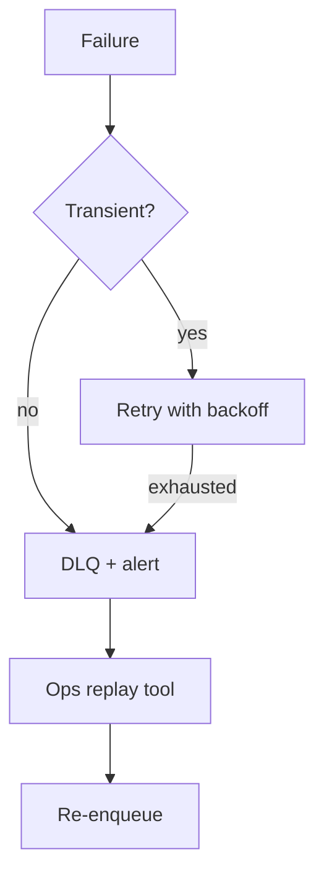

# Failure Handling

Retries, DLQ, degradation, and recovery patterns for Encompass integration failures.

---

## Failure taxonomy



| Class | Examples | Action |
|-------|----------|--------|
| **Transient** | 429, 503, network timeout | Retry |
| **Auth** | 401 Encompass | Refresh token once; alert if repeat |
| **Permission** | 403 Encompass | DLQ + integration_error; no retry |
| **Not found** | 404 after delete | Mark projection deleted; ack |
| **Poison** | JSON parse error | DLQ after 1 attempt |
| **Signature invalid** | Webhook | 403 — do not enqueue |

---

## SQS retry policy

```yaml
# CloudFormation / Terraform illustrative
VisibilityTimeout: 300  # 5 min — max processor time
MessageRetentionPeriod: 1209600  # 14 days
RedrivePolicy:
  deadLetterTargetArn: !GetAtt EncompassEventsDLQ.Arn
  maxReceiveCount: 5
```

Processor throws → message returns to queue after visibility timeout.

### Exponential backoff (in processor)

```java
public void callEncompassWithRetry(Runnable call) {
  int attempt = 0;
  while (true) {
    try {
      call.run();
      return;
    } catch (EncompassRateLimitException e) {
      if (++attempt > 5) throw e;
      sleep(Duration.ofSeconds((long) Math.pow(2, attempt)));
    }
  }
}
```

---

## Partial failure

Single webhook may update conditions OK but timeline insert fails.

**Pattern:** Transaction boundaries per aggregate:

```java
@Transactional
public void upsertCondition(ConditionEntity entity) {
  conditionRepository.save(entity);
}

@Transactional
public void writeTimeline(List<TimelineEventDraft> drafts) {
  timelineWriter.write(drafts);
}
```

If timeline fails, condition is updated — reconciliation job compares counts. Or use **outbox pattern** for atomicity.

---

## DLQ replay

Admin CLI or internal endpoint:

```java
@Service
public class DlqReplayService {

  public int replay(int maxMessages) {
    List<Message> messages = sqs.receiveDlq(maxMessages);
    for (Message m : messages) {
      sqs.sendMainQueue(m.body());
      sqs.deleteDlqMessage(m);
    }
    return messages.size();
  }
}
```

Require `ADMIN` role + audit log entry.

---

## Dashboard API degradation

| Dependency down | Behavior |
|-----------------|----------|
| **Redis** | Bypass cache — hit Aurora directly |
| **OpenSearch** | Loan search → Postgres ILIKE; timeline → no full-text `q` |
| **Aurora reader** | Failover to writer; circuit breaker |
| **Aurora total** | 503 with Retry-After |

```java
@CircuitBreaker(name = "openSearch", fallbackMethod = "searchLoansFallback")
public SearchResult<LoanSearchHit> searchLoans(LoanSearchQuery q) {
  return openSearchClient.search(q);
}

SearchResult<LoanSearchHit> searchLoansFallback(LoanSearchQuery q, Throwable t) {
  return postgresLoanSearch.search(q);
}
```

Response header: `X-Degraded-Mode: search-fallback`.

---

## Encompass outage

- Webhooks queue in ICE (unknown buffer) — may lose if prolonged
- Processor marks loans `sync_stale`
- Display banner: "Encompass connectivity degraded"
- Do not delete projections — stale read better than empty

Recovery:

1. Drain SQS backlog
2. Run reconciliation for stale loans
3. Compare webhook_event count vs ICE event history API

---

## Webhook receiver failures

| Failure | Response |
|---------|----------|
| DB down | 503 — ICE retries |
| S3 down | 503 — ICE retries |
| Invalid signature | 403 — no retry expected |

Receiver must **not** call Encompass — stays fast.

---

## Data corruption guard

- `sync_version` monotonic — reject older writes
- `payload_sha256` on S3 — detect tampering
- Nightly reconciliation sample — auto-heal

---

## Integration error table

All permanent failures → `integration_error` row linked to `webhook_event_id` for support UI.

```java
catch (Exception e) {
  integrationErrorRepository.save(
      IntegrationErrorEntity.from(event, e));
  throw e; // let SQS retry if transient classification
}
```

---

## Disaster recovery

| Scenario | RTO target | Procedure |
|----------|------------|-----------|
| Aurora failure | < 30 min | Multi-AZ failover; restore from snapshot |
| Region loss | Hours | Cross-region replica promote; DNS switch |
| OpenSearch loss | Hours | Reindex from Aurora timeline + loans |
| S3 raw intact | — | Full replay re-normalization |

---

## Testing failures

- Chaos: kill processor mid-transaction
- Inject 429 from Encompass mock
- Fill DLQ in staging → verify replay
- Disable OpenSearch → verify fallback

---

## References

- [reconciliation.md](./reconciliation.md)
- [event-ingestion.md](./event-ingestion.md)
- [observability.md](./observability.md)
