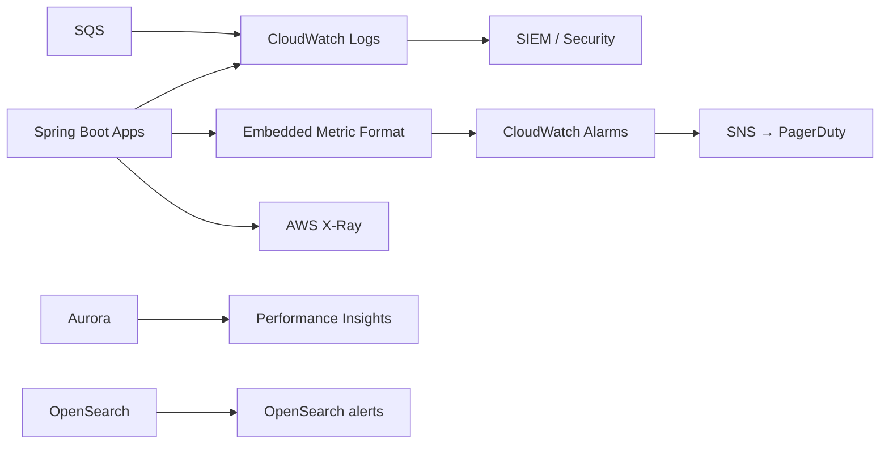

# Observability

Metrics, logs, traces, and alerts for the Encompass dashboard platform on AWS.

---

## Observability stack



---

## Golden signals

| Signal | Key metrics |
|--------|-------------|
| **Latency** | Dashboard API p50/p95/p99 by endpoint |
| **Traffic** | Requests/min; webhooks/min |
| **Errors** | 5xx rate; integration_error rate |
| **Saturation** | ECS CPU; Aurora connections; SQS depth |

---

## Business metrics

| Metric | Source | Alert |
|--------|--------|-------|
| `sync_lag_seconds` | `now - loan.last_webhook_at` | p95 > 300s |
| `webhook_process_success_rate` | webhook_event status | < 99% |
| `projection_drift_rate` | nightly reconciliation | > 0.1% |
| `timeline_events_ingested/min` | processor | drop 50% |
| `dlq_message_count` | SQS DLQ | > 0 |
| `encompass_api_429_count` | processor | sustained > 0 |

---

## Structured logging

```java
@Slf4j
public class EventProcessor {

  public void process(IngestCommand cmd) {
    MDC.put("encompassEventId", cmd.encompassEventId());
    MDC.put("loanId", cmd.encompassLoanId());
    MDC.put("traceId", TraceContext.traceId());

    log.info("event.process.start type={}", cmd.eventType());
    try {
      dispatch(cmd);
      log.info("event.process.success durationMs={}", elapsed);
    } catch (Exception e) {
      log.error("event.process.failed errorClass={}", e.getClass().getSimpleName());
      throw e;
    } finally {
      MDC.clear();
    }
  }
}
```

**Never log:** PII, tokens, comment bodies, full payloads.

---

## Distributed tracing

X-Ray segments:

- API Gateway → Webhook Receiver
- SQS → Event Processor → Encompass GET (subsegment)
- Dashboard API → Aurora / OpenSearch

Trace ID returned in API error responses (`traceId`).

---

## CloudWatch dashboards

### Ingestion dashboard

- Webhooks received / min
- Processor lag (SQS oldest message age)
- Encompass GET latency
- DLQ depth
- integration_error count by error_code

### Read path dashboard

- `/loans/{id}/overview` latency
- Cache hit rate
- OpenSearch query latency
- Aurora slow queries (PI)

---

## Alerts (SNS)

| Severity | Condition |
|----------|-----------|
| **P1** | DLQ > 0 for 5 min; API 5xx > 5% for 5 min |
| **P2** | Sync lag p95 > 5 min; Aurora CPU > 85% |
| **P3** | OpenSearch cluster yellow; disk > 80% |

---

## Health checks

```java
@Component
public class EncompassIntegrationHealthIndicator implements HealthIndicator {

  @Override
  public Health health() {
    boolean dlqEmpty = sqsClient.getDlqDepth() == 0;
    boolean dbUp = dataSource.isValid(2);
    boolean recentWebhook = webhookRepository.receivedSince(Duration.ofMinutes(30));

    if (dlqEmpty && dbUp) {
      return Health.up()
          .withDetail("recentWebhook", recentWebhook)
          .build();
    }
    return Health.down().build();
  }
}
```

Endpoints:

- `/actuator/health` — load balancer
- `/actuator/health/liveness` — ECS
- `/actuator/health/readiness` — includes Aurora + Redis

---

## Encompass API monitoring

Track per endpoint:

- Latency histogram
- 401/403 (credential/permission)
- 429 (rate limit — backoff)
- 5xx (ICE outage)

```java
@Around("execution(* com..EncompassClient.*(..))")
public Object meterEncompassCalls(ProceedingJoinPoint pjp) throws Throwable {
  long start = System.currentTimeMillis();
  try {
    return pjp.proceed();
  } finally {
    metrics.timer("encompass.api", "method", pjp.getSignature().getName())
        .record(System.currentTimeMillis() - start, TimeUnit.MILLISECONDS);
  }
}
```

---

## Audit vs operational logs

| Log type | Destination | Retention |
|----------|-------------|-----------|
| Application | CloudWatch | 30–90 days |
| Access audit | Aurora `audit_log` + SIEM | 7 years |
| Raw webhooks | S3 | 7 years |

---

## References

- [failure-handling.md](./failure-handling.md)
- [reconciliation.md](./reconciliation.md)
- [security.md](./security.md)
