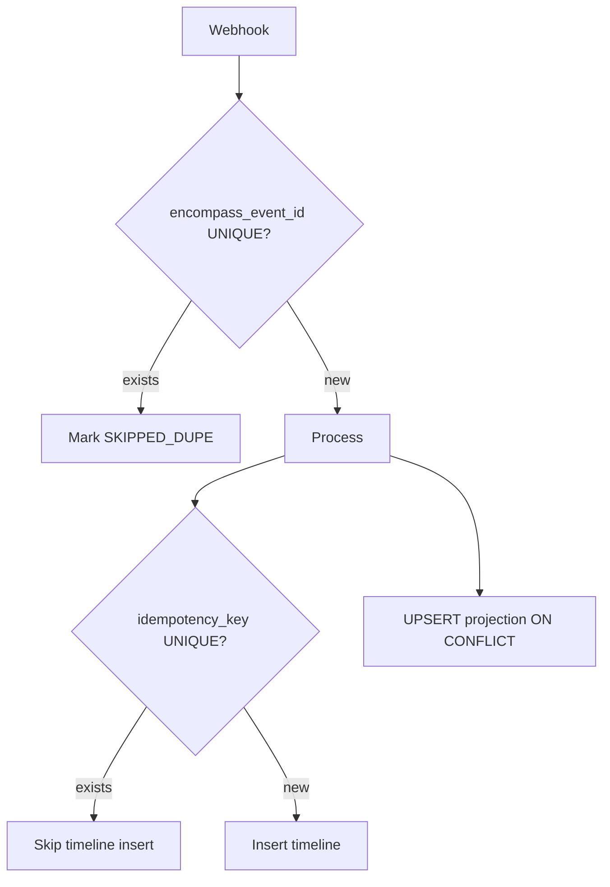
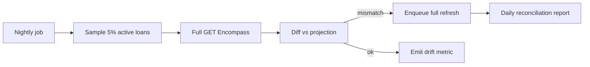

# Reconciliation

Idempotency, ordering, gaps, replay, and polling fallback — Encompass sync correctness.

---

## Failure modes

| Mode | Cause | Mitigation |
|------|-------|------------|
| **Duplicate webhooks** | ICE retry, at-least-once delivery | Dedupe on `encompass_event_id` |
| **Retry** | Processor crash mid-handle | SQS visibility timeout + idempotent upsert |
| **Out-of-order** | Network / parallel workers | Upsert by resource version; UI sorts by `event_time` |
| **Late events** | Delayed webhook | Upsert overwrites; timeline insert if new idempotency key |
| **Missing events** | WH failure, 250KB payload skip, subscription gap | Scheduled poll + audit backfill |
| **Replay** | Re-process S3 raw | Idempotency keys prevent dup timeline rows |
| **Drift** | Smart Client edit without WH | Poll `view=logs`; compare `raw_entity_hash` |

---

## Idempotency layers



### Layer 1 — Webhook dedupe

```sql
CREATE UNIQUE INDEX ux_webhook_encompass_event_id
  ON webhook_event (encompass_event_id);
```

### Layer 2 — Projection upsert

```sql
INSERT INTO condition (encompass_condition_id, loan_id, status, status_date, sync_version)
VALUES (?, ?, ?, ?, ?)
ON CONFLICT (encompass_condition_id) DO UPDATE SET
  status = EXCLUDED.status,
  status_date = EXCLUDED.status_date,
  sync_version = GREATEST(condition.sync_version, EXCLUDED.sync_version);
```

Only update if incoming `updated_at_enc` or `sync_version` is newer.

### Layer 3 — Timeline idempotency key

See [timeline-service.md](./timeline-service.md).

---

## Out-of-order handling

**Rule:** Projections reflect **latest known Encompass state** after GET — not event order.

Example:

1. Event B arrives first: condition status = "Received"
2. Event A arrives late: condition status = "Requested"

If A's `eventTime` < B but GET after A shows "Requested", projection becomes "Requested" — **incorrect transient**.

**Fix:**

- Compare `eventTime` from webhook vs `status_date` from GET body
- Prefer GET body timestamps for current state
- Timeline keeps **both** events (audit truth of notifications)

---

## Missing event detection

### Staleness flags

```sql
UPDATE loan SET sync_stale = true
WHERE last_webhook_at < now() - interval '2 hours'
  AND is_deleted = false
  AND loan_folder NOT IN ('Completed', 'Archive');
```

Poller prioritizes `sync_stale = true`.

### Hash reconciliation

After poll GET `view=entity`:

```java
String hash = DigestUtils.sha256Hex(canonicalJson);
if (!hash.equals(loan.getRawEntityHash())) {
  loanRepository.updateHashAndVersion(loanId, hash);
  fullProjectionRefresh(loanId);
}
```

---

## Replay procedure

### Single event

```
1. Load webhook_event by encompass_event_id
2. Load S3 payload
3. SET process_status = PENDING
4. Enqueue SQS IngestCommand
5. Processor re-runs (idempotent)
```

### Bulk replay (mapper bug fix)

```
1. Step Functions: list S3 prefix by date range
2. For each key: enqueue with replayFlag=true
3. TimelineWriter uses new schema_version in idempotency key suffix
4. Optional: mark old timeline rows superseded
```

### Webhook event history API

ICE `GET /webhook/v1/events` — gap fill for missed notifications (official). Compare against `webhook_event` table.

---

## API polling fallback schedule

| Cohort | Criteria | APIs |
|--------|----------|------|
| **Hot** | Open pipeline, webhook in last 24h | logs, conditions, tasks every 10 min |
| **Warm** | Active, quiet webhooks | every 30 min |
| **Cold** | Funded/closed | daily entity hash only |

Shard: `WHERE mod(abs(hashtext(encompass_loan_id)), :shards) = :shardId`

---

## Reconciliation job (nightly)



Alert if drift rate > 0.1%.

---

## Manual refresh (admin)

Dashboard API (privileged):

```
POST /api/v1/admin/loans/{loanId}/sync
  → Enqueue FULL_SYNC for loan
  → Returns 202 job id
```

Rate-limited — Encompass API quota protection.

---

## Java — transactional outbox (optional)

For strict audit between projection and timeline:

```java
@Transactional
public void handleEvent(WebhookEventEntity event) {
  projectionService.apply(event);
  outboxRepository.save(OutboxEntry.timelineWrite(event.getId()));
}
// Separate poller reads outbox → TimelineWriter
```

---

## References

- [event-ingestion.md](./event-ingestion.md)
- [failure-handling.md](./failure-handling.md)
- [03-loan-communications/timeline-api-strategy.md](../03-loan-communications/timeline-api-strategy.md)
