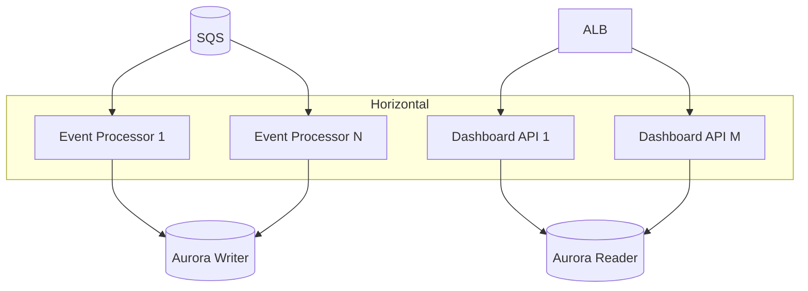

# Scalability

Design targets: **100,000+ loans**, **millions of timeline events**, high webhook concurrency, large Encompass payloads.

---

## Scale targets (initial)

| Metric | Target |
|--------|--------|
| Active pipeline loans | 100,000 |
| Timeline events | 10–50 million |
| Webhook peak | 500 events/min (EFC bursts higher) |
| Dashboard DAU | 500–2,000 |
| Loan overview p95 | < 200 ms |
| Timeline page p95 | < 400 ms |
| Sync lag p95 | < 60 s (non-EFC) |

---

## Scaling dimensions



| Component | Scale lever |
|-----------|-------------|
| Event Processor | ECS task count ← SQS depth |
| Dashboard API | ECS/EC2 ← CPU/latency |
| Aurora | Read replicas; connection pooling |
| OpenSearch | Data nodes + shards |
| Redis | Cluster mode for large keyspace |
| S3 | Unlimited raw storage |

---

## Large loan payloads

`view=full` can be **multi-MB** JSON.

| Rule | Action |
|------|--------|
| Never store full loan JSON in Postgres row | Store hash + selected fields only |
| Raw full payload | S3 optional for debug cohort only |
| Field sync | Field Reader for targeted fields |
| EFC volume | Filtered `fieldchange` for UI fields; EFC to dedicated worker pool |

Webhook > 250 KB may skip field change delivery (ICE release note) — rely on audit trail poll.

---

## High-volume field changes

`enhancedfieldchange` on all loans:

| Strategy | Detail |
|----------|--------|
| **Dedicated queue** | `encompass-efc-events` separate from main |
| **Separate worker pool** | Lower priority; more tasks |
| **Suppress timeline** | Field changes → `field_change` table only; timeline for allowlist fields |
| **Batch insert** | JDBC batch 500 rows |

```java
@Async("efcExecutor")
public void handleEnhancedFieldChange(WebhookEventEntity event) {
  List<FieldChangeEntity> batch = mapper.toFieldChanges(event);
  fieldChangeRepository.saveAllBatch(batch);
  if (shouldEmitTimeline(batch)) {
    timelineWriter.write(mapper.toTimelineDrafts(batch));
  }
}
```

---

## Large comment history

- Denormalize **latest comment** on `condition` row for dashboard list
- Full thread on detail page — paginated `condition_comment` query
- OpenSearch for "search comment text" — not table scan

```sql
SELECT * FROM condition_comment
WHERE condition_id = ?
ORDER BY added_at DESC
LIMIT 20 OFFSET ?;
```

Index: `(condition_id, added_at DESC)`.

---

## Millions of timeline events

### Postgres partitioning (optional at 20M+ rows)

```sql
CREATE TABLE loan_timeline_event (
  ...
) PARTITION BY RANGE (event_time);

CREATE TABLE loan_timeline_event_2026_03
  PARTITION OF loan_timeline_event
  FOR VALUES FROM ('2026-03-01') TO ('2026-04-01');
```

### Query patterns

- Always filter `loan_id` first
- Default 90-day window on UI
- Keyset pagination — never OFFSET deep pages

### OpenSearch ILM

Monthly indices for timeline; delete after retention period.

---

## Concurrent webhook processing

| Concern | Mitigation |
|---------|------------|
| Same loan parallel updates | Upsert + row locks on `loan.sync_version`; optional FIFO per loanId |
| Encompass rate limits | Token bucket in processor; exponential backoff on 429 |
| DB connection exhaustion | HikariCP max 20 per task × task count; PgBouncer optional |
| Hot loan | Sarah's high-activity loan — same as others; cache absorbs read load |

---

## Search at millions of events

| Query | Path |
|-------|------|
| Single loan timeline + text | OpenSearch filter `loan_id` + match — fast |
| Cross-loan "donor" last 7 days | OpenSearch + date range + role filter |
| Cross-loan unfiltered | **Blocked** — require date or user filter |

Pre-aggregate workload metrics in analytics table — not live scan.

---

## Caching strategy at scale

| Key | TTL | Invalidation |
|-----|-----|--------------|
| Loan overview | 5 min | Webhook `loanId` |
| Open condition counts | 5 min | `condition` WH |
| User workload summary | 15 min | Scheduled + task WH |
| Field dictionary | 24 h | Admin refresh |

Cache stampede: single-flight lock on miss.

---

## Cost controls

- Aurora Serverless v2 for dev; provisioned for prod
- S3 Intelligent-Tiering for raw events
- OpenSearch UltraWarm for old timeline indices
- EFC on subset of loans if lender agrees

---

## Load testing checklist

- [ ] 1000 webhooks/min sustained 30 min
- [ ] 500 concurrent loan overview reads
- [ ] Timeline query loan with 50k events
- [ ] Full reindex OpenSearch from Postgres
- [ ] Aurora failover drill

---

## References

- [search.md](./search.md)
- [system-architecture.md](./system-architecture.md)
- [reconciliation.md](./reconciliation.md)
