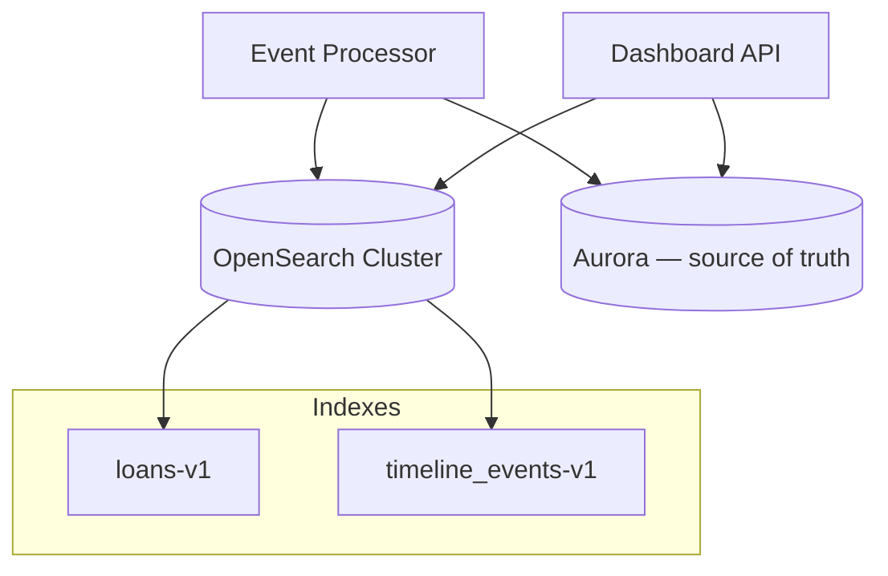

# Search

OpenSearch-backed loan discovery and timeline full-text search at 100k+ loans and millions of events.

---

## Index strategy



| Index | Purpose | Source table |
|-------|---------|--------------|
| `loans-v1` | Pipeline search, loan picker | `loan` + `borrower` + `associate` |
| `timeline_events-v1` | Cross-loan activity, comment text | `loan_timeline_event` |

**Aurora remains authoritative** — OpenSearch is a query accelerator; rebuild from Postgres if index corrupt.

---

## `loans-v1` document

```json
{
  "loan_id": "uuid-internal",
  "encompass_loan_id": "guid",
  "loan_number": "123456",
  "loan_number_edge": "123456",
  "borrower_names": "John Smith",
  "borrower_names_normalized": "john smith",
  "loan_folder": "Pipeline",
  "current_milestone_name": "Cond. Approval",
  "loan_amount": 400000,
  "purpose": "Purchase",
  "program": "Conventional",
  "processor_user_id": "sarah-id",
  "underwriter_user_id": "robert-id",
  "open_condition_count": 4,
  "sync_version": 42,
  "updated_at": "2026-03-15T10:00:00Z"
}
```

| Field | Tag |
|-------|-----|
| `loan_number`, `borrower_names`, `current_milestone_name` | ENCOMPASS / derived |
| `open_condition_count` | DERIVED |
| `borrower_names_normalized` | DERIVED (lowercase fold) |

### Analyzers

- `borrower_names`: `standard` + `edge_ngram` for typeahead (min 2 chars)
- `loan_number`: `keyword` + `edge_ngram` for prefix search

---

## `timeline_events-v1` document

```json
{
  "event_id": "uuid",
  "loan_id": "uuid",
  "loan_number": "123456",
  "event_time": "2026-03-15T10:32:00Z",
  "event_type": "CONDITION_COMMENTED",
  "resource_type": "CONDITION",
  "resource_id": "cond-guid",
  "actor": "Robert",
  "actor_user_id": "robert-id",
  "title": "Condition commented",
  "description": "Need donor statement.",
  "milestone_name": "Processing",
  "processor_user_id": "sarah-id"
}
```

Full-text on `description`, `title`, `actor`.

---

## Query patterns

### Loan search (dashboard header)

```java
@Service
public class LoanSearchService {

  public SearchResult<LoanSearchHit> searchLoans(LoanSearchQuery q) {
    BoolQueryBuilder bool = QueryBuilders.boolQuery();

    if (q.text() != null) {
      bool.should(QueryBuilders.matchQuery("borrower_names", q.text()))
          .should(QueryBuilders.prefixQuery("loan_number_edge", q.text()))
          .minimumShouldMatch(1);
    }
    if (q.processorId() != null) {
      bool.filter(QueryBuilders.termQuery("processor_user_id", q.processorId()));
    }
    if (q.milestone() != null) {
      bool.filter(QueryBuilders.termQuery("current_milestone_name", q.milestone()));
    }

    return openSearchClient.search(bool, q.from(), q.size());
  }
}
```

### Timeline search within loan

```
GET timeline_events-v1/_search
{
  "query": {
    "bool": {
      "filter": [{ "term": { "loan_id": "..." }}],
      "must": [{ "match": { "description": "donor statement" }}]
    }
  },
  "sort": [{ "event_time": "desc" }],
  "size": 50
}
```

### Cross-loan processor activity

Requires denormalized `processor_user_id` on timeline docs at index time from `loan_search_dim`.

---

## Sync modes

| Mode | Trigger |
|------|---------|
| **Real-time** | Event processor indexes after timeline insert |
| **Bulk** | Nightly `_reindex` or compare `sync_version` lag |
| **Rebuild** | Blue/green index alias swap `loans-v1` → `loans-v2` |

---

## Performance at scale

| Technique | Detail |
|-----------|--------|
| Shard sizing | ~30–50 GB per shard; timeline index time-based indices `timeline-2026-03` optional |
| ILM | Delete timeline indices > 7 years per retention policy |
| Denormalize | Loan number on timeline docs avoids join at search time |
| Avoid deep pagination | `search_after` keyset — not `from: 10000` |
| Hot/warm | Recent month on hot nodes; older on warm |

Millions of events: expect **50–200ms** p95 for filtered loan timeline; **<500ms** for cross-loan with narrow filters.

---

## Fallback

If OpenSearch unavailable:

- Loan search → Postgres `ILIKE` on `borrower.display_name`, `loan_number` (degraded)
- Timeline → Aurora keyset only — disable `q` full-text

Circuit breaker in Dashboard API — see [failure-handling.md](./failure-handling.md).

---

## References

- [03-loan-communications/search-strategy.md](../03-loan-communications/search-strategy.md)
- [scalability.md](./scalability.md)
- [api-design.md](./api-design.md)
