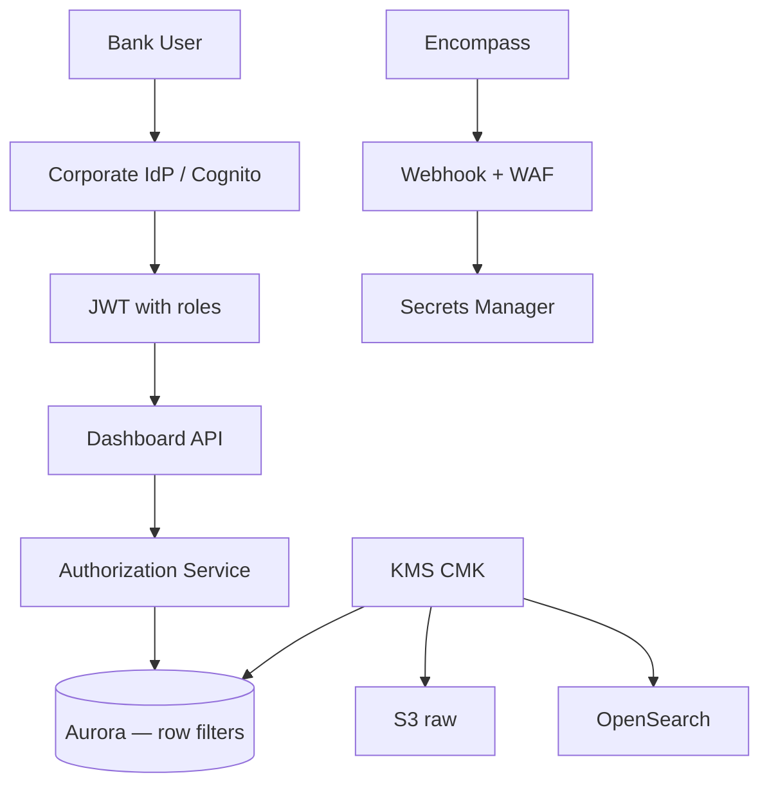

# Security

Banking-grade security for PII-heavy Encompass mirror data on AWS.

**Threat model:** Multi-tenant lender staff access; integration credentials; webhook spoofing; insider over-read; data exfiltration via logs.

---

## Security architecture



---

## PII inventory

| Data | Location | Classification |
|------|----------|----------------|
| Borrower name, email, phone | `borrower`, conversation_log | PII |
| Property address | `property` | PII |
| SSN | **Do not store full** — Encompass field; mask or omit | Sensitive |
| Comment / note text | timeline, comments | May contain PII |
| Document filenames | `attachment` | May contain PII |
| Attachment bytes | **Not stored** — Encompass only | Sensitive |

---

## Encryption

| Layer | Control |
|-------|---------|
| **In transit** | TLS 1.2+ everywhere; API Gateway, CloudFront, Aurora |
| **At rest** | Aurora encryption (KMS); S3 SSE-KMS; OpenSearch encryption; Redis transit + at-rest |
| **Secrets** | AWS Secrets Manager — Encompass OAuth, webhook signing key, DB creds |
| **Backups** | Aurora snapshots encrypted; cross-region DR copy |

No Encompass credentials in environment variables on disk — inject at runtime from Secrets Manager.

---

## Authentication

| Actor | Method |
|-------|--------|
| **Dashboard users** | Corporate SSO (SAML/OIDC) → Cognito or Spring OAuth2 resource server |
| **Service-to-service** | IAM roles for ECS tasks; no long-lived keys |
| **Encompass API** | OAuth 2.0 client credentials (integration user) — processor only |
| **Webhooks** | HMAC signature verification — no JWT |

```java
@Configuration
@EnableWebSecurity
public class SecurityConfig {

  @Bean
  SecurityFilterChain filterChain(HttpSecurity http) throws Exception {
    return http
        .csrf(csrf -> csrf.disable()) // API — use token-based
        .authorizeHttpRequests(auth -> auth
            .requestMatchers("/webhooks/**").permitAll() // signature instead
            .requestMatchers("/actuator/health").permitAll()
            .anyRequest().authenticated())
        .oauth2ResourceServer(oauth2 -> oauth2.jwt(Customizer.withDefaults()))
        .build();
  }
}
```

---

## Authorization (RBAC)

Map dashboard roles to Encompass **persona** visibility — **LENDER CONFIGURABLE**.

| Dashboard role | Access |
|----------------|--------|
| **Processor** | Assigned loans + pipeline folder; conversation logs |
| **Underwriter** | UW queue loans; conditions; documents |
| **Closer** | Closing stage loans; disclosures |
| **Manager** | Team workload aggregates — no raw SSN |
| **Admin** | Full pipeline; sync admin; audit exports |
| **Integration** | Webhook endpoint only |

### Row-level security

```java
@PreAuthorize("hasPermission(#loanId, 'Loan', 'READ')")
public LoanOverviewDto getOverview(UUID loanId) {
  return loanQueryService.getOverview(loanId, currentUser());
}
```

Permission check:

1. User's Encompass `entityId` in loan `associate` table, OR
2. User's role matches loan folder/milestone access rules, OR
3. Manager hierarchy (org chart table — INTERNAL)

**Least privilege:** Default deny; explicit grant per loan folder.

---

## Sensitive comments

| Flag | Handling |
|------|----------|
| `condition_comment.is_external` | Hide from internal-only roles if policy requires |
| Conversation log PII | Mask phone/email in list views; full in detail with permission |
| `is_external` LogCommentContract | Respect Encompass semantics |

Do not log comment **body** in application logs — log `event_id` only.

---

## Document security

- **Metadata only** in dashboard DB
- Download links: **proxy through Dashboard API** with auth check → short-lived Encompass download URL
- Never expose Encompass OAuth token to browser
- Audit every document download:

```java
auditLog.record(AuditAction.DOCUMENT_DOWNLOAD, userId, loanId, documentId);
```

---

## Webhook security

| Control | Detail |
|---------|--------|
| WAF | Rate limit; geo allowlist if applicable |
| Signature | Verify every POST; reject missing/invalid |
| IP allowlist | Optional ICE egress IPs if published |
| mTLS | Optional additional layer |
| Body size limit | API Gateway max payload |

Failed signature → 403 + CloudWatch metric `webhook.signature.invalid` — no payload stored.

---

## Audit (platform)

| Event | Stored |
|-------|--------|
| User login | `audit_log` |
| Loan view | Optional high-value loans |
| Timeline export | Required |
| Admin sync trigger | Required |
| Permission denied | Required |

Retention: align with lender policy (typically 7 years for financial audit).

---

## Data retention

| Store | Retention |
|-------|-----------|
| S3 raw events | 7 years → Glacier |
| Timeline | 7 years online; archive older |
| Integration errors | 90 days |
| Application logs | 30–90 days — **no PII** |
| Redis cache | TTL only |

GDPR/CCPA delete requests: dashboard projections deletable; Encompass remains source — coordinate with lender compliance.

---

## Masking

| Field | UI display |
|-------|------------|
| SSN | `***-**-1234` or hidden |
| Phone | `(***) ***-4567` in list |
| Email | `j***@example.com` in list |

```java
public String maskPhone(String phone) {
  if (phone == null || phone.length() < 4) return "***";
  return "***-***-" + phone.substring(phone.length() - 4);
}
```

---

## Logging rules

- **Never:** full webhook payload, comment text, tokens, signing keys
- **Do:** `encompass_event_id`, `loan_id`, `event_type`, latency, error class
- Structured JSON logs → CloudWatch Logs → SIEM

---

## OAuth & API credentials

| Secret | Rotation |
|--------|----------|
| Encompass client secret | 90 days; dual-secret window |
| Webhook signing key | ICE API rotate + update Secrets Manager |
| DB password | RDS rotation |
| JWT signing keys | IdP managed |

ECS task role:

```json
{
  "Effect": "Allow",
  "Action": ["secretsmanager:GetSecretValue"],
  "Resource": "arn:aws:secretsmanager:*:*:secret:encompass/*"
}
```

---

## References

- [02-apis/api-authentication.md](../02-apis/api-authentication.md)
- [02-apis/webhook-api.md](../02-apis/webhook-api.md)
- [failure-handling.md](./failure-handling.md)
