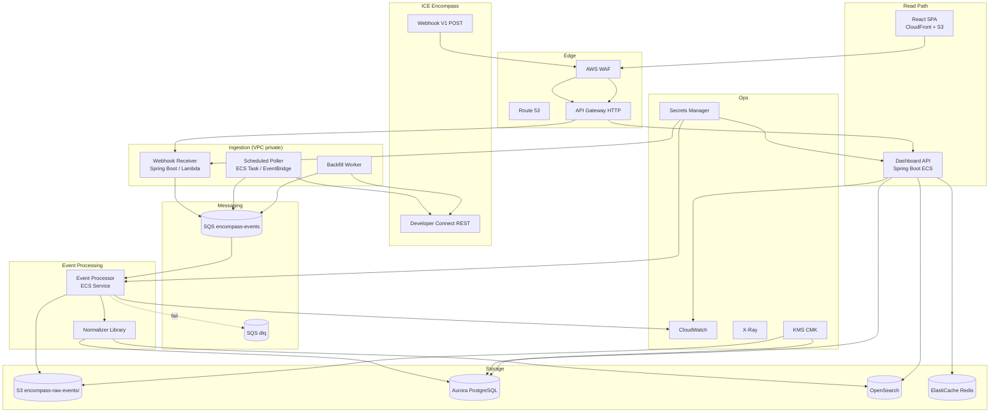
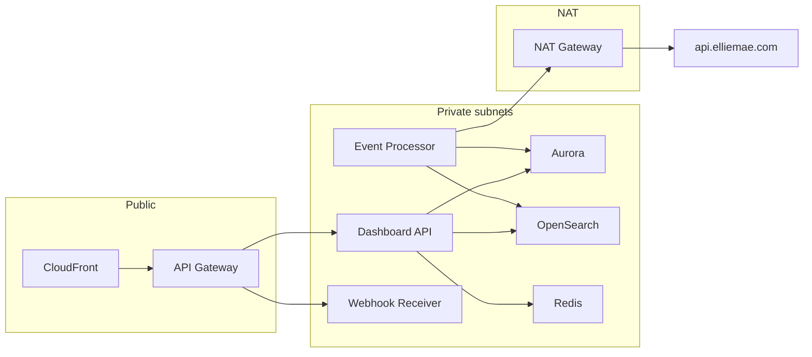
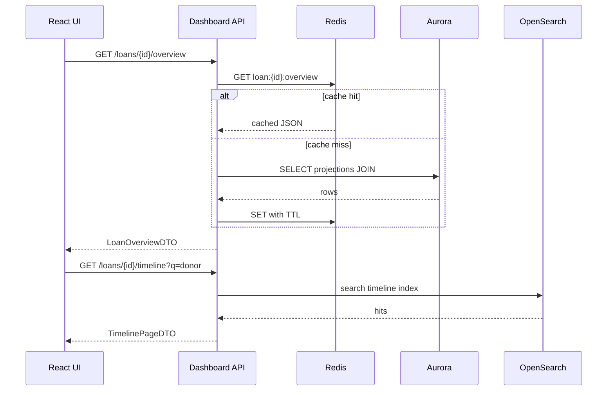
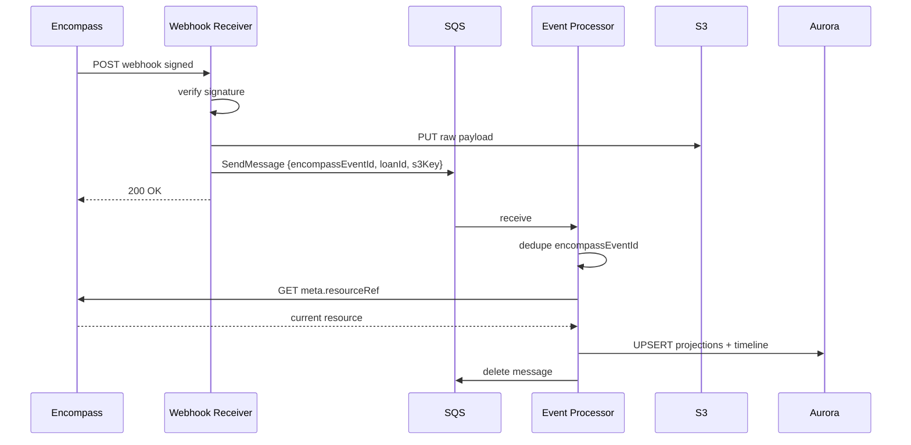

# System Architecture

AWS-oriented production architecture for the Encompass read-optimized lending dashboard.

---

## Design principles

1. **Encompass is system of record** — dashboard never assumes it owns loan truth.
2. **Eventual consistency** — webhooks + polling; GET reconciles after every signal.
3. **Immutable raw + mutable projection** — S3/raw table for audit; Aurora for fast reads.
4. **Idempotent ingestion** — safe retries, duplicates, out-of-order delivery.
5. **Read path never calls Encompass synchronously** for standard dashboard page loads (except explicit "refresh from Encompass" admin action).

---

## Full topology



---

## Component catalog

| Component | AWS service | Responsibility |
|-----------|-------------|----------------|
| Webhook Receiver | API Gateway + ECS/Lambda | Validate signature, persist raw, enqueue |
| Event Processor | ECS Fargate | Dequeue, GET Encompass, upsert projections, timeline |
| Scheduled Poller | EventBridge + ECS | `view=logs`, conditions, documents, tasks per loan cohort |
| Backfill Worker | ECS one-shot / Step Functions | Audit trail, onboarding new loans |
| Raw Event Store | S3 + Postgres `webhook_event` | Immutable payloads, compliance |
| Current State DB | Aurora PostgreSQL | Normalized loan graph for dashboards |
| Timeline Store | Aurora `loan_timeline_event` | Activity stream |
| Search Index | OpenSearch | Loan + timeline full-text |
| Hot Cache | ElastiCache Redis | Loan overview, team, stage chips |
| Dashboard API | ECS/EC2 Spring Boot | BFF for React — no Encompass on hot path |
| Analytics | Aurora replica / Athena | Workload, aging aggregates |

---

## Store deep dive

### System of Record (Encompass)

| Aspect | Detail |
|--------|--------|
| **Owner** | ICE / lender Encompass instance |
| **Writes** | Encompass UI, Smart Client, Developer Connect APIs |
| **Dashboard role** | Subscribe to changes; periodic reconciliation |
| **Conflict rule** | On mismatch, **Encompass wins** — projection overwritten on next successful GET |

### Cache (Redis)

| Aspect | Detail |
|--------|--------|
| **Purpose** | Sub-100ms loan header, milestone strip, open condition counts |
| **Keys** | `loan:{loanId}:overview`, `loan:{loanId}:milestones`, `user:{id}:workload` |
| **TTL** | 1–15 minutes; event-driven invalidation on webhook `loanId` |
| **Not cached** | Full timeline pages, audit exports, search results (stale risk) |

```java
// Spring Cache + Redis — invalidate on ingest
@CacheEvict(cacheNames = "loanOverview", key = "#loanId")
public void onLoanProjectionUpdated(String loanId) { }
```

### Operational Database (Aurora PostgreSQL)

| Aspect | Detail |
|--------|--------|
| **Purpose** | Current-state projections for all dashboard widgets |
| **Schema** | Normalized tables — see [data-model.md](./data-model.md) |
| **Writes** | Event processor only (no user writes in v1) |
| **Reads** | Dashboard API, analytics replica |
| **Sizing** | r6g.large+; read replicas for reporting |

### Event Store (S3 + table)

| Aspect | Detail |
|--------|--------|
| **Purpose** | Compliance replay, debugging, re-normalization |
| **S3 layout** | `s3://bucket/raw/{yyyy}/{mm}/{dd}/{encompassEventId}.json.gz` |
| **Postgres** | `webhook_event` index: `encompass_event_id` UNIQUE, `loan_id`, `received_at` |
| **Retention** | 7 years banking default — lifecycle to Glacier after 90 days |

### Search Index (OpenSearch)

| Aspect | Detail |
|--------|--------|
| **Indexes** | `loans`, `timeline_events`, optional `comments` |
| **Purpose** | Pipeline search, borrower name, comment text, cross-loan activity |
| **Sync** | Event processor upserts; nightly full reconcile job |

### Timeline Store (Aurora)

| Aspect | Detail |
|--------|--------|
| **Purpose** | Unified activity feed — see [03-loan-communications/timeline-data-model.md](../03-loan-communications/timeline-data-model.md) |
| **Partition** | `loan_id` + BRIN on `event_time` |
| **Volume** | Millions of rows — keyset pagination |

### Analytics Store

| Aspect | Detail |
|--------|--------|
| **Purpose** | Processor/UW workload, SLA breach rates, condition aging percentiles |
| **Source** | Aurora read replica or nightly S3 export → Athena |
| **Latency** | Minutes to hours — not on critical path |

---

## Network & VPC



- Encompass OAuth and GET calls from **private subnets** via NAT
- No Encompass credentials on Dashboard API instances (processor only)

---

## Deployment units

| Unit | Scaling |
|------|---------|
| Webhook Receiver | Scale on API Gateway RPS; stateless |
| Event Processor | SQS `ApproximateNumberOfMessagesVisible` → ECS auto-scale |
| Dashboard API | CPU/latency → ECS auto-scale |
| Poller | Fixed schedule; shard loans by `hash(loan_id) % N` |

---

## Data flow: read path



---

## Data flow: write path (ingestion only)



---

## Integration with existing Gamya EC2 pattern

This repo already runs Spring Boot on EC2 behind nginx. Migration path:

| Phase | Approach |
|-------|----------|
| **Now** | Dashboard API on EC2; Redis on ElastiCache; Aurora/Supabase-compatible Postgres |
| **Scale** | Move workers to ECS Fargate; keep API on EC2 or migrate to ECS |
| **Webhook** | API Gateway → Lambda receiver OR dedicated `/webhooks/encompass` on EC2 behind WAF |

---

## References

- [event-ingestion.md](./event-ingestion.md)
- [data-model.md](./data-model.md)
- [03-loan-communications/unified-loan-timeline.md](../03-loan-communications/unified-loan-timeline.md)
