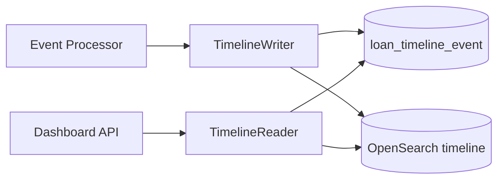

# Timeline Service

Normalization layer that produces `LoanTimelineEvent` rows from webhooks, polls, and backfills.

Builds on [03-loan-communications/timeline-data-model.md](../03-loan-communications/timeline-data-model.md).

---

## Service boundaries

| Component | Owns |
|-----------|------|
| **Event Processor** | Ingest, GET Encompass, invoke TimelineWriter |
| **TimelineWriter** | Idempotent insert/upsert into `loan_timeline_event` + OpenSearch |
| **TimelineReader** | Dashboard API queries — no Encompass |



---

## Normalization pipeline

```
Raw payload (S3)
  → parse eventType + meta
  → fetch current resource (GET resourceRef)
  → ResourceMapper.map(previousSnapshot, currentResource)
  → List<TimelineEventDraft>
  → TimelineWriter.write(drafts)
```

### Draft → entity

```java
public record TimelineEventDraft(
    String loanId,
    Instant eventTime,
    String eventType,       // INTERNAL taxonomy
    String resourceType,
    String resourceId,
    String actor,
    ActorType actorType,
    String title,
    String description,
    String previousValue,
    String newValue,
    String source,
    String rawReference,
    String encompassEventType,
    String encompassEventId,
    UUID webhookEventId,
    Map<String, Object> metadata
) {}

@Service
@RequiredArgsConstructor
public class TimelineWriter {

  private final LoanTimelineEventRepository repository;
  private final TimelineSearchIndexer searchIndexer;

  @Transactional
  public void write(List<TimelineEventDraft> drafts) {
    for (TimelineEventDraft draft : drafts) {
      String idempotencyKey = idempotencyKey(draft);
      if (repository.existsByIdempotencyKey(idempotencyKey)) continue;

      LoanTimelineEventEntity row = mapper.toEntity(draft);
      row.setIdempotencyKey(idempotencyKey);
      repository.save(row);
      searchIndexer.index(row);
    }
  }

  private String idempotencyKey(TimelineEventDraft d) {
    // Webhook-sourced: encompass event + sub-resource
    if (d.encompassEventId() != null) {
      return d.encompassEventId() + ":" + d.eventType() + ":" + nullToEmpty(d.resourceId());
    }
    // Poll-sourced: content hash
    return d.source() + ":" + d.resourceType() + ":" + d.resourceId()
        + ":" + d.eventTime() + ":" + sha256(d.description());
  }
}
```

Add column: `idempotency_key VARCHAR(128) UNIQUE`.

---

## Fan-out examples

### Enhanced field change

One webhook → N timeline rows:

```java
public List<TimelineEventDraft> mapEnhancedFieldChange(JsonNode payload) {
  ArrayNode events = payload.path("meta").path("payload").path("event")
      .path("fieldChangeEvents");
  List<TimelineEventDraft> drafts = new ArrayList<>();
  for (JsonNode fc : events) {
    drafts.add(TimelineEventDraft.builder()
        .eventType("LOAN_FIELD_CHANGED")
        .resourceType("LOAN_FIELD")
        .resourceId(fc.path("modifiedField").asText())
        .previousValue(fc.path("encompass").path("previousValue").asText(null))
        .newValue(fc.path("encompass").path("newValue").asText(null))
        .encompassEventType("enhancedfieldchange")
        .build());
  }
  return drafts;
}
```

### Condition update

May emit: `CONDITION_UPDATED`, `CONDITION_COMMENTED`, `CONDITION_TRACKING_UPDATED`, `DOCUMENT_ASSIGNED_TO_CONDITION` — compare previous DB snapshot vs GET response.

---

## Event time resolution

Priority when multiple timestamps exist:

1. Webhook `eventTime` (official)
2. Resource-specific: `addedDate`, `statusDate`, `dateUtc`, `completed`
3. `ingestedAt` — only as last resort (label in UI as "synced")

Store both:

| Column | Purpose |
|--------|---------|
| `event_time` | Display sort |
| `source_event_time` | Original Encompass timestamp |
| `ingested_at` | Pipeline latency monitoring |

---

## Title and description generation (INTERNAL)

```java
public String titleFor(TimelineEventDraft draft) {
  return switch (draft.eventType()) {
    case "CONDITION_COMMENTED" -> "Condition commented";
    case "TASK_COMPLETED" -> "Task completed";
    case "LOAN_FIELD_CHANGED" -> fieldDictionary.label(draft.resourceId()) + " changed";
    default -> humanize(draft.eventType());
  };
}
```

Field dictionary table maps Encompass field IDs → display labels (**LENDER CONFIGURABLE** per instance).

---

## Read API (internal to TimelineReader)

Not exposed raw — wrapped by [api-design.md](./api-design.md).

```java
public TimelinePage getTimeline(TimelineQuery query) {
  if (query.hasFullText()) {
    return searchIndexer.search(query);
  }
  return repository.findByLoanIdKeyset(
      query.loanId(),
      query.from(),
      query.to(),
      query.eventTypes(),
      query.cursor(),
      query.limit());
}
```

Default sort: `event_time DESC, event_id DESC`.

---

## Borrower communication history

Filter preset:

```java
private static final Set<String> COMMUNICATION_TYPES = Set.of(
    "CONVERSATION_LOG_CREATED",
    "CONVERSATION_LOG_UPDATED",
    "CONVERSATION_LOG_COMMENT_ADDED",
    "EMAIL_LOG_CREATED",
    "NOTE_CREATED"
);
```

---

## Audit timeline vs activity timeline

| View | Filter |
|------|--------|
| **Activity** | All event types except bulk EFC noise |
| **Audit** | `LOAN_FIELD_CHANGED`, lock events, disclosure, system logs |
| **Communications** | COMMUNICATION_TYPES |

Configurable EFC suppression: only fields in `audit_field_allowlist` table.

---

## Re-normalization

When taxonomy or mapper logic changes:

1. Read S3 raw events for date range
2. Re-run mappers (do not DELETE old rows — insert new `schema_version` or run migration job)
3. Or: soft-supersede old rows with `superseded_by` column

---

## References

- [03-loan-communications/unified-loan-timeline.md](../03-loan-communications/unified-loan-timeline.md)
- [search.md](./search.md)
- [reconciliation.md](./reconciliation.md)
