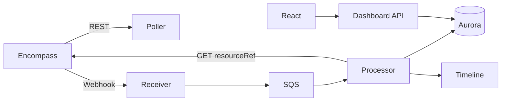

# Integration Map

## Purpose

End-to-end **integration patterns** from Encompass to dashboard.

## Scope

Official webhook+GET pattern and **INTERNAL_ARCHITECTURE_RECOMMENDATION** AWS pipeline.

## Key concepts

## Official pattern (OFFICIAL_DOCUMENTATION)

1. Subscribe webhooks  
2. Receive POST with `eventId`, `meta.resourceRef`  
3. Verify signature  
4. GET resource for truth  
5. Idempotent processing  

Source: [01-domain/events.md](../01-domain/events.md)

## Internal pattern (INTERNAL_ARCHITECTURE_RECOMMENDATION)

Full stack: [05-dashboard-architecture/system-architecture.md](../05-dashboard-architecture/system-architecture.md)

Timeline: [03-loan-communications/unified-loan-timeline.md](../03-loan-communications/unified-loan-timeline.md)

Reconciliation: [05-dashboard-architecture/reconciliation.md](../05-dashboard-architecture/reconciliation.md)

## Definitions

- **EFC firehose** — subscribe `enhancedfieldchange` — high volume — **OFFICIAL_DOCUMENTATION**
- **Filtered fieldchange** — max 50 fields — **OFFICIAL_DOCUMENTATION**

## API references

Subscriptions: [02-apis/webhook-api.md](../02-apis/webhook-api.md)  
Ingestion strategy: [03-loan-communications/timeline-api-strategy.md](../03-loan-communications/timeline-api-strategy.md)

## Examples

Loan `condition` WH → GET conditions Full → upsert + CONDITION_* timeline events — **INTERNAL_ARCHITECTURE_RECOMMENDATION**

## Production notes

Separate EFC queue at scale — [05-dashboard-architecture/scalability.md](../05-dashboard-architecture/scalability.md)

## Common mistakes

- Dashboard API calling Encompass synchronously on page load — **INTERNAL_ARCHITECTURE_RECOMMENDATION** avoid

## FAQ

See [architect-faq.md](./architect-faq.md) · [developer-faq.md](./developer-faq.md).

## Related documents

- [event-map.md](./event-map.md) · [05-dashboard-architecture/event-ingestion.md](../05-dashboard-architecture/event-ingestion.md)

## Source references

- [Webhooks Overview](https://developer.icemortgagetechnology.com/developer-connect/reference/webhook) — Last verified 2026-08-13
