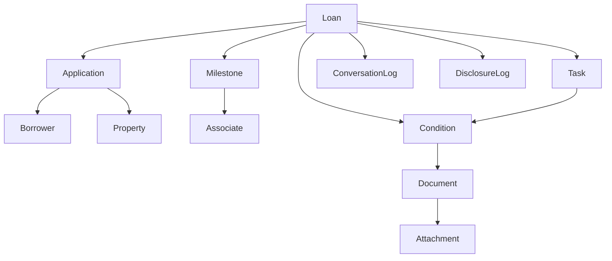

# Relationship Map

## Purpose

**Cross-object relationships** for graph queries, dashboard joins, and RAG context.

## Scope

Origination domain. Canonical diagram: [01-domain/domain-relationships.md](../01-domain/domain-relationships.md).

## Key concepts

## Relationship table (selected)

| From | To | Cardinality | Classification |
|------|-----|-------------|----------------|
| Loan | Application | 1..n | **OFFICIAL_DOCUMENTATION** |
| Condition | Document | n..m | **OFFICIAL_DOCUMENTATION** |
| Document | Attachment | 1..n | **OFFICIAL_DOCUMENTATION** |
| Task | Condition | n..m via associations | **OFFICIAL_DOCUMENTATION** (opaque URNs) |
| Document Order | Disclosure Log | creates on delivery | **OFFICIAL_DOCUMENTATION** |

## Definitions

**Association URN (Task):** e.g. `urn:elli:encompass:loan:underwritingcondition` — **OFFICIAL_DOCUMENTATION**

## API references

Condition documents: `PATCH .../conditions/{id}/documents` — **OFFICIAL_DOCUMENTATION**

Task associations: create task payload — **OFFICIAL_DOCUMENTATION**

## Examples

**ILLUSTRATIVE_BUSINESS_EXAMPLE:** Task "Review income" associated to paystub condition — [01-domain/domain-relationships.md](../01-domain/domain-relationships.md).

## Production notes

Dashboard FK design: [05-dashboard-architecture/data-model.md](../05-dashboard-architecture/data-model.md) — **INTERNAL_ARCHITECTURE_RECOMMENDATION**

## Common mistakes

- Assuming platform enforces Task→Condition workflow order — **ILLUSTRATIVE_BUSINESS_EXAMPLE** only

## FAQ

**Q: Can one document satisfy multiple conditions?** A: Yes — **OFFICIAL_DOCUMENTATION**

## Related documents

- [master-object-matrix.md](./master-object-matrix.md) · [integration-map.md](./integration-map.md)

## Source references

- [01-domain/domain-relationships.md](../01-domain/domain-relationships.md) — Last verified 2026-08-13
