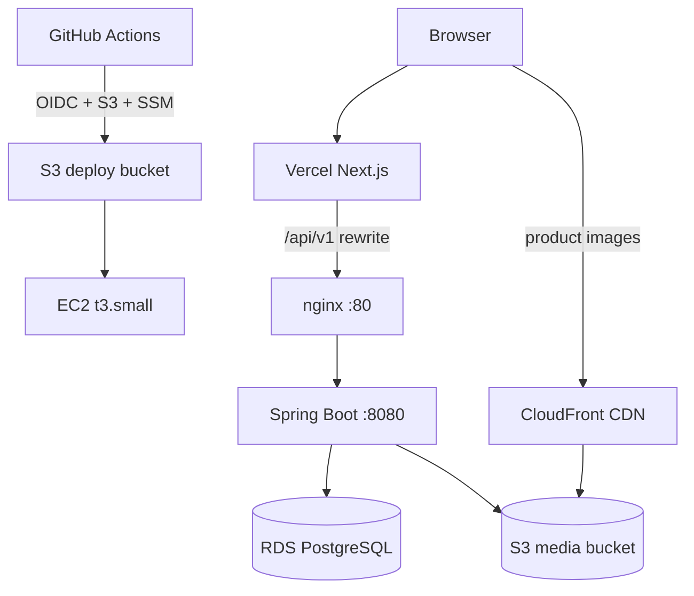

# Gamya Couture

Customized women's wear boutique — ecommerce storefront, admin catalog, and CRM leads.

| Layer | Stack | Host |
|-------|-------|------|
| Frontend | Next.js 15, React 19, TanStack Query, Zustand, Tailwind | [Vercel](https://vercel.com) |
| Backend | Java 21, Spring Boot 3.4, Spring Security, JWT | AWS EC2 (`ap-south-1`) |
| Database | PostgreSQL 16, Flyway, JPA | AWS RDS |
| Media | S3 + CloudFront | AWS |
| CI/CD | GitHub Actions (OIDC) → S3 → SSM deploy | This repo |

**Repos:** [gvsharma/gamyaboutique](https://github.com/gvsharma/gamyaboutique) (app) · [gvsharma/gamya-couture-infra](https://github.com/gvsharma/gamya-couture-infra) (Terraform)

---

## Architecture



Browser traffic hits Vercel (HTTPS). API calls use same-origin `/api/v1`; Next.js rewrites proxy to EC2 over HTTP. Product images are served from CloudFront/S3.

---

## Repository structure

```
gamya-boutique/
├── frontend/                    # Next.js storefront + admin UI
│   ├── src/app/                 # App Router (route groups)
│   ├── src/components/          # UI, catalog, cart, auth, admin
│   ├── src/lib/api/             # Axios client, services, endpoints
│   └── src/stores/              # Zustand (auth, wishlist)
├── src/main/java/com/gamyacouture/
│   ├── auth/ cart/ wishlist/    # Commerce & identity
│   ├── product/ catalog/        # Catalog browse + admin products
│   ├── customer/ crm/ admin/    # Profile, leads, dashboard, media
│   └── shared/                  # Security, exceptions, S3 storage
├── src/main/resources/
│   ├── db/migration/            # Flyway V1–V20 (shipped to prod)
│   └── db/migration-dev/        # Local-only synthetic seed (V100)
├── deploy/                      # EC2 bootstrap, systemd, env templates, SSM scripts
├── scripts/                     # Smoke tests, env pairing, deploy helpers
├── docs/                        # Architecture, API, setup guides
├── docker-compose.yml           # Local PostgreSQL
├── docker-compose.rds.yml       # Optional: app container → RDS
└── .github/workflows/           # CI (validate) + deploy (main)
```

---

## Quick start

### Prerequisites

| Tool | Version | Used for |
|------|---------|----------|
| Java | 21+ | Backend |
| Maven | 3.9+ | Backend build/test |
| Node.js | 20+ (CI uses 22) | Frontend |
| npm | 10+ | Frontend |
| Docker | Latest | Local Postgres + backend integration tests |
| AWS CLI | v2 | Optional — deploy troubleshooting, SSM |

### 1. Clone and start database

```bash
git clone https://github.com/gvsharma/gamyaboutique.git
cd gamya-boutique
docker compose up -d
```

Creates PostgreSQL on `localhost:5432`, database `gamya_couture`, user `gamya` / `gamya_secret`.

### 2. Backend

```bash
mvn spring-boot:run -Dspring-boot.run.profiles=local
```

| URL | Purpose |
|-----|---------|
| http://localhost:8080/api/v1 | REST API |
| http://localhost:8080/swagger-ui.html | OpenAPI UI |
| http://localhost:8080/actuator/health | Health check |

**Default admin** (Flyway V8): `admin@gamyacouture.com` / `Admin@123`

### 3. Frontend

```bash
cd frontend
cp .env.local.example .env.local
npm ci && npm run dev
```

Open http://localhost:3000

Full walkthrough: [docs/DEVELOPER-ONBOARDING.md](docs/DEVELOPER-ONBOARDING.md)

---

## Setup documentation

| Guide | Contents |
|-------|----------|
| [docs/DEVELOPER-ONBOARDING.md](docs/DEVELOPER-ONBOARDING.md) | Clone → run locally → admin login → pre-push checks |
| [docs/BACKEND-SETUP.md](docs/BACKEND-SETUP.md) | Java/Maven, profiles, Flyway, tests, Swagger, EC2 |
| [frontend/README.md](frontend/README.md) | Node, env vars, Vercel, API proxy |
| [docs/INFRA-SETUP.md](docs/INFRA-SETUP.md) | Terraform, AWS resources, GitHub Actions, cost scheduler |
| [docs/DEPLOYMENT.md](docs/DEPLOYMENT.md) | Production deploy runbook |
| [deploy/README.md](deploy/README.md) | EC2 bootstrap, SSM deploy flow |

**Reference docs:** [docs/README.md](docs/README.md) · [API contract](docs/API_CONTRACT.md) · [Architecture](docs/ARCHITECTURE.md)

---

## Deployment overview

| Component | How it deploys |
|-----------|----------------|
| **Frontend** | Vercel auto-deploy on push to `main`; root directory = `frontend` |
| **Backend** | GitHub Actions `deploy.yml` on push to `main`: validate → build JAR → S3 → SSM → health + smoke |
| **Database** | RDS managed by Terraform; Flyway runs on Spring Boot startup |
| **Images** | Admin upload → S3 `gamya-couture-dev-media` → CloudFront URLs in DB |

Deploy workflow highlights (recent improvements):

- **RDS auto-start** — if RDS is stopped (cost scheduler), deploy starts it and waits before proceeding
- **EC2 auto-start** — stopped instances are started; SSM ping waits extended after cold start
- **Async SSM deploy** — short SSM kickoff runs `remote-deploy.sh` via `nohup`; workflow polls `deploy.status` instead of blocking on a long SSM timeout

Details: [docs/DEPLOYMENT.md](docs/DEPLOYMENT.md) · [docs/INFRA-SETUP.md](docs/INFRA-SETUP.md)

---

## Environment variables (summary)

### Backend

| Variable | Local default | Production |
|----------|---------------|------------|
| `DB_URL` | `jdbc:postgresql://localhost:5432/gamya_couture` | RDS JDBC URL |
| `DB_USER` / `DB_PASSWORD` | `gamya` / `gamya_secret` | From SSM or `application.env` |
| `JWT_SECRET` | dev placeholder | Strong random (≥256 bits) |
| `CORS_ALLOWED_ORIGINS` | `http://localhost:3000` | Vercel URL + localhost |
| `APP_STORAGE_S3_*` | disabled locally | Enabled on EC2 |
| `SPRING_PROFILES_ACTIVE` | `local` | `dev` (EC2) |

Template: [deploy/env/application.env.example](deploy/env/application.env.example)

### Frontend

| Variable | Local | Vercel |
|----------|-------|--------|
| `NEXT_PUBLIC_API_BASE_URL` | `http://localhost:8080/api/v1` | `/api/v1` |
| `API_PROXY_TARGET` | (empty) | `http://<EC2_PUBLIC_IP>` |
| `NEXT_PUBLIC_SITE_URL` | `http://localhost:3000` | `https://gamyaboutique.vercel.app` |
| `NEXT_PUBLIC_IMAGE_CDN_HOST` | CloudFront hostname | same |

Template: [frontend/.env.local.example](frontend/.env.local.example)

Validate frontend/backend pairing: `./scripts/check-env-pairing.sh .env.prod.example frontend/.env.local`

---

## Common commands

```bash
# Backend — run tests before every push (Docker required)
mvn -B test                    # unit tests
mvn -B verify                  # unit + Testcontainers integration tests

# Backend — run locally
mvn spring-boot:run -Dspring-boot.run.profiles=local

# Frontend
cd frontend && npm run dev
cd frontend && npm run lint && npx tsc --noEmit && npm run build

# Post-deploy smoke (from laptop)
./scripts/smoke-test-api.sh http://<EC2_HOST>
./scripts/verify-api-integration.sh http://<EC2_HOST>

# EC2 service (via SSM Session Manager)
sudo systemctl status gamya-couture-backend
sudo journalctl -u gamya-couture-backend -f
tail -f /opt/gamya-couture/logs/application.log
```

---

## CI/CD

| Workflow | Trigger | Action |
|----------|---------|--------|
| [ci.yml](.github/workflows/ci.yml) | PR + push to `main` | Calls `validate.yml` |
| [validate.yml](.github/workflows/validate.yml) | Reusable | `mvn verify`, frontend lint/build, security scan |
| [deploy.yml](.github/workflows/deploy.yml) | Push to `main` | Build JAR → S3 → SSM deploy → health + smoke |

---

## Troubleshooting

| Symptom | Likely cause | Fix |
|---------|--------------|-----|
| **502** on `/api/v1/*` (Vercel) | Spring Boot down or EC2 stopped | Check EC2 running; `systemctl status gamya-couture-backend`; verify `API_PROXY_TARGET` |
| **502** on EC2 directly | nginx up, app down | `journalctl -u gamya-couture-backend`; check RDS connectivity |
| **Empty products** on Vercel | Wrong proxy or API down | Set `API_PROXY_TARGET` to current EC2 IP; redeploy Vercel |
| **CORS errors** | Origin not allowed | Add Vercel URL to `CORS_ALLOWED_ORIGINS` on EC2 |
| **Mixed content** | HTTP API URL in browser | Use `NEXT_PUBLIC_API_BASE_URL=/api/v1` + `API_PROXY_TARGET` |
| **RDS connection refused** | RDS stopped or SG mismatch | Start RDS in console; deploy workflow auto-starts if configured; check SG allows EC2 → 5432 |
| **Deploy fails: SSM not Online** | Agent not ready after cold start | Wait and retry; restart `amazon-ssm-agent`; verify IAM role has `AmazonSSMManagedInstanceCore` |
| **Deploy fails: health timeout** | Bad JAR, Flyway error, wrong DB password | Check `/opt/gamya-couture/logs/deploy.latest.log`; `remote-deploy.sh` auto-rolls back |
| **S3 upload fails** | EC2 IAM missing permissions | Attach S3 PutObject policy to instance role |
| **Tests fail locally** | Docker not running | Start Docker Desktop; Testcontainers needs it |
| **Storefront down overnight (IST)** | Cost scheduler stops EC2/RDS at midnight | Expected 00:00–09:00 IST; deploy or scheduler starts resources |

---

## Features (summary)

**Customer:** Home, shop, categories, product detail, guest + auth cart, wishlist, register/login, password reset (when mail enabled), profile & addresses, express interest.

**Admin:** Dashboard, product CRUD + S3 image upload, category CRUD, taxonomy management, role-based access (ADMIN).

**Not implemented:** Checkout, payments, order fulfillment.

---

## Documentation index

| Doc | Purpose |
|-----|---------|
| [docs/DEVELOPER-ONBOARDING.md](docs/DEVELOPER-ONBOARDING.md) | New developer setup |
| [docs/BACKEND-SETUP.md](docs/BACKEND-SETUP.md) | Backend development |
| [docs/INFRA-SETUP.md](docs/INFRA-SETUP.md) | AWS + Terraform |
| [docs/FEATURES.md](docs/FEATURES.md) | Business features |
| [docs/ARCHITECTURE.md](docs/ARCHITECTURE.md) | Technical architecture |
| [docs/DATABASE_SCHEMA.md](docs/DATABASE_SCHEMA.md) | Tables, ER diagram |
| [docs/API_CONTRACT.md](docs/API_CONTRACT.md) | REST endpoints |
| [docs/AUTH_FLOW.md](docs/AUTH_FLOW.md) | Security & auth |
| [docs/TESTING.md](docs/TESTING.md) | QA & test strategy |
| [CHANGELOG.md](CHANGELOG.md) | Release history |
