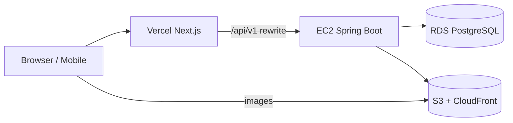

# Gamya Couture

Customized women's wear boutique — ecommerce storefront + admin catalog + CRM leads.  
**Frontend:** Next.js 15 on Vercel · **Backend:** Spring Boot 3.4 on EC2 · **DB:** PostgreSQL RDS

---

## 5-minute overview

Gamya Couture is a **modular monolith**: one Spring Boot JAR serves REST APIs; a Next.js App Router site is the customer-facing storefront and admin UI. Customers browse products, manage cart/wishlist, register/login, and submit styling inquiries. Admins manage products (with S3 images), categories, and view dashboard metrics.



| Layer | Tech |
|-------|------|
| Frontend | Next.js 15, React 19, TanStack Query, Zustand, Tailwind |
| Backend | Java 21, Spring Boot 3.4, Spring Security, JWT |
| Database | PostgreSQL 16, Flyway, JPA |
| Storage | AWS S3 + CloudFront for product images |
| Deploy | GitHub Actions → EC2 (SSM); Vercel auto-deploy |

**Deep dives:** [Features](docs/FEATURES.md) · [Architecture](docs/ARCHITECTURE.md) · [API](docs/API_CONTRACT.md) · [Deploy](docs/DEPLOYMENT.md)

---

## Features (summary)

**Customer:** Home, shop, categories, product detail (gallery, related items), guest + auth cart, wishlist, register/login, forgot/reset password, profile & addresses, express interest inquiry.

**Admin:** Dashboard, product CRUD + S3 upload, category CRUD, role-based access (ADMIN).

**Not implemented:** Checkout, payments, order fulfillment. Password reset email via SMTP when `MAIL_ENABLED=true` (Gmail/SendGrid free tier).

---

## Repository structure

```
gamya-boutique/
├── frontend/                 # Next.js storefront + admin UI
│   └── src/
│       ├── app/              # App Router pages (route groups)
│       ├── components/       # UI, catalog, cart, auth, admin
│       ├── lib/api/          # Axios client, services, endpoints
│       └── stores/           # Zustand (auth, wishlist)
├── src/main/java/com/gamyacouture/
│   ├── auth/                 # Login, register, sessions, password reset
│   ├── cart/ wishlist/       # Commerce
│   ├── product/ catalog/     # Catalog browse + admin products
│   ├── customer/             # Profile, addresses
│   ├── crm/ admin/           # Leads, dashboard, media upload
│   └── shared/               # Security, exceptions, storage
├── src/main/resources/db/migration/   # Flyway V1–V13
├── deploy/                   # EC2 bootstrap, systemd, env templates
├── scripts/                  # Smoke tests, deploy helpers
├── docs/                     # Architecture, API, schema, QA
└── .github/workflows/        # CI + deploy
```

---

## Prerequisites

- **Backend:** Java 21+, Maven 3.9+, Docker (PostgreSQL)
- **Frontend:** Node.js 22+, npm

---

## Local setup

### 1. Database

```bash
docker compose up -d
# Creates PostgreSQL on localhost:5432, database gamya_couture
```

Or: `./scripts/setup-local-db.sh`

### 2. Backend

```bash
mvn spring-boot:run -Dspring-boot.run.profiles=local
```

| URL | Purpose |
|-----|---------|
| http://localhost:8080/api/v1 | API base |
| http://localhost:8080/swagger-ui.html | OpenAPI UI |
| http://localhost:8080/actuator/health | Health |

**Default admin** (after Flyway V8 seed): `admin@gamyacouture.com` / `Admin@123`

### 3. Frontend

```bash
cd frontend
cp .env.example .env.local
npm ci && npm run dev
```

Open http://localhost:3000

---

## Environment variables

### Backend (`application.yml` / env)

| Variable | Default (local) | Required prod |
|----------|-----------------|---------------|
| `DB_URL` | `jdbc:postgresql://localhost:5432/gamya_couture` | ✅ RDS JDBC URL |
| `DB_USER` / `DB_PASSWORD` | `gamya` / `gamya_secret` | ✅ |
| `JWT_SECRET` | dev placeholder | ✅ ≥256 bits |
| `JWT_ACCESS_EXPIRATION_MS` | 1800000 (30m) | ☐ |
| `JWT_REFRESH_EXPIRATION_MS` | 604800000 (7d) | ☐ |
| `CORS_ALLOWED_ORIGINS` | `http://localhost:3000` | ✅ Vercel URL |
| `APP_STORAGE_S3_*` | disabled locally | ✅ on EC2 |

See [deploy/env/application.env.example](deploy/env/application.env.example).

### Frontend (`frontend/.env.local`)

| Variable | Local | Vercel prod |
|----------|-------|-------------|
| `NEXT_PUBLIC_API_BASE_URL` | `http://localhost:8080/api/v1` | `/api/v1` |
| `API_PROXY_TARGET` | (empty) | `http://<EC2_IP>` |
| `NEXT_PUBLIC_SITE_URL` | `http://localhost:3000` | `https://gamyaboutique.vercel.app` |
| `NEXT_PUBLIC_IMAGE_CDN_HOST` | CloudFront hostname | same |

---

## Common commands

```bash
# Backend
mvn verify                          # compile + test (Docker required)
mvn spring-boot:run -Dspring-boot.run.profiles=local

# Frontend
cd frontend && npm run dev
cd frontend && npm run lint && npx tsc --noEmit && npm run build

# Smoke test (after deploy)
./scripts/smoke-test-api.sh http://<EC2_HOST>
./scripts/verify-api-integration.sh http://<EC2_HOST>

# EC2 service (on server)
sudo systemctl status gamya-couture-backend
sudo journalctl -u gamya-couture-backend -f
```

---

## CI/CD

| Workflow | Trigger | Action |
|----------|---------|--------|
| [ci.yml](.github/workflows/ci.yml) | PR + push to `main` | Backend test, frontend lint/build, security scan |
| [deploy.yml](.github/workflows/deploy.yml) | Push to `main` only | Validate → build JAR → S3 → SSM deploy → health + smoke |

**Vercel:** Connect repo, root directory `frontend`, deploys on merge to `main`.

Details: [docs/DEPLOYMENT.md](docs/DEPLOYMENT.md) · [docs/production/](docs/production/)

---

## Deployment overview

| Component | Target |
|-----------|--------|
| Backend JAR | EC2 Ubuntu, systemd `gamya-couture-backend`, nginx :80 → :8080 |
| Frontend | Vercel (API proxied to EC2) |
| Database | RDS PostgreSQL (private, EC2 SG access) |
| Images | S3 `gamya-couture-dev-media` + CloudFront |

Full guide: [docs/DEPLOYMENT.md](docs/DEPLOYMENT.md)

---

## Troubleshooting

| Symptom | Likely cause | Fix |
|---------|--------------|-----|
| 502 on `/api/v1/*` | Spring Boot down | `systemctl status gamya-couture-backend`; check RDS password in `application.env` |
| CORS errors | Origin not allowed | Add Vercel URL to `CORS_ALLOWED_ORIGINS` |
| Mixed content on Vercel | HTTP API URL in browser | Use `/api/v1` + `API_PROXY_TARGET` |
| Flyway migration fail | Schema drift | Check `flyway_schema_history`; restore RDS snapshot if needed |
| S3 upload fail | IAM missing on EC2 role | Add `s3:PutObject` on media bucket |
| Cart empty after login | Merge failed silently | Re-login; check guest cart header; see [AUTH_FLOW](docs/AUTH_FLOW.md) |
| Tests fail locally | Docker not running | Start Docker for Testcontainers |

---

## Documentation index

| Doc | Purpose |
|-----|---------|
| [docs/FEATURES.md](docs/FEATURES.md) | Business features (2 min read) |
| [docs/ARCHITECTURE.md](docs/ARCHITECTURE.md) | Technical architecture (10 min) |
| [docs/DATABASE_SCHEMA.md](docs/DATABASE_SCHEMA.md) | Tables, ER diagram |
| [docs/API_CONTRACT.md](docs/API_CONTRACT.md) | REST endpoints |
| [docs/AUTH_FLOW.md](docs/AUTH_FLOW.md) | Security & auth flows |
| [docs/DEPLOYMENT.md](docs/DEPLOYMENT.md) | Production deploy |
| [docs/TESTING.md](docs/TESTING.md) | QA & test strategy |
| [docs/DECISIONS.md](docs/DECISIONS.md) | Engineering decisions |
| [CHANGELOG.md](CHANGELOG.md) | Major changes |
| [TODO.md](TODO.md) | Roadmap |
| [GO_LIVE_CHECKLIST.md](GO_LIVE_CHECKLIST.md) | MVP launch checklist |
