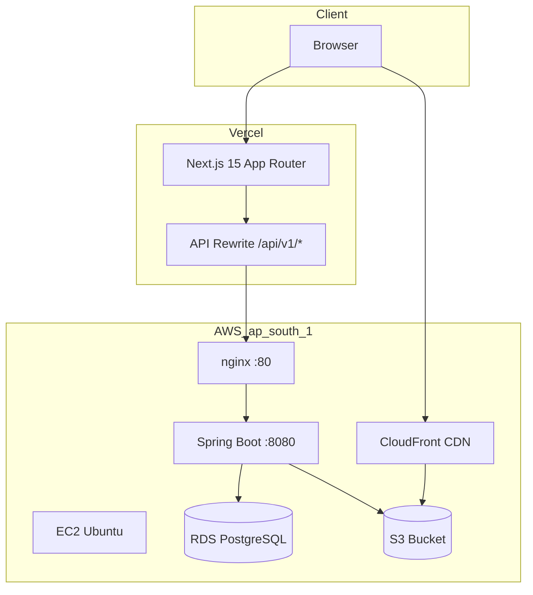
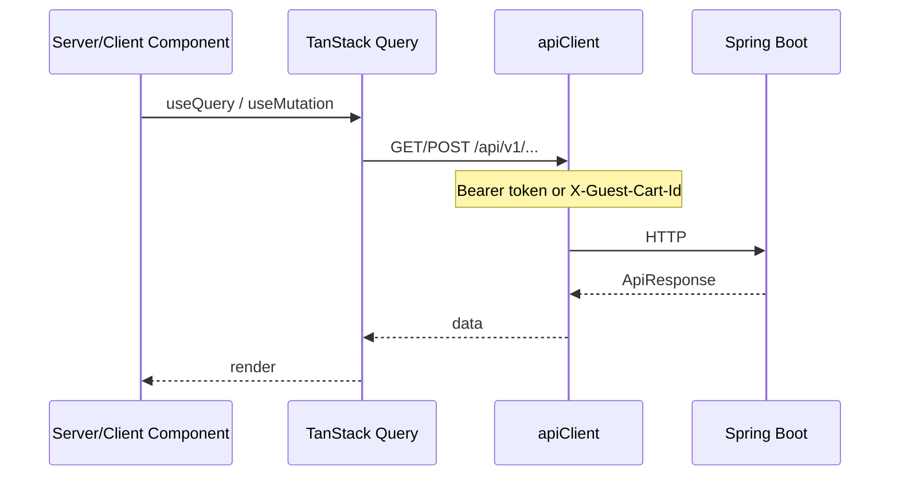
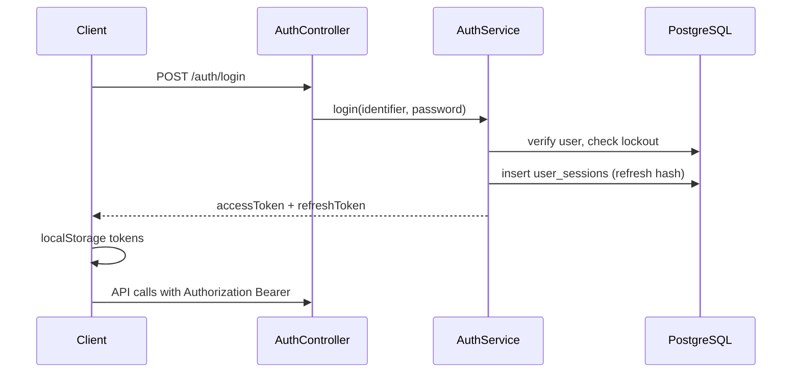
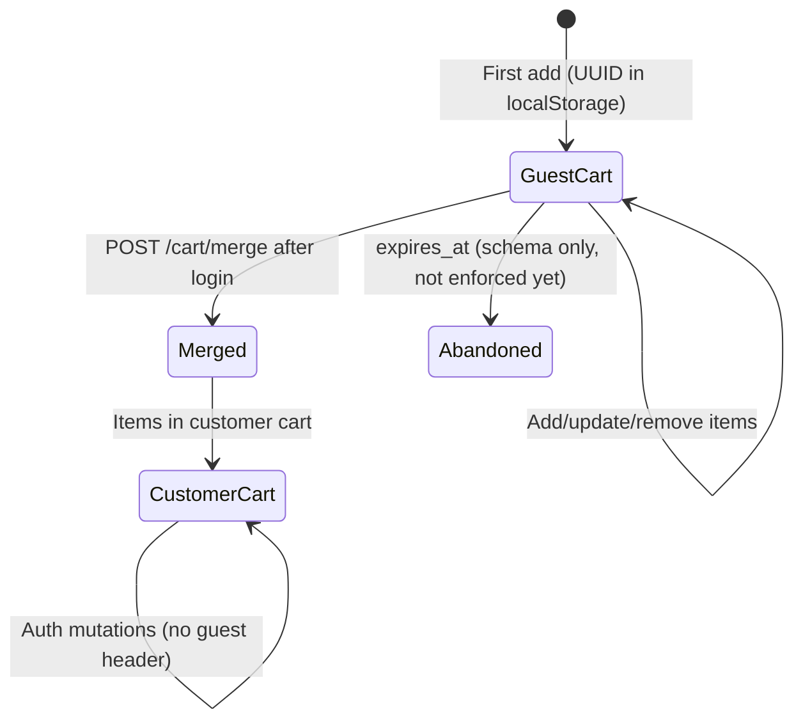
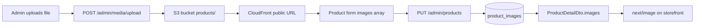
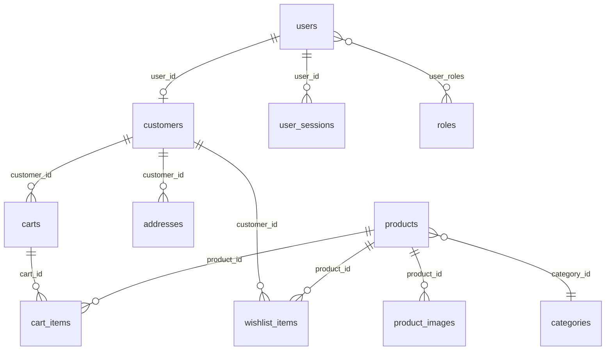
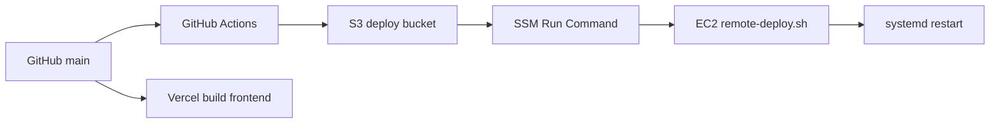

# Architecture — Gamya Couture

Technical overview for engineers. Estimated read time: **10 minutes**.

---

## High-level architecture



| Principle | Choice |
|-----------|--------|
| Backend style | Modular monolith (package-by-feature) |
| API | REST JSON, `/api/v1` prefix, `ApiResponse<T>` envelope |
| Auth | Stateless JWT + server-side refresh sessions |
| DB access | Spring Data JPA, Flyway migrations, soft-delete |
| Frontend data | TanStack Query (server state) + Zustand (auth, wishlist) |

---

## Backend modules

```
com.gamyacouture
├── auth          # Register, login, sessions, password reset
├── cart          # Guest + customer carts, merge
├── wishlist      # Saved products, move-to-cart
├── product       # Browse, search, admin CRUD, interest
├── catalog       # Categories, browse by slug
├── customer      # Profile, addresses, recently viewed
├── crm           # Leads, customer interest pipeline
├── admin         # Dashboard, S3 media, taxonomy
├── notification  # Outbox (skeleton)
└── shared        # Security, JWT, exceptions, S3 storage
```

---

## Frontend architecture

### Route groups (`frontend/src/app/`)

| Group | Routes | Layout |
|-------|--------|--------|
| `(marketing)` | `/`, `/about`, `/contact` | Site shell (nav + footer) |
| `(shop)` | `/shop`, `/products/[id]`, `/category/[slug]` | Site shell |
| `(account)` | `/login`, `/register`, `/cart`, `/wishlist`, `/account/**` | Site shell or auth card |
| `(admin)` | `/admin/**` | Admin shell + `AdminGuard` |

### Data flow



**Server components** use `serverFetch()` for SSR (homepage, PDP metadata).  
**Client components** use `apiClient` + React Query for interactive flows.

### Key libraries

| Concern | Library |
|---------|---------|
| HTTP | Axios + interceptors (`client.ts`) |
| Forms | react-hook-form + Zod |
| Styling | Tailwind + design tokens (`globals.css`) |
| Images | `next/image` + CDN remote patterns |

---

## Authentication flow

See [AUTH_FLOW.md](./AUTH_FLOW.md) for full detail.



---

## Cart lifecycle



| State | Identification |
|-------|----------------|
| Guest | `X-Guest-Cart-Id: <uuid>` header |
| Authenticated | JWT → `customer_id` on cart row |
| Merged | Guest cart `status = MERGED`, items deleted |

**Stock:** `CartService.validateStock` on add (total qty) and update.

---

## Wishlist lifecycle

```mermaid
flowchart LR
  A[POST /wishlist/items/{productId}] --> B[(wishlist_items)]
  B --> C[GET /wishlist → ProductSummary list]
  C --> D[POST .../move-to-cart]
  D --> E[CartService.addItem]
  D --> F[Soft-delete wishlist row]
```

Auth required for all wishlist endpoints. Inactive products excluded from list query.

---

## Product image lifecycle



**Validation:** HTTPS URLs; allowed hosts (S3, CloudFront, Unsplash for dev).  
**Ordering:** `display_order` column; gallery sorts ascending.

---

## Database relationships (core commerce)



Full schema: [DATABASE_SCHEMA.md](./DATABASE_SCHEMA.md)

---

## S3 / CloudFront integration

| Config key | Purpose |
|------------|---------|
| `APP_STORAGE_S3_ENABLED` | Toggle real uploads |
| `APP_STORAGE_S3_BUCKET` | e.g. `gamya-couture-dev-media` |
| `APP_STORAGE_S3_PUBLIC_BASE_URL` | CloudFront distribution URL |
| `APP_STORAGE_S3_KEY_PREFIX` | `products/` |

EC2 instance role needs `s3:PutObject`, `s3:GetObject` on bucket.  
Frontend `NEXT_PUBLIC_IMAGE_CDN_HOST` must match CloudFront hostname in `next.config.ts` `remotePatterns`.

---

## Deployment architecture



| Component | Detail |
|-----------|--------|
| CI | `validate.yml`: mvn verify, npm lint/build, Trivy |
| CD backend | `deploy.yml`: main only, smoke test post-deploy |
| CD frontend | Vercel Git integration |
| Infra | Separate repo `gamya-couture-infra` (Terraform) |

Details: [DEPLOYMENT.md](./DEPLOYMENT.md)

---

## Security layers

| Layer | Mechanism |
|-------|-----------|
| Transport | HTTPS on Vercel; HTTP EC2 (nginx) — custom domain recommended |
| API auth | JWT Bearer + `@PreAuthorize` |
| Passwords | BCrypt |
| Refresh tokens | SHA-256 hashed in DB, rotation on refresh |
| CORS | Configurable origins |
| CSRF | Disabled (token API) |

---

## Cross-cutting concerns

| Concern | Implementation |
|---------|----------------|
| Errors | `GlobalExceptionHandler` → `ApiResponse` + HTTP status |
| Validation | Jakarta `@Valid` on DTOs |
| Auditing | JPA `@CreatedDate`, soft-delete `deleted_at` |
| Caching | Spring `@Cacheable` on product reads; evict on admin writes |
| Pagination | Spring `Pageable` → `PageResponse<T>` |

---

## Related docs

- [API_CONTRACT.md](./API_CONTRACT.md)
- [AUTH_FLOW.md](./AUTH_FLOW.md)
- [frontend/ARCHITECTURE.md](../frontend/ARCHITECTURE.md) (frontend-specific notes)
