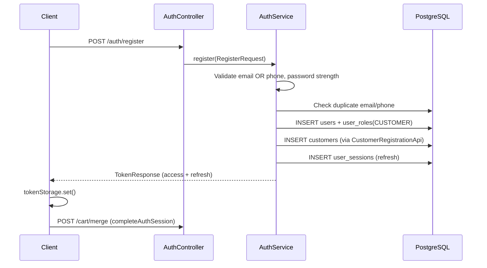
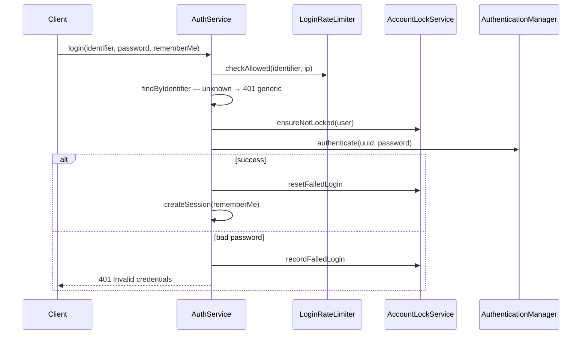
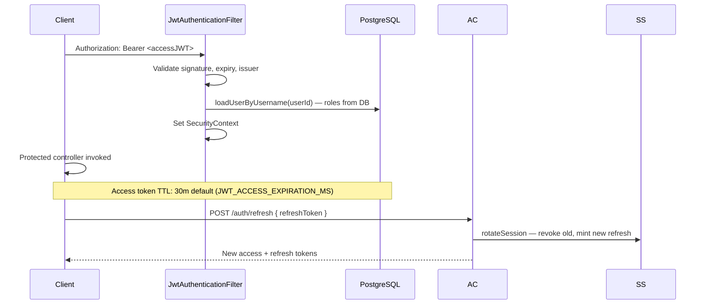
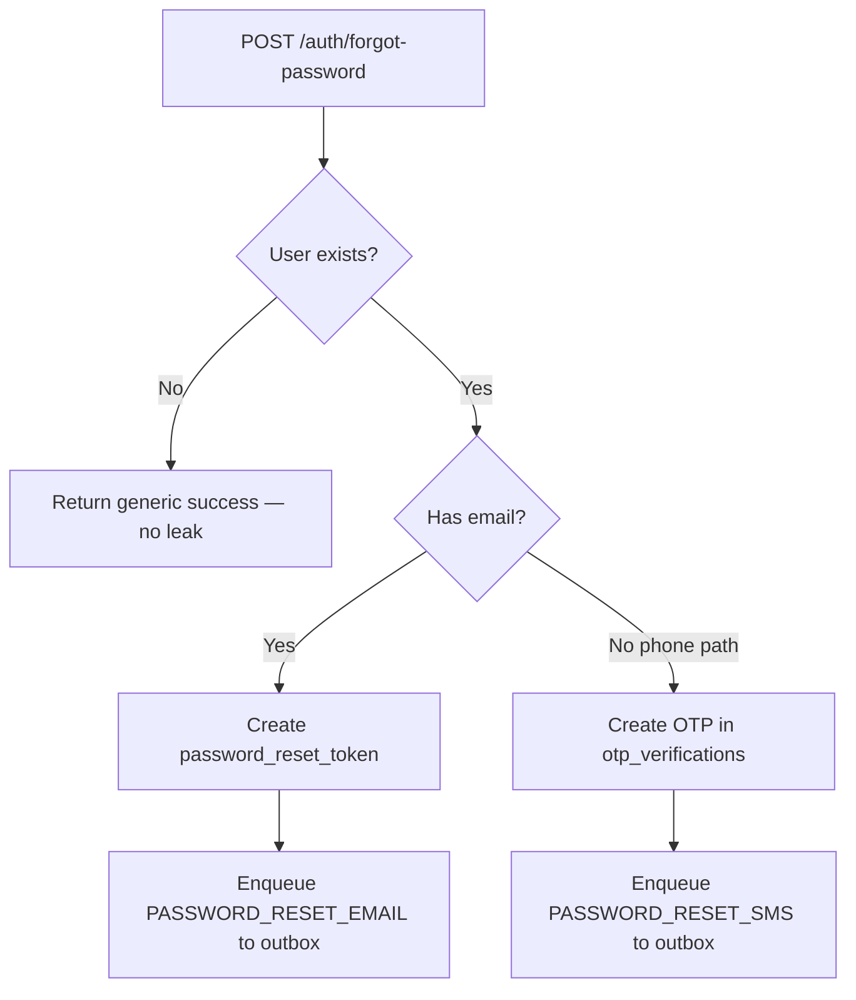

# Authentication & Security — Gamya Couture

How identity, sessions, and authorization work in the backend and frontend.

---

## Overview

| Aspect | Implementation |
|--------|----------------|
| Protocol | Stateless JWT access tokens |
| Sessions | Opaque refresh tokens in `user_sessions` (hashed) |
| Password hashing | BCrypt |
| Identifier | Email **or** phone (India-normalized) |
| CSRF | Disabled (Bearer token API) |
| Roles | ADMIN, STAFF, CUSTOMER |

---

## Register flow

**Validation:** `@EmailOrPhoneRequired`, `@ValidPassword`, unique email/phone.  
**Note:** `email_verified_at` / `phone_verified_at` columns exist but are not set — accounts are immediately active.

---

## Login flow

**Lockout:** 5 failed attempts → 15-minute `locked_until`.  
**Rate limits:** Per-identifier (DB), per-IP (in-memory), on login and forgot-password.

---

## JWT + session flow

| Token | Storage (frontend) | TTL |
|-------|-------------------|-----|
| Access JWT | `localStorage` | 30 min (configurable) |
| Refresh opaque | `localStorage` | 7 days / 30 days if rememberMe |

**Refresh token:** Two UUIDs concatenated; stored as SHA-256 hash in `user_sessions`. Rotated on each refresh.

**Logout:** `POST /auth/logout` sets `revoked_at` on matching session. Access JWT valid until expiry (~30 min).

**Password change/reset:** All sessions revoked via `SessionService.revokeAllForUser`.

**Gap:** Frontend does not yet call `/auth/refresh` automatically — users may be redirected to login when access token expires.

---

## Forgot password flow

**Anti-enumeration:** Same response whether account exists.  
**Delivery:** `NotificationOutboxService` queues events — **no SMTP/SMS worker wired yet**.

---

## Reset password flow

Two paths in `ResetPasswordRequest`:

1. **Email:** `{ token, newPassword }` — validates `password_reset_tokens`, single-use, 60 min TTL.
2. **Phone:** `{ otp, identifier, newPassword }` — validates latest OTP, max 5 attempts.

On success: update password hash, clear lockout, **revoke all sessions**.

---

## Authorization rules

From `SecurityConfig`:

| Pattern | Access |
|---------|--------|
| `GET /catalog/**`, `/products/**`, `/categories/**` | Public |
| `GET/POST/PATCH/DELETE /cart/**` | Public (guest header) |
| `POST /cart/merge` | Authenticated |
| `POST /auth/**` | Public |
| `POST /products/*/interest`, `/interests` | Public |
| `/wishlist/**`, `/customers/**` | Authenticated |
| `/admin/**` | ADMIN |
| `/crm/**` | STAFF or ADMIN |
| Swagger, `/actuator/health` | Public (restrict in prod) |

Method-level: `@PreAuthorize("hasRole('ADMIN')")` on admin controllers.

**JWT filter:** Reloads user + roles from DB each request (role changes apply without re-login).

---

## Frontend auth integration

| File | Role |
|------|------|
| `lib/auth/token-storage.ts` | localStorage access + refresh |
| `lib/auth/guest-cart-storage.ts` | Guest cart UUID |
| `lib/api/client.ts` | Bearer header; 401 → redirect login |
| `lib/api/services/auth.service.ts` | login, register, merge, completeAuthSession |
| `stores/auth-store.ts` | In-memory user profile |
| `components/account/account-guard.tsx` | Redirect unauthenticated |
| `components/admin/admin-guard.tsx` | ADMIN check + fetchMe |

**Post-login:** `completeAuthSession()` → `fetchMe()` + `mergeGuestCart()` + invalidate cart/wishlist queries.

---

## Security measures

| Measure | Status |
|---------|--------|
| BCrypt passwords | ✅ |
| Refresh token hashing | ✅ SHA-256 |
| Session rotation | ✅ |
| Session revoke on password change | ✅ |
| Account lockout | ✅ |
| Login rate limiting | ✅ |
| Forgot-password rate limiting | ✅ |
| Reset rate limiting | ✅ |
| Disabled user refresh blocked | ✅ |
| CORS allowlist | ✅ |
| Guest cart IDOR | ⚠️ UUID secrecy only |
| Access token revocation | ❌ Until expiry |
| Email/SMS verification | ❌ Not implemented |
| Frontend token refresh | ❌ Not implemented |

---

## Token expiry defaults

From `application.yml`:

| Setting | Default |
|---------|---------|
| `JWT_ACCESS_EXPIRATION_MS` | 1,800,000 (30 min) |
| `JWT_REFRESH_EXPIRATION_MS` | 604,800,000 (7 days) |
| `JWT_REMEMBER_ME_EXPIRATION_MS` | 2,592,000,000 (30 days) |

**Production:** Set `JWT_SECRET` via SSM; never use default placeholder.

---

## Related

- [API_CONTRACT.md](./API_CONTRACT.md) — auth endpoints
- [DATABASE_SCHEMA.md](./DATABASE_SCHEMA.md) — V10/V11 tables
- [DECISIONS.md](./DECISIONS.md) — why JWT + refresh sessions
