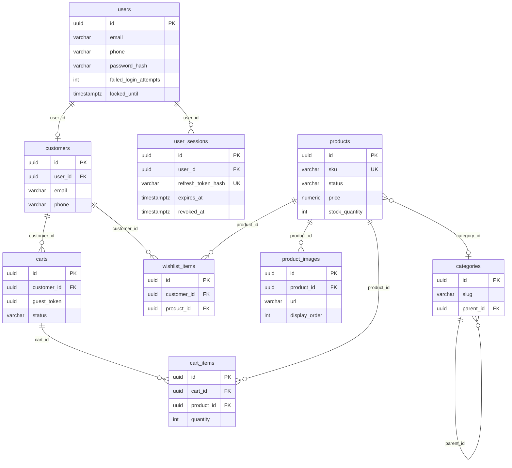

# Database Schema — Gamya Couture

Quick reference for PostgreSQL tables. Source: Flyway migrations `V1`–`V12` + JPA entities.

**Soft-delete:** Most business tables use `deleted_at`; JPA `@SQLRestriction("deleted_at IS NULL")` on `BaseSoftDeletableEntity`.

---

## ER diagram (commerce + auth)

---

## Migration timeline

| Version | Theme |
|---------|-------|
| V1 | Extensions, `set_updated_at()` |
| V2 | `roles`, `users`, `user_roles` |
| V3 | Taxonomy: categories, fabrics, prints, tags, offers, seasonal |
| V4 | Products, images, join tables, full-text search |
| V5 | Customers, addresses |
| V6 | Customer interest, manual orders |
| V7 | Notifications, outbox, CRM leads |
| V8 | Seed admin user |
| V9 | Interest lead workflow + audit log |
| **V10** | **Email/phone auth, lockout columns** |
| **V11** | **Sessions, password reset, OTP, login attempts** |
| **V12** | **Cart, wishlist, stock, recently viewed** |

---

## Core tables

### `users` (V2, extended V10)

| Column | Purpose |
|--------|---------|
| `id` | PK UUID |
| `email` | Nullable (V10); unique when set |
| `phone` | Nullable; unique when set |
| `password_hash` | BCrypt |
| `first_name`, `last_name` | Profile |
| `enabled` | Account active flag |
| `failed_login_attempts`, `locked_until` | Lockout (V10) |
| `email_verified_at`, `phone_verified_at` | Verification (unused in app yet) |
| `deleted_at` | Soft delete |

**Constraints:** `chk_users_email_or_phone` — at least one of email/phone.  
**Indexes:** `uq_users_email_active`, `uq_users_phone_active` (partial, `deleted_at IS NULL`).

---

### `customers` (V5, extended V10)

| Column | Purpose |
|--------|---------|
| `user_id` | FK → `users`, nullable SET NULL |
| `email`, `phone` | Mirror of user contact |
| `notes` | CRM notes |

Links authenticated commerce to `carts`, `wishlist_items`, `addresses`.

---

### `products` (V4, extended V12)

| Column | Purpose |
|--------|---------|
| `sku` | Unique among active rows |
| `status` | `DRAFT`, `ACTIVE`, `ARCHIVED` |
| `price`, `compare_at_price`, `currency` | Pricing |
| `category_id`, `fabric_id`, `print_id` | Taxonomy FKs |
| `search_vector` | tsvector for full-text |
| `stock_quantity` | Nullable = made-to-order (V12) |
| `low_stock_threshold` | Default 5 (V12) |

---

### `product_images` (V4)

| Column | Purpose |
|--------|---------|
| `product_id` | FK CASCADE |
| `url` | S3/CloudFront HTTPS URL |
| `display_order` | Gallery sort |

---

### `categories` (V3)

| Column | Purpose |
|--------|---------|
| `slug` | URL segment; unique per parent |
| `parent_id` | Self-ref tree |
| `path`, `depth` | Materialized path for queries |
| `active` | Visible on storefront |

---

## Auth tables (V10–V11) — **new**

### `user_sessions` (V11)

| Column | Purpose |
|--------|---------|
| `refresh_token_hash` | SHA-256 of opaque refresh token (unique) |
| `remember_me` | Extended TTL flag |
| `expires_at`, `revoked_at` | Session lifecycle |
| `user_agent`, `ip_address` | Audit metadata |

**FK:** `user_id → users ON DELETE CASCADE`  
**Rationale:** Server-side refresh token rotation; logout revokes row.

---

### `password_reset_tokens` (V11)

| Column | Purpose |
|--------|---------|
| `token_hash` | SHA-256 of email reset UUID |
| `expires_at` | 60 min TTL |
| `used_at` | Single-use |

---

### `otp_verifications` (V11)

| Column | Purpose |
|--------|---------|
| `destination` | Phone or email |
| `purpose` | `PASSWORD_RESET`, etc. |
| `otp_hash` | SHA-256 of 6-digit OTP |
| `attempts`, `max_attempts` | Brute-force limit |

---

### `login_attempts` (V11)

| Column | Purpose |
|--------|---------|
| `identifier` | Email/phone tried |
| `ip_address` | Client IP |
| `success` | Boolean |

**Index:** `(identifier, created_at DESC)` for rate limiting.

**Rationale (V10):** Support Indian market phone login; nullable email; account lockout columns.

---

## Commerce tables (V12) — **new**

### `carts`

| Column | Purpose |
|--------|---------|
| `customer_id` | Set when authenticated |
| `guest_token` | UUID for guest carts |
| `status` | `ACTIVE`, `MERGED`, `ABANDONED` |
| `expires_at` | Guest TTL (30 days on create) |

**Constraints:** `chk_cart_owner` — customer_id OR guest_token required.  
**Unique:** One active cart per customer or guest token.

---

### `cart_items`

| Column | Purpose |
|--------|---------|
| `cart_id`, `product_id` | FKs |
| `quantity` | CHECK > 0 |
| `selected_size`, `selected_color` | Optional variants |

**Unique:** `(cart_id, product_id, size, color)` via COALESCE.  
**FK:** `product_id ON DELETE RESTRICT` — cannot hard-delete product with cart lines.

---

### `wishlist_items`

| Column | Purpose |
|--------|---------|
| `customer_id`, `product_id` | FKs |

**Unique:** `(customer_id, product_id)` where `deleted_at IS NULL`.  
**FK:** `product_id ON DELETE CASCADE`.

---

### `recently_viewed_products` (V12)

| Column | Purpose |
|--------|---------|
| `customer_id`, `product_id` | FKs |
| `viewed_at` | Timestamp |

**Unique:** one row per customer+product (upsert on view).

**Rationale (V12):** Guest cart before checkout; wishlist for authenticated users; stock for inventory-aware cart.

---

## CRM / interest

### `customer_interest` (V6, V9)

Lead capture from PDP. Status workflow: `NEW` → … → `DELIVERED` / `LOST`.  
Audit trail in `customer_interest_audit_log`.

### `crm_leads` (V7)

Staff-managed leads; linked to products/customers optionally.

---

## Supporting tables

| Table | Purpose |
|-------|---------|
| `roles`, `user_roles` | ADMIN, STAFF, CUSTOMER |
| `addresses` | Customer shipping/billing |
| `notification_outbox` | Async email/SMS events (password reset) |
| `fabrics`, `prints`, `tags`, `offers` | Product taxonomy |
| `manual_orders` | Pre-checkout order records (admin) |

---

## Index gaps (recommended future migration)

| Table | Suggested index |
|-------|-------------------|
| `cart_items` | `(cart_id)` |
| `wishlist_items` | `(customer_id)` |
| `products` | `(category_id)` where active |

---

## Rollback note

Flyway migrations are **forward-only**. Rollback = restore RDS snapshot or write corrective `V13+` migration. Never delete applied migration files.

See [DEPLOYMENT.md](./DEPLOYMENT.md) for migration runbook.
