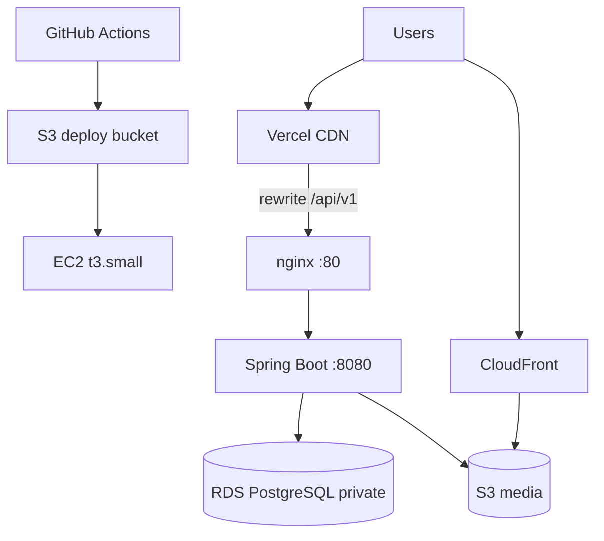

# Deployment Guide — Gamya Couture

Production deployment: **Vercel (frontend)** + **EC2 (backend)** + **RDS (PostgreSQL)** in **ap-south-1**.  
Infrastructure provisioning: separate **gamya-couture-infra** Terraform repo.

---

## Architecture



---

## Frontend — Vercel

### Setup

1. Import GitHub repo; set **Root Directory** = `frontend`
2. Framework preset: Next.js
3. Production branch: `main`

### Environment variables (Production)

| Variable | Example |
|----------|---------|
| `NEXT_PUBLIC_API_BASE_URL` | `/api/v1` |
| `API_PROXY_TARGET` | `http://<EC2_PUBLIC_IP>` |
| `NEXT_PUBLIC_SITE_URL` | `https://gamyaboutique.vercel.app` |
| `NEXT_PUBLIC_IMAGE_CDN_HOST` | `d2568bpd35bq6a.cloudfront.net` |

**Why proxy:** Browser calls same-origin `/api/v1`; Vercel rewrites to EC2 HTTP backend (avoids mixed content).

Config: `frontend/next.config.ts` `rewrites()`.

### Verification

- [ ] Production deploy green in Vercel dashboard
- [ ] Homepage loads products
- [ ] Network tab: `/api/v1/products` → 200
- [ ] Images load from CloudFront
- [ ] Login/register pages work
- [ ] Lighthouse: Performance ≥ 80, A11y ≥ 90

---

## Backend — EC2

### First-time bootstrap

```bash
# On EC2 via SSM Session Manager
git clone <repo-url> && cd gamya-boutique
sudo bash deploy/scripts/ec2-bootstrap.sh
sudo cp deploy/env/application.env.example /opt/gamya-couture/config/application.env
sudo bash deploy/scripts/sync-rds-env-from-ssm.sh   # optional: DB password from SSM
# Edit JWT_SECRET, verify CORS, S3 vars
sudo systemctl enable --now gamya-couture-backend
```

Files on EC2:

| Path | Purpose |
|------|---------|
| `/opt/gamya-couture/app/gamya-couture.jar` | Running JAR |
| `/opt/gamya-couture/config/application.env` | Env vars (640 root:gamya) |
| `/opt/gamya-couture/backup/` | Previous JARs |
| `/opt/gamya-couture/logs/` | App logs |

### systemd service

Unit: `deploy/systemd/gamya-couture-backend.service`

```bash
sudo systemctl status gamya-couture-backend
sudo systemctl restart gamya-couture-backend
sudo journalctl -u gamya-couture-backend -f --since "10 min ago"
```

### Build commands (local / CI)

```bash
mvn -B verify          # CI: full test
mvn -B -DskipTests package   # Deploy job: package only after tests passed
```

### CI/CD deploy (automatic on merge to main)

Workflow: `.github/workflows/deploy.yml`

1. `validate.yml` — tests, lint, security scan
2. Build JAR → upload to S3 deploy bucket
3. SSM runs `deploy/scripts/remote-deploy.sh` on EC2
4. Health check + `scripts/smoke-test-api.sh`

**GitHub secrets/variables:** `AWS_BACKEND_DEPLOY_ROLE_ARN`, `DEPLOY_BUCKET` (required). `EC2_INSTANCE_ID` and `EC2_HOST` are optional — deploy resolves the live EC2 by tag `gamya-couture-dev-api`. Infra Terraform can auto-sync all four when `GAMYABOUTIQUE_GH_TOKEN` is configured on `gamya-couture-infra`.

Optional: `SMOKE_TEST_EMAIL`, `SMOKE_TEST_PASSWORD` for authenticated smoke tests.

### Manual deploy

```bash
./scripts/deploy-ec2-dev.sh   # from developer machine (if configured)
```

### Rollback

`remote-deploy.sh` **auto-rollback** if health check fails after deploy.

**Manual rollback:**

```bash
sudo cp /opt/gamya-couture/backup/gamya-couture.jar.<timestamp> \
        /opt/gamya-couture/app/gamya-couture.jar
sudo chown gamya:gamya /opt/gamya-couture/app/gamya-couture.jar
sudo systemctl restart gamya-couture-backend
curl -sf http://127.0.0.1:8080/actuator/health
```

Keep last 5 backups (`KEEP_BACKUPS=5`).

---

## Database — Supabase (preferred) / RDS (legacy)

### Supabase (preferred)

- Project: [nlntrftvzcwtrdenufoi](https://supabase.com/dashboard/project/nlntrftvzcwtrdenufoi)
- Profile: `SPRING_PROFILES_ACTIVE=supabase` and `DB_PROVIDER=supabase`
- Schema: `supabase/migrations/` (Flyway **disabled** on this profile)
- Credentials: Dashboard Database password; optional SSM `/gamya-couture/dev/supabase/db/password`
- Deploy: `sync-rds-env-from-ssm.sh` / `remote-deploy.sh` **skip RDS overwrite** when Supabase is detected

EC2 `application.env` template: [deploy/env/application.supabase.env.example](../deploy/env/application.supabase.env.example)

### Legacy RDS

- Database name: `gamya` (RDS) vs `gamya_couture` (local Docker)
- Access: EC2 security group → RDS port 5432 only
- Credentials: SSM `/gamya-couture/dev/db/password` (synced in deploy when `DB_PROVIDER=rds`)

### Migration steps

| Target | How schema changes |
|--------|--------------------|
| Supabase | Add SQL under `supabase/migrations/` (or MCP `apply_migration`); restart app (no Flyway) |
| RDS / local | Flyway on Spring Boot startup from `db/migration/` |

RDS Flyway verify:

```sql
SELECT version FROM flyway_schema_history ORDER BY installed_rank DESC LIMIT 5;
```

### Rollback strategy

| Approach | When |
|----------|------|
| Supabase PITR / SQL forward-fix | Hosted Supabase |
| RDS snapshot restore | Legacy RDS corruption |
| **Never** delete Flyway history rows manually | — |

---

## AWS services

### S3

| Bucket | Purpose |
|--------|---------|
| `gamya-couture-dev-media` | Product images under `products/` |
| `*-backend-deploy` | CI deploy artifacts (JAR, scripts) |

EC2 IAM role: `s3:PutObject`, `s3:GetObject` on media bucket.

### CloudFront

Public image URLs via `APP_STORAGE_S3_PUBLIC_BASE_URL`.  
Frontend: `NEXT_PUBLIC_IMAGE_CDN_HOST`.

### Database hosts

| Host | Notes |
|------|-------|
| Supabase Postgres 17 | Preferred; region `ap-southeast-2` |
| RDS PostgreSQL 16 | Legacy; private subnet, backups ≥ 7 days |

### Secrets (SSM Parameter Store)

| Parameter | Purpose |
|-----------|---------|
| `/gamya-couture/dev/supabase/db/password` | Supabase DB password (optional; preferred) |
| `/gamya-couture/dev/db/password` | Legacy RDS password |
| (recommended) `/gamya-couture/prod/jwt/secret` | JWT signing key |

**Never commit real secrets** — use `deploy/env/application.supabase.env.example` as template only.

---

## Environment checklist

### EC2 `application.env`

```bash
DB_PROVIDER=supabase
SPRING_PROFILES_ACTIVE=supabase
SERVER_PORT=8080
DB_URL=jdbc:postgresql://db.nlntrftvzcwtrdenufoi.supabase.co:5432/postgres?sslmode=require
DB_USER=postgres
DB_PASSWORD=<from Supabase dashboard or SSM supabase path>
JWT_SECRET=<strong random>
CORS_ALLOWED_ORIGINS=https://gamyaboutique.vercel.app,http://localhost:3000
APP_STORAGE_S3_ENABLED=true
APP_STORAGE_S3_BUCKET=gamya-couture-dev-media
APP_STORAGE_S3_REGION=ap-south-1
APP_STORAGE_S3_PUBLIC_BASE_URL=https://d2568bpd35bq6a.cloudfront.net
APP_STORAGE_S3_KEY_PREFIX=products/

# Password reset (cheapest MVP: Gmail app password or SendGrid free — no AWS SES required)
MAIL_ENABLED=true
MAIL_HOST=smtp.gmail.com
MAIL_PORT=587
MAIL_USERNAME=<smtp-user>
MAIL_PASSWORD=<app-password>
MAIL_FROM=noreply@yourdomain.com
APP_FRONTEND_URL=https://gamyaboutique.vercel.app
```

---

## Post-deploy verification

```bash
curl http://<EC2>/actuator/health
./scripts/smoke-test-api.sh http://<EC2>
./scripts/verify-api-integration.sh http://<EC2>
```

Open Vercel URL → shop → PDP → add to cart.

---

## Related runbooks

- [docs/production/DEPLOYMENT-CHECKLIST.md](./production/DEPLOYMENT-CHECKLIST.md) — step-by-step checklist
- [docs/production/MONITORING-CHECKLIST.md](./production/MONITORING-CHECKLIST.md) — post-launch monitoring
- [deploy/README.md](../deploy/README.md) — EC2 bootstrap details
