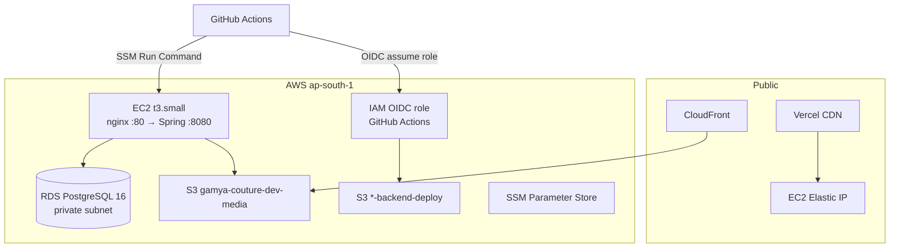

# Infrastructure Setup — Gamya Couture

AWS infrastructure is provisioned by **[gamya-couture-infra](https://github.com/gvsharma/gamya-couture-infra)** (Terraform). This repo contains application code, deploy scripts, and GitHub Actions workflows that consume infra outputs.

**Region:** `ap-south-1` (Mumbai)

---

## Architecture (AWS)



---

## AWS resources (dev environment)

| Resource | Purpose | Notes |
|----------|---------|-------|
| **EC2** (`*-api`) | Spring Boot + nginx | Elastic IP; SSM Session Manager access |
| **RDS PostgreSQL** (`*-pg`) | Application database | Private subnet; database name `gamya` |
| **S3 media bucket** | Product images | `gamya-couture-dev-media`; CloudFront in front |
| **S3 deploy bucket** | CI artifacts | JAR + deploy scripts for SSM |
| **CloudFront** | CDN for S3 images | `NEXT_PUBLIC_IMAGE_CDN_HOST` on frontend |
| **SSM Parameter Store** | DB credentials | `/gamya-couture/dev/db/username`, `/password` |
| **IAM OIDC role** | GitHub Actions deploy | No long-lived AWS keys in GitHub |
| **EventBridge scheduler** | Cost control | Weekly IST windows — Mon–Fri 06:00–11:00; Sat 18:00–00:00; Sun 06:00–00:00 |

Example dev outputs (verify with `terraform output` — IPs may change):

| Output | Example |
|--------|---------|
| `api_public_ip` | EC2 Elastic IP |
| `ec2_instance_id` | `i-...` |
| `backend_deploy_bucket` | `gamya-couture-dev-backend-deploy` |
| `backend_deploy_role_arn` | IAM role for OIDC |
| RDS instance id | `gamya-couture-dev-pg` (Name tag: `gamya-couture-dev-postgres`) |
| RDS endpoint | `gamya-couture-dev-pg.*.ap-south-1.rds.amazonaws.com` |

---

## Terraform apply (infra repo)

```bash
git clone https://github.com/gvsharma/gamya-couture-infra.git
cd gamya-couture-infra/environments/dev

# Configure AWS credentials (admin or deploy role)
export AWS_REGION=ap-south-1

terraform init
terraform plan
terraform apply
```

After apply, export GitHub setup values:

```bash
terraform output -json backend_deploy_github_setup
```

### Optional: auto-sync GitHub secrets

When `GAMYABOUTIQUE_GH_TOKEN` is set on the infra repo, Terraform module `github-backend-deploy-config` can push secrets/variables to **gvsharma/gamyaboutique** automatically.

---

## GitHub Actions configuration

Configure in **gvsharma/gamyaboutique** → Settings → Secrets and variables → Actions.

### Required

| Name | Type | Source (Terraform output) |
|------|------|---------------------------|
| `AWS_BACKEND_DEPLOY_ROLE_ARN` | Secret | `backend_deploy_role_arn` |
| `DEPLOY_BUCKET` | Variable or secret | `backend_deploy_bucket` |

### Optional (auto-resolved if missing)

| Name | Type | Purpose |
|------|------|---------|
| `EC2_INSTANCE_ID` | Variable or secret | Target instance; resolved by tag `{prefix}-api` if stale |
| `EC2_HOST` | Variable or secret | Public IP for health checks; resolved at deploy time |
| `RDS_INSTANCE_ID` | Variable or secret | DB instance id (e.g. `gamya-couture-dev-pg`); defaults to `{prefix}-pg`, then tag lookup `{prefix}-postgres` |
| `SMOKE_TEST_EMAIL` | Secret | Authenticated smoke test login |
| `SMOKE_TEST_PASSWORD` | Secret | Authenticated smoke test login |

No SSH keys are required for CI. Port 22 can remain restricted to admin IPs.

---

## Deploy flow (S3 + SSM)

Triggered by push to `main` — [.github/workflows/deploy.yml](../.github/workflows/deploy.yml).

```
1. validate.yml
   └── mvn verify, frontend lint/build, security scan

2. build-and-deploy
   ├── mvn -DskipTests package
   ├── OIDC → assume AWS_BACKEND_DEPLOY_ROLE_ARN
   ├── Prepare RDS (start if stopped, wait available)
   ├── Prepare EC2 (start if stopped, wait SSM Online)
   ├── Upload to S3:
   │     incoming/gamya-couture.jar
   │     incoming/remote-deploy.sh
   │     incoming/sync-rds-env-from-ssm.sh
   │     incoming/ssm-kickoff-deploy.sh
   ├── SSM short probe command (verify agent works)
   ├── SSM kickoff → nohup ssm-kickoff-deploy.sh on EC2
   │     └── downloads artifacts, syncs DB password, runs remote-deploy.sh
   ├── Poll deploy.status (success/failed) via SSM
   ├── curl http://<EC2>/actuator/health (via nginx)
   └── scripts/smoke-test-api.sh
```

### Why async SSM?

Long-running deploys (JAR download, Flyway, health wait) run in a background process on EC2. GitHub Actions sends a short SSM kickoff and polls `/opt/gamya-couture/logs/deploy.status` — avoiding SSM command timeout failures.

### remote-deploy.sh behavior

- Backs up current JAR to `/opt/gamya-couture/backup/`
- Syncs `DB_PASSWORD` from SSM
- Installs new JAR, restarts `gamya-couture-backend`
- Health check with automatic rollback on failure

Scripts: [deploy/scripts/](../deploy/scripts/)

---

## Cost scheduler

Dev environment uses EventBridge Scheduler rules (timezone `Asia/Kolkata`) to reduce compute costs:

| Day | Running window (IST) | Stop rules | Start rules |
|-----|----------------------|------------|-------------|
| **Mon–Fri** | 06:00–11:00 (5 h) | 11:00 | 06:00 |
| **Saturday** | 18:00–00:00 (6 h) | 00:00 Sun | 18:00 Sat |
| **Sunday** | 06:00–00:00 (18 h) | 00:00 Mon | 06:00 Sun |

**Impact:** Storefront and API are down outside the windows above unless manually started or a deploy cold-starts resources.

**Deploy handles stopped resources:** The deploy workflow starts stopped RDS and EC2 before deploying and waits for SSM to come online (extended timeout after cold start).

Manual start (AWS Console or CLI):

```bash
aws ec2 start-instances --instance-ids <id> --region ap-south-1
aws rds start-db-instance --db-instance-identifier <id> --region ap-south-1
```

---

## SSM Parameter Store

| Parameter | Purpose |
|-----------|---------|
| `/gamya-couture/dev/db/username` | RDS username (`gamya_admin`) |
| `/gamya-couture/dev/db/password` | RDS password (encrypted) |

Sync to EC2 `application.env`:

```bash
sudo bash /opt/gamya-couture/scripts/sync-rds-env-from-ssm.sh
```

This runs automatically during each deploy via `ssm-kickoff-deploy.sh`.

---

## S3 buckets

| Bucket | Purpose | Access |
|--------|---------|--------|
| `gamya-couture-dev-media` | Product images under `products/` | Public read via CloudFront; EC2 IAM write |
| `*-backend-deploy` | Deploy artifacts | GitHub OIDC role write; EC2 instance read |

Example IAM policies: [deploy/s3/](../deploy/s3/)

---

## Vercel (frontend hosting)

Not managed by Terraform in the app repo. Configure manually:

1. Import **gvsharma/gamyaboutique** on Vercel
2. **Root Directory:** `frontend`
3. Production branch: `main`
4. Environment variables — see [frontend/README.md](../frontend/README.md)

Pair with EC2 `CORS_ALLOWED_ORIGINS` and `API_PROXY_TARGET`.

---

## EC2 one-time bootstrap

Connect via **AWS Systems Manager → Session Manager** (no SSH required).

```bash
sudo dnf install -y git
git clone https://github.com/gvsharma/gamyaboutique.git
cd gamya-boutique
sudo bash deploy/scripts/ec2-bootstrap.sh
sudo cp deploy/env/application.env.example /opt/gamya-couture/config/application.env
sudo bash deploy/scripts/sync-rds-env-from-ssm.sh
# Set JWT_SECRET, verify CORS
sudo systemctl enable --now gamya-couture-backend
```

Bootstrap installs Java 21, creates `gamya` user, installs systemd unit, nginx proxy, AWS CLI.

Full details: [deploy/README.md](../deploy/README.md)

---

## Troubleshooting

| Symptom | Investigation |
|---------|---------------|
| Deploy: RDS not found / prepare skipped | Set `RDS_INSTANCE_ID=gamya-couture-dev-pg`, or grant deploy role `rds:DescribeDBInstances` + `tag:GetResources`; workflow falls back to Name tag `{prefix}-postgres` |
| Deploy: SSM PingStatus ≠ Online | Instance IAM role needs `AmazonSSMManagedInstanceCore`; restart SSM agent |
| Deploy: health check timeout | Read `/opt/gamya-couture/logs/deploy.latest.log` via SSM |
| 502 outside scheduler window | Cost scheduler stopped EC2/RDS — wait for next start window or start manually |
| Wrong EC2 targeted | Set `EC2_INSTANCE_ID` or verify Name tag `{prefix}-api` |
| GitHub OIDC assume role fails | Check trust policy allows `gvsharma/gamyaboutique` repo |

### Useful CLI checks

```bash
# EC2 + SSM status
aws ec2 describe-instances --instance-ids <id> --region ap-south-1
aws ssm describe-instance-information --filters "Key=InstanceIds,Values=<id>" --region ap-south-1

# RDS status
aws rds describe-db-instances --db-instance-identifier <id> --region ap-south-1

# Health
curl -s http://<EC2_IP>/actuator/health
```

---

## Related docs

| Doc | Contents |
|-----|----------|
| [DEPLOYMENT.md](./DEPLOYMENT.md) | Full production deploy runbook |
| [AWS-DEV-SETUP.md](./AWS-DEV-SETUP.md) | End-to-end Vercel + EC2 + RDS walkthrough |
| [deploy/README.md](../deploy/README.md) | EC2 paths, rollback, systemd |
| [CICD-IMPLEMENTATION-PLAN.md](./CICD-IMPLEMENTATION-PLAN.md) | CI/CD design rationale |
