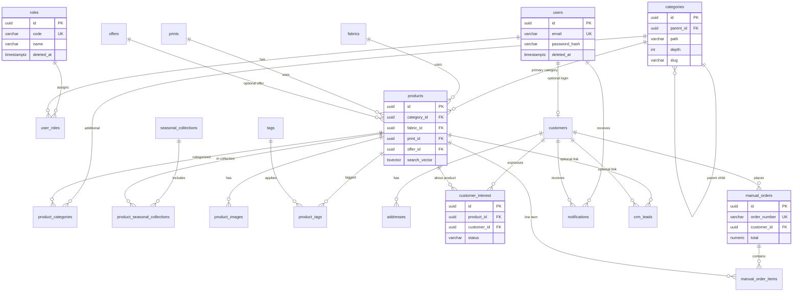

# Gamya Couture — PostgreSQL ER Design

Boutique CRM catalog schema: normalized tables, UUID keys, audit columns, soft deletes, and filter-friendly indexes.

## Entity-relationship diagram

## Category hierarchy

Categories are self-referential with materialized `path` and `depth` for efficient filtering.

Example:

| name | slug | parent | path | depth |
|------|------|--------|------|-------|
| Women | women | NULL | /women | 0 |
| Kurtis | kurtis | Women | /women/kurtis | 1 |
| Printed Kurtis | printed-kurtis | Kurtis | /women/kurtis/printed-kurtis | 2 |

Filter products under **Women** using `categories.path LIKE '/women/%'` OR assign products to leaf categories and expand descendants in queries.

## Filter dimensions

| Filter | Source |
|--------|--------|
| Category | `products.category_id`, `product_categories`, `categories.path` |
| Fabric | `products.fabric_id` → `fabrics` |
| Print | `products.print_id` → `prints` |
| Offer | `products.offer_id` → `offers` (compare-at / sale price) |
| Tag | `product_tags` → `tags` (`tag_type` distinguishes OFFER, SEASONAL, etc.) |
| Seasonal collection | `product_seasonal_collections` → `seasonal_collections` |

## Audit and soft delete

All business tables include:

- `created_at`, `updated_at` (TIMESTAMPTZ, maintained by trigger)
- `created_by`, `updated_by` (VARCHAR — Spring Security principal / email)
- `deleted_at` (NULL = active; partial indexes use `WHERE deleted_at IS NULL`)

## Constraints summary

- **Uniqueness:** email (users), sku (products), order_number (manual_orders), role code, fabric/print/tag/collection slugs
- **Checks:** product status, order status, interest status, discount types, notification channel/status
- **FK:** ON DELETE RESTRICT for catalog references; CASCADE for owned children (images, line items, junction rows)

## Index strategy

- B-tree: FK columns, status, `deleted_at IS NULL` partial filters, slug lookups
- GIN: `products.search_vector` for full-text catalog search
- Composite: `(parent_id, slug)` for category siblings, `(product_id, display_order)` for images

## Migration layout

| Version | File | Contents |
|---------|------|----------|
| V1 | `V1__extensions_and_audit.sql` | pgcrypto, `set_updated_at()` trigger function |
| V2 | `V2__roles_and_users.sql` | roles, users, user_roles |
| V3 | `V3__catalog_taxonomy.sql` | categories, fabrics, prints, tags, offers, seasonal_collections |
| V4 | `V4__products.sql` | products, images, junctions, search vector |
| V5 | `V5__customers_and_addresses.sql` | customers, addresses |
| V6 | `V6__customer_interest_and_orders.sql` | customer_interest, manual_orders, items |
| V7 | `V7__notifications_and_crm.sql` | notifications, notification_outbox, crm_leads |
| V8 | `V8__seed_admin_user.sql` | dev admin seed |

## JPA package map

| Table | Entity | Package |
|-------|--------|---------|
| roles | `RoleEntity` | `auth.domain` |
| users | `UserAccount` | `auth.domain` |
| categories | `Category` | `catalog.domain` |
| fabrics | `Fabric` | `catalog.domain` |
| prints | `PrintPattern` | `catalog.domain` |
| tags | `Tag` | `catalog.domain` |
| offers | `Offer` | `catalog.domain` |
| seasonal_collections | `SeasonalCollection` | `catalog.domain` |
| products | `Product` | `product.domain` |
| product_images | `ProductImage` | `product.domain` |
| product_tags | `ProductTag` | `product.domain` |
| customers | `Customer` | `customer.domain` |
| addresses | `Address` | `customer.domain` |
| customer_interest | `CustomerInterest` | `crm.domain` |
| manual_orders | `ManualOrder` | `crm.domain` |
| notifications | `Notification` | `notification.domain` |
