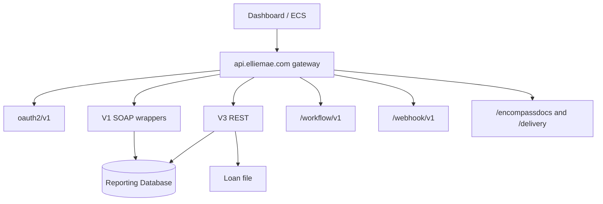

# Encompass architecture (API consumer view)

ICE does not publish a full LOS internal diagram. This is the **documented integration surface**.

V1 vs V3: V1 wraps legacy SOAP/WCF; V3 is native REST; gateway routes. Use V3 when available. No global V1 sunset.

Source: [https://developer.icemortgagetechnology.com/developer-connect/docs/v1-vs-v3-encompass-apis-whats-the-difference-1](https://developer.icemortgagetechnology.com/developer-connect/docs/v1-vs-v3-encompass-apis-whats-the-difference-1)

## Two stores

| Store | APIs | Freshness |
| ----- | ---- | --------- |
| Loan file | Get/Update Loan, Field Reader | On save (locks apply) |
| RDB | Pipeline, field audit | Async. Cursor = snapshot. Quantified lag: **NOT ESTABLISHED BY CURRENT OFFICIAL DOCUMENTATION**. |

Source: [https://developer.icemortgagetechnology.com/developer-connect/reference/loan-pipeline](https://developer.icemortgagetechnology.com/developer-connect/reference/loan-pipeline)

## Gateway limits

| Limit | Official |
| ----- | -------- |
| Default concurrency | 30 in-flight / environment. 429 when exhausted. [https://developer.icemortgagetechnology.com/developer-connect/docs/concurrency-limits](https://developer.icemortgagetechnology.com/developer-connect/docs/concurrency-limits) |
| Response size | 6 MB [https://developer.icemortgagetechnology.com/developer-connect/docs/response-payload-size-limit](https://developer.icemortgagetechnology.com/developer-connect/docs/response-payload-size-limit) |
| Loan file via API | < 40 MB |
| Token | 30 min, max 24 h; use within 15 min or 30-min expiry applies |

Lock APIs: `/encompass/v3/resourceLocks`. Lock webhooks not guaranteed real-time.
