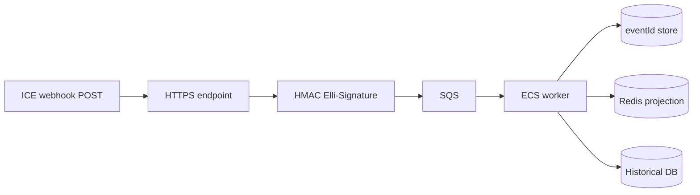

# Event processing (INTERNAL ARCHITECTURE RECOMMENDATION on AWS ECS)

- Verify signature; reject invalid
- Persist envelope first (at-least-once)
- Dedupe on `eventId`
- Apply to Redis keys (see cache-strategy)
- Batch ICE follow-up GETs (concurrency 30)
- Exponential backoff on 429
- Re-subscribe if ICE auto-deleted subscription
- Do not assume order: use eventTime + version clocks

Official: notifications not guaranteed real-time; lock/unlock still need retries.
