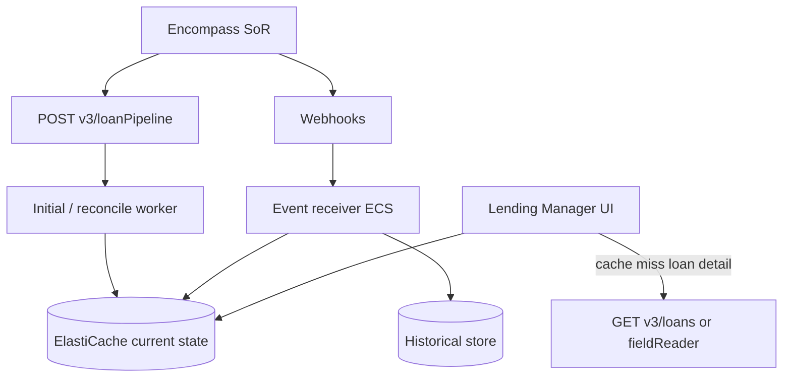

# Dashboard architecture

**INTERNAL ARCHITECTURE RECOMMENDATION** using only ICE-supported read/event APIs.

- Redis: current projection only
- History: Postgres/OpenSearch + raw webhook log
- Hot path 2s: Redis only
- Encompass: hydrate, miss, reconcile

Concurrency: default 30 — serialize ICE calls via queue.
